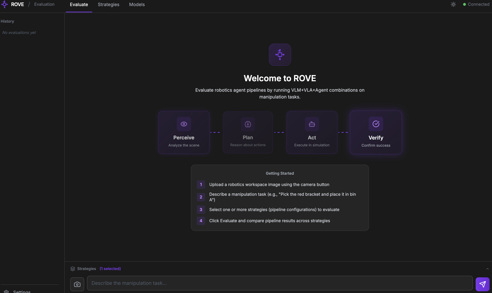

# ROVE
### Robot Observation & Vision Evaluation

> Roving through model space so you don't have to.

**ROVE evaluates robotics AI pipelines — running real inference through VLM+VLA+LLM combinations to find the best agent stack for your specific task.**



Upload a scene image, describe a manipulation task, select strategies, and ROVE runs the full inference pipeline — comparing success rate, latency, and cost across agent configurations in real time.

A robot that can pick, place, or assemble needs multiple AI models working together as an agent system. A Vision-Language Model sees the scene. An LLM or VLM plans the approach. A Vision-Language-Action model predicts the physical movements. And a VLM verifies the result.

No single model does all of this. The right combination depends on your task, your environment, and your constraints — latency, cost, accuracy. ROVE evaluates these combinations by running the full inference pipeline end-to-end, on your task, measuring what actually works before you deploy to a real robot.

---

## Configuration-Driven Pipeline

ROVE uses a single YAML configuration file — inspired by infrastructure-as-code patterns — to define models, tasks, and pipeline runs. Everything is declared, nothing is hardcoded.

```yaml
# rove.yaml — single source of truth
version: "1.0"

# Endpoints — flat list of model configurations (one model per entry)
endpoints:
  # VLMs
  qwen3-vl-8b:
    type: vlm
    adapter: lmstudio
    display_name: "Qwen3-VL 8B"
    deployment_type: local
    config:
      endpoint: "http://127.0.0.1:1234"
      model_id: "qwen3-vl-8b"

  mock-vlm:
    type: vlm
    adapter: mock_vlm
    display_name: "Mock VLM"
    deployment_type: local

  # VLAs
  mock-vla:
    type: vla
    adapter: mock_vla
    deployment_type: local

  # Sim
  mock-sim:
    type: sim
    adapter: mock_sim

# Strategies — named pipeline configurations (map endpoints to stages)
strategies:
  mock:
    display_name: "Mock (Test)"
    description: "All mock adapters — for testing pipeline plumbing"
    perceive: mock-vlm
    plan: mock-vlm
    act: mock-vla
    verify: mock-vlm
    sim: mock-sim
    tags: [test, mock]

  scene_detect:
    display_name: "Scene Detection"
    description: "Perceive + verify only — no planning or action"
    perceive: qwen3-vl-8b
    verify: qwen3-vl-8b
    sim: mock-sim
    tags: [scene, vlm, local]

  scene_plan:
    display_name: "Scene + Plan"
    description: "Perceive, plan a strategy, and verify"
    perceive: qwen3-vl-8b
    plan: qwen3-vl-8b
    verify: qwen3-vl-8b
    sim: mock-sim
    tags: [scene, plan, vlm, local]

  full_local:
    display_name: "Full Pipeline (Local)"
    description: "All 4 stages with local VLM + mock VLA"
    perceive: qwen3-vl-8b
    plan: qwen3-vl-8b
    act: mock-vla
    verify: qwen3-vl-8b
    sim: mock-sim
    tags: [full, local, vla]

# Defaults
defaults:
  sim: mock-sim
  trials: 1
  mode: full
```

Run strategies:

```bash
rove evaluate --config rove.yaml --strategies mock
rove evaluate --config rove.yaml --strategies scene_detect,scene_plan
rove evaluate --config rove.yaml --strategies full_local
```

---

## Why ROVE Exists

Robots that interact with the physical world need a stack of AI models working together as an agent system: perception, reasoning, planning, and action. Today, building and testing these agent pipelines is manual work — writing custom scripts for each model combination, wiring them together, running a simulator, measuring what happened.

For a single VLM+VLA combination, this means coordinating four inference stages, a simulator, and repeated trials. For three VLMs and three VLAs, that is nine complete agent configurations. Nobody does this systematically.

ROVE evaluates these agent pipelines. You describe your task, select candidate models for each pipeline stage, and ROVE runs the full inference pipeline across every combination — measuring success rate, latency, and cost on *your* task, in *your* environment.

**ROVE is inference-only.** It does not train, fine-tune, or modify models. It runs them in realistic robotics pipelines and measures the results. The question ROVE answers is not "how good is this model?" but "how well does this agent stack — this specific combination of VLM, VLA, LLM, and grounding model — perform on this robotic task?"

---

## How It Works

Every pipeline run follows a fixed four-stage inference sequence. The pipeline is deterministic — no LLM decides which stages to run. Models only participate inside their designated stages. Stages are optional: a strategy can define only the stages it needs (e.g. perceive + verify for scene detection).

```
 ┌──────────┐    ┌──────────┐    ┌──────────┐    ┌──────────┐
 │ perceive │───>│   plan   │───>│   act    │───>│  verify  │
 │   (VLM)  │    │  (VLM)   │    │  (VLA +  │    │  (VLM)   │
 │          │    │          │    │   Sim)   │    │          │
 └──────────┘    └──────────┘    └──────────┘    └──────────┘
  Scene image     Task plan:      Action chunk    Before/after
  → objects,      strategy,       7-DOF deltas    comparison
  spatial         steps,          executed in     → success/fail
  relationships   confidence      simulator       + confidence
```

| Stage | Model Type | Input | Output |
|-------|-----------|-------|--------|
| perceive | VLM | Scene image + task description | Objects, spatial relationships, task-relevant observations |
| plan | VLM | Image + scene analysis + task | Strategy, reasoning, ordered steps, confidence |
| act | VLA + Sim | Sim observation + task + proprioception | Action chunk → sim execution → post-execution observation |
| verify | VLM | Initial image vs post-execution image | Success (bool), confidence (0-1), reasoning |

Strategies define which stages to run and which model handles each. ROVE runs selected strategies concurrently via `asyncio.TaskGroup()`, streaming progress in real time.

### Partial Pipelines

Strategies can omit stages. For example, `scene_detect` runs only perceive + verify (no planning or action). `scene_plan` adds planning. This lets you evaluate VLM perception and planning quality without a full simulation loop.

```bash
rove evaluate --config rove.yaml --strategies scene_detect,scene_plan
```

---

## What ROVE Reports

For every model combination on every task, across N trials:

| Metric | Description | Source |
|--------|-------------|--------|
| **Success rate** | Fraction of trials where the task completed successfully (e.g., 46/50 = 92%) | VLM verify step + sim ground truth |
| **Latency breakdown** | Per-step and total pipeline inference time in milliseconds | Measured at adapter boundary |
| **Cost** | API inference cost per step and total per run in USD | From `rove.yaml` cost config |
| **VLM verification confidence** | VLM self-reported confidence on verify step (0.0-1.0) | VLM verify output |
| **Judge calibration** | Does VLM verification agree with sim ground truth? | VLM success vs sim success |
| **Action safety** (Phase 2+) | Trajectory smoothness, workspace bounds compliance | Computed from action predictions |

Results are ranked by: success rate (descending) → latency (ascending) → cost (ascending).

---

## Supported Models

Phase 1 ships with mock adapters for pipeline development. Real model adapters are added in Phases 2 and 3.

### Vision-Language Models (VLMs)

| Model | Parameters | Hosting | Phase |
|-------|-----------|---------|-------|
| GPT-4o | — | Azure OpenAI | 3 |
| Qwen3-VL | 8B / 2B | Local (LM Studio) | 2 |
| Phi-4 Multimodal | 14B | Azure AI Foundry / local | 2 |
| Ministral 3 | 3B | Local (LM Studio) | 2 |
| Mock VLM | — | In-process | 1 (now) |

### Vision-Language-Action Models (VLAs)

| Model | Parameters | Hosting | Phase | Notes |
|-------|-----------|---------|-------|-------|
| pi0-FAST | — | Local (openpi) | 2 | Most advanced open-source VLA |
| pi0 | — | Local (openpi) | 2 | Flow matching |
| SmolVLA | 450M | Local (LeRobot, MPS) | 2 | Flow matching, 10-step chunks |
| OpenVLA-OFT | 7B | Local (MLX quantization) | 2 | Autoregressive. MLX required (bitsandbytes incompatible with MPS) |
| CogACT | 7B | Azure GPU VM | 3 | Diffusion, 2-10s inference, 16-step chunks |
| Octo-Base | 93M | Local | 2 | Smallest VLA |
| Mock VLA | — | In-process | 1 (now) | |

### Simulation

| Component | Hosting | Phase | Notes |
|-----------|---------|-------|-------|
| MuJoCo + LIBERO | Local (native ARM) | 2 | 130+ manipulation tasks |
| Mock Sim | In-process | 1 (now) | |

Adding a new model = implement one Protocol + add a YAML entry. No changes to orchestrator, API, or dashboard.

---

## Quick Start

### Install

```bash
pip install rove-eval
```

### Launch the dashboard

```bash
rove serve
# Open http://localhost:5001
```

From the dashboard:
1. Upload a robotics workspace image using the camera button
2. Describe a manipulation task (e.g., "Pick the red bracket and place it in bin A")
3. Select one or more strategies (pipeline configurations) to evaluate
4. Click Evaluate and compare pipeline results across strategies

### CLI (batch processing)

The CLI is designed for scripted runs, CI pipelines, and batch evaluation:

```bash
# Run with mock adapters (zero dependencies)
rove evaluate --config rove.yaml --strategies mock

# Compare multiple strategies
rove evaluate --config rove.yaml --strategies scene_detect,scene_plan

# List models and check health
rove models --config rove.yaml
rove models --config rove.yaml --check-health

# Export results
rove export --evaluation-id eval_001 --format jsonl --output results.jsonl
```

### Python library

```python
import rove

results = await rove.evaluate(
    config_path="rove.yaml",
    evaluation_id="pick_bracket",
)

for r in results.ranked:
    print(f"{r.vlm_id} + {r.vla_id}: {r.success_rate:.0%} success, {r.avg_latency_ms:.0f}ms")
```

---

## Access Modes

ROVE has three access modes sharing the same pipeline engine.

| Mode | Best For | How |
|------|----------|-----|
| **Web dashboard** | Interactive testing, exploration, team demos | `rove serve` → `http://localhost:5001` |
| **CLI** | Batch processing, scripted runs, CI pipelines | `rove evaluate --strategies mock,scene_plan` |
| **Python library** | Jupyter notebooks, programmatic analysis | `await rove.evaluate(config_path="rove.yaml", ...)` |

The dashboard is **static HTML + vanilla JavaScript** served by FastAPI. No React, no npm, no build step. It streams pipeline progress in real time via SSE (Server-Sent Events). Zero frontend dependencies — works anywhere FastAPI runs.

---

## API Reference

Evaluations are asynchronous: `POST /api/evaluations` returns immediately with a job ID.

```bash
# Submit an evaluation
curl -X POST http://localhost:8000/api/evaluations \
  -H "Content-Type: application/json" \
  -d '{"task": "Pick the red bracket", "vlm_ids": ["gpt-4o"], "vla_ids": ["cogact-7b"], "trials": 5}'
# → {"evaluation_id": "eval_abc123", "status": "queued"}

# Poll for results
curl http://localhost:8000/api/evaluations/eval_abc123

# Stream live progress (SSE)
curl -N http://localhost:8000/api/evaluations/eval_abc123/stream

# List all evaluations
curl http://localhost:8000/api/evaluations

# Get leaderboard
curl http://localhost:8000/api/leaderboard

# Export
curl http://localhost:8000/api/evaluations/eval_abc123/export?format=jsonl
```

Full OpenAPI spec at `http://localhost:8000/docs`.

---

## Adding a New Model

Two steps. No changes to any existing code.

**Step 1: Implement the Protocol.**

```python
# rove/adapters/vlm/my_model.py
from rove.adapters.protocols import VLMAdapter

class MyModelAdapter:
    """Implements VLMAdapter protocol."""

    def __init__(self, model_id: str, config: dict):
        self._model_id = model_id
        self._endpoint = config["endpoint"]

    @property
    def model_id(self) -> str:
        return self._model_id

    async def analyze_scene(self, image: bytes, task: str) -> SceneAnalysis:
        # Call your model, normalize output to SceneAnalysis
        ...

    async def plan_grasp(self, image: bytes, task: str,
                         scene: SceneAnalysis, bbox: BoundingBox) -> GraspPlan:
        ...

    async def verify_success(self, initial_image: bytes,
                             final_image: bytes, task: str) -> VerificationResult:
        ...

    async def health_check(self) -> bool:
        ...
```

**Step 2: Add to `rove.yaml`.**

```yaml
models:
  vlm:
    my-model-7b:
      adapter: my_model            # maps to rove.adapters.vlm.my_model
      display_name: "My Model 7B"
      deployment_type: self_hosted
      config:
        endpoint: http://localhost:8080
      cost: { type: fixed, per_call: 0.0 }
```

The model appears in `rove models` and is available in all evaluations.

---

## MCP Servers — Model-Agnostic Agent Building

ROVE exposes three MCP (Model Context Protocol) servers that let AI agents use ROVE's adapters as tools without coupling to specific models.

| Server | Port | Tools |
|--------|------|-------|
| VLM Server | 8081 | `analyze_scene`, `plan_grasp`, `verify_success` |
| VLA Server | 8082 | `predict_action` |
| Grounding + Sim | 8083 | `localize`, `segment`, `sim_reset`, `sim_step` |

**Why this matters**: An agent built in Claude Desktop, Copilot, or Azure AI Foundry calls `analyze_scene(image, task, model_id="gpt-4o")` through MCP. It gets structured scene analysis back. When you change the model in `rove.yaml`, the agent's behavior updates — no agent code changes. This is the "model-agnostic agent" pattern: the agent works at the task level, ROVE handles model routing.

MCP servers ship in Phase 4. The evaluation pipeline calls adapters directly (not through MCP) for zero-overhead performance.

---

## Architecture

```
                     ┌──────────────────────────────────────┐
                     │           Access Layer                │
                     │  CLI  │  Python Library  │  Dashboard │
                     │       │  (import rove)   │  (HTML+JS) │
                     └──────────────┬───────────────────────┘
                                    │
                     ┌──────────────▼───────────────────────┐
                     │         FastAPI Backend               │
                     │  POST /api/evaluations → async job   │
                     │  GET  /api/evaluations/:id → poll    │
                     │  GET  /api/evaluations/:id/stream    │
                     │  Serves static dashboard at /        │
                     └──────────────┬───────────────────────┘
                                    │ asyncio.create_task()
                     ┌──────────────▼───────────────────────┐
                     │       Evaluation Engine               │
                     │  RunManager → asyncio.gather(         │
                     │    Orchestrator(vlm_1, vla_1),        │
                     │    Orchestrator(vlm_1, vla_2),        │
                     │    Orchestrator(vlm_2, vla_1), ...    │
                     │  )                                    │
                     └──────┬──────────┬──────────┬─────────┘
                            │          │          │
                     ┌──────▼──┐ ┌─────▼────┐ ┌──▼────────┐
                     │   VLM   │ │   VLA    │ │ Grounding │
                     │ Adapter │ │ Adapter  │ │ + Sim     │
                     └─────────┘ └──────────┘ └───────────┘
                            ▲          ▲          ▲
                            │          │          │
                     ┌──────┴──────────┴──────────┴─────────┐
                     │         Adapter Registry              │
                     │  rove.yaml → model_id → adapter      │
                     │  Lazy loading, health checks          │
                     └──────────────────────────────────────┘

    External: MCP Servers (Phase 4, not in evaluation path)
    ┌──────────────┐ ┌──────────────┐ ┌────────────────────┐
    │ VLM :8081    │ │ VLA :8082    │ │ Grounding+Sim:8083 │
    └──────┬───────┘ └──────┬───────┘ └──────┬─────────────┘
           └────────────────┴────────────────┘
              Same adapters, different entry point
              Used by: Claude, Copilot, Foundry agents
```

Key decisions:
- **The API is the product.** Delete the dashboard — evaluation still works.
- **Adapters are Protocols, not base classes.** Structural typing via `@runtime_checkable`.
- **The orchestrator is deterministic.** Four fixed stages. LLMs execute inside adapters only.
- **Configuration over code.** `rove.yaml` is the single source of truth.
- **Async jobs.** `POST /api/evaluations` returns immediately. SSE streams progress.
- **Plain HTML+JS dashboard.** No npm, no build step, no frontend dependencies.

---

## Project Structure

```
src/
└── rove/                          # Python package (import rove) — src layout
    ├── __init__.py
    ├── models.py                  # Shared dataclasses + Pydantic models
    ├── config.py                  # Load rove.yaml, Pydantic-validated config
    ├── cli.py                     # Click CLI entry point
    ├── adapters/
    │   ├── protocols.py           # THE contracts: VLMAdapter, PolicyAdapter, AgentAdapter, SimAdapter
    │   ├── registry.py            # YAML → adapter resolution + health checks
    │   ├── vlm/                   # mock, lmstudio, azure_foundry
    │   ├── policy/                # mock (+ local_lerobot, local_hf in Phase 2)
    │   ├── agent/                 # mock (+ azure_foundry in Phase 4)
    │   └── sim/                   # mock (+ local_mujoco in Phase 2)
    ├── orchestrator/
    │   ├── pipeline.py            # EvaluationPipeline — deterministic 4-stage pipeline
    │   └── run_manager.py         # Concurrent multi-strategy execution
    └── api/
        └── app.py                 # FastAPI app + SSE streaming
frontend/
    └── index.html                 # Dashboard — single HTML file, no build step
tests/                             # pytest + pytest-asyncio
rove.yaml                          # Single source of truth: endpoints + strategies
pyproject.toml                     # Package: rove-eval
```

---

## Roadmap

**Phase 1 — Mock-first foundation** (current)
Complete pipeline with mock adapters. CLI, API, dashboard. Zero external dependencies. Named evaluations from `rove.yaml`.

**Phase 2 — Local models**
SmolVLA (LeRobot/MPS), OpenVLA-OFT (MLX), GroundingDINO, SAM2 (CoreML), MuJoCo + LIBERO, Cosmos-Reason2 (MLX). Runs entirely on Apple Silicon.

**Phase 3 — Cloud models**
GPT-4o (Azure OpenAI), Qwen2.5-VL (Azure HF), CogACT (Azure GPU). Full cost tracking.

**Phase 4 — MCP + Azure AI Foundry**
Three MCP servers. Foundry-compatible JSONL export validated. ROVE evaluators registerable in Foundry.

---

## What ROVE Does Not Do

- **No model training or fine-tuning** — ROVE is inference-only. It consumes models, it does not produce or modify them.
- **No real robot control** — evaluation runs in simulation (MuJoCo + LIBERO). Output is data, not robot motion.
- **No model serving infrastructure** — ROVE calls models (local or cloud), it does not host them.
- **No general-purpose LLM evaluation** — ROVE evaluates robotics agent pipelines, not chatbots or text generation.
- No authentication or access control
- No multi-tenant support
- No streaming video input

---

## Name

ROVE is an anagram of VERO — Latin for "truly." The goal is honest, reproducible evaluation of robotics agent pipelines on real tasks — not cherry-picked benchmark results, not isolated model scores, but end-to-end pipeline performance on the task you actually need to deploy.

*Roving through model space so you don't have to.*

---

## License

MIT — See [LICENSE](LICENSE).
