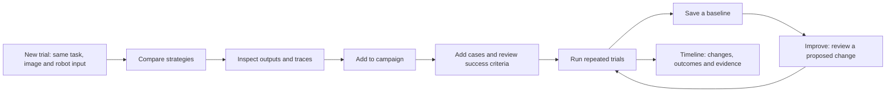

# ROVE

**Robot Observation & Vision Evaluation**

**ROVE evaluates robotics agent pipelines on your task.**

Compare the same **task + observation + robot configuration** across your chosen
strategies. Inspect each strategy's outputs and traces, then use campaigns to repeat
that comparison, preserve a baseline and track changes to cases, models and success
criteria over time.

A strategy can use a VLM, a tool-using agent, a VLA or a configured combination of
pipeline stages. ROVE evaluates the connected system through supported adapters;
training is an explicit standalone preparation step, separate from trials and
campaigns. This is an experimental OSS
workbench for robotics evaluation engineering.

It connects supported model and agent adapters, optional MuJoCo diagnostics,
and a local browser dashboard. This is an experimental OSS project for
demonstrating and improving evaluation engineering. Import customer cases, review
individual outputs, freeze dataset revisions and compare a changed strategy with
an explicit baseline. See the [customer workflow](docs/product/evaluation-workflows.md)
and [product specification](docs/PRODUCT_SPEC.md) for scope and remaining work.

The evaluation core is also reusable for non-robotics tasks. Structured-input
trials and campaigns use the same history, evidence and reports through a trusted
execution adapter. Try the [offline text example](examples/general-evaluation/README.md)
or read the [core boundary and scope](docs/product/reusable-evaluation-core.md).
The existing robotics workbench remains available.

For a separate hands-on learning exercise, open the
[ABC + XDOF Jupyter notebook](notebooks/abc_xdof/README.md): inspect demonstrations,
run a released VLA in ABC's simulator, and optionally explore fine-tuning.
Its GPU steps use an independent environment and are not ROVE application features.

The experimental [ABC-VLA versus pi0.5 comparison](docs/product/abc-pi05-comparison.md)
connects complete bimanual simulator episodes to ROVE's Trials and Campaigns.
Register compatible checkpoints with `rove bimanual setup`, preview fixed scene
cases and repeated policy seeds, then run comparisons with preserved measurements
and evidence. The pi0.5 checkpoint must be adapted to ABC's robot. Local checks
cover the integration contracts, a real ABC CPU simulation with rendering, and
LeRobot dataset conversion/readback. GPU inference, fine-tuning and model
performance remain unverified on the development host.


## Try it locally

Python 3.12 and [uv](https://docs.astral.sh/uv/) are recommended. Run from the
repository root because the dashboard uses the source checkout's assets. The mock
workflow needs no cloud account or model download.

```bash
git clone https://github.com/niksacdev/rove.git
cd rove
uv sync --frozen --python 3.12 --extra dev --extra data --extra kinematics
uv run --no-sync rove serve
# Open http://127.0.0.1:5001
```

Choose **New trial**, load a sample observation or provide an image and task, and
add a URDF when your evaluation needs robot geometry. In **Configure**, select one
or several strategies, including **Mock (Test)** for an offline demonstration.
**Review & run** shows the exact inputs; **Run trials** starts execution. Results
retains an **All strategies** overview, individual outputs and **Inspect trial &
traces**. Mock output verifies the workflow, not robot competence.

**Trials** and **Campaigns** browse saved work. **Settings** maintains reusable
configuration and the optional assistant. Creation, inspection and execution are
separate actions: opening history never reruns a model.

## From one comparison to an improvement history



Start a **New campaign** directly when you already have a case collection. Its stages
are **Cases → Configure → Success metrics → Run → Review & improve**. The header
keeps the campaign name, attempts per case and planned total visible:
**cases × strategies × attempts = trials**. Saved campaigns show their recorded setup;
**Improve** creates a linked editable copy.

- **Bring cases.** Select bundled samples, add customer images/tasks, or import
  JSONL with separate images. Case revisions retain source identity, optional robot
  input and private reference material. [Synthetic customer cases](examples/customer-cases/README.md)
  exercise onboarding without claiming measured outcomes.
- **Define success.** Each criterion has a pass condition and a human reviewer or
  configured verifier. AI can suggest a draft; writing a condition does not implement
  a check. Reports calculate eligible success/reliability measures and timing from
  actual assessments and measurements. Missing judgments remain unknown.
- **Run and inspect.** Watch each strategy's pipeline progress, compare outputs and
  inspect individual trials. **Set as baseline** freezes one completed strategy's
  assessment reference; review coverage is visible even when outcomes are unknown.
- **Iterate deliberately.** Save a changed strategy revision, inspect the proposed
  change and run new trials. The timeline records changes to cases, strategies and
  criteria. Changed assessment conditions remain useful history but do not establish
  a controlled improvement.

**Add to campaign** retains the exploratory trial and carries its case/strategy
context forward. A campaign schedules fresh attempts. **Save case collection** or
**Add to an existing collection** creates a dataset revision with exact membership
and review choices; previous revisions remain available.

ROVE stores durable trials, case/configuration revisions, reviews and lineage in
local SQLite databases, with large media in managed asset files. Inspect clock-aware
trace lanes, stage outputs and exact evidence references; telemetry supplements these
records rather than becoming the source of scores. The [evidence and exchange guide](docs/product/evidence-and-exchange.md)
explains portable studies. Fabric/Databricks/Delta integration remains a future
consumer of these records, not a replacement for transactional storage.

## Build on ABC data

Use **Cases → Import cases → XDOF ABC episode**, or `rove data case import-abc`,
to turn a selected observation from an upstream converted episode into a ROVE case.
ROVE reuses the ABC team's converter and public samples, preserving current state,
source hashes and private demonstration artifacts. The [ABC guide](examples/abc/README.md)
explains supported formats, bounded imports and source attribution. This imports
observations for your own strategy comparisons; it does not run ABC's simulator or
turn a demonstration into candidate success.

## Automate evaluations

Compare your own observation across two configured strategies:

```bash
uv run --no-sync rove trial run --task "Pick up the bracket" --image observation.png \
  --strategy mock-consistent --strategy mock-variable --config examples/benchmarks/rove.yaml
```

Add `--urdf robot.urdf` when applicable. Each strategy produces its own saved trial.
For repeated offline trials and an HTML/JSON/CSV report:

```bash
uv run --no-sync rove benchmark run examples/benchmarks/mock.json --config examples/benchmarks/rove.yaml
```

The [CLI guide](docs/product/cli-ui-parity.md) covers cases, reviews, campaigns,
strategy revisions, baselines, reports, timeline and assistant controls. The
[GitHub Actions example](examples/ci/README.md) restores explicit study state, records
a source revision, writes reports and applies declared quality gates. It is an
example to adapt, not a preconfigured hosted service. See [report metrics](docs/BENCHMARKS.md)
for pass@k, pass^k, eligibility, unknown outcomes and seed limitations.

## What you can inspect

- VLA action generation separately from later perception, planning and judging.
- Side-by-side strategy outputs, stage timing, and failure hypotheses.
- Input/config fingerprints, selected models, and dependency versions.
- Joint limits, modeled contacts, endpoint trajectories and singularity diagnostics
  when an appropriate robot model and state are available.
- Explicit `hard`, `estimated`, and `unknown` evidence with missing-check reasons.
- Action-space and robot-embodiment metadata, including approximate Jacobian IK.

`hard` means computed for the supplied model, state and action interpretation.
It is not proof of real-world execution. Default initial states and approximate
IK produce estimated evidence. Missing collision geometry produces **unknown**,
not “no collision.” Torque and payload feasibility remain **not computed** until
ROVE has a validated timing, inertia and actuator-mapping contract.

**Action output is not a complete episode.** The local VLA path generates actions
from the supplied image/state; it does not execute a chunk, observe the changed
scene and repeat. A URDF supports robot description and applicable checks, not
universal checkpoint compatibility. [Action-level vs episode-level evaluation](docs/product/action-and-episode-evaluation.md)
explains the current value, missing lifecycle and why multiple chunks still belong
to one episode trial rather than separate reliability samples.

A VLM's success judgment is not measured task success. Stage attribution is a
heuristic debugging hypothesis, not a demonstrated causal root cause. Perception
and planning diagnostics do not control VLA actions in the parallel pipeline.
The experimental ABC integration adds a separate closed-loop episode path;
its [validation scope](docs/product/abc-pi05-comparison.md) remains explicit.
The original image-based pipeline's `mock-sim` remains a stub.

## Connect your models

`rove.yaml` declares endpoints and strategies. The mock strategy works out of the
box. Other configurations are examples and require your own running endpoints,
credentials and compatible checkpoints.

- OpenAI-compatible vision endpoints: configure provider URL and model ID.
- Local Scene: run Qwen3-VL in LM Studio and choose **Scene Detection · Local Qwen**
  or **Scene + Plan · Local Qwen**. These explicit variants use Qwen for verification
  and need no Foundry agent; output review is not observed robot completion.
- Azure: run `uv sync --frozen --extra azure --inexact`; set credentials through
  the environment, `AZURE_AI_FOUNDRY_ENDPOINT` and `AZURE_AI_FOUNDRY_AGENT_NAME`
  for your own Foundry project and agent. Start with `uv run --no-sync rove serve`
  to preserve installed optional runtime dependencies.
- LeRobot policies: use the [experimental isolated runtime](examples/runtime/lerobot/README.md)
  for trusted local SmolVLA/Pi0.5 checkpoints. It keeps native policy dependencies
  separate from ROVE. **SmolVLA probe · Local Qwen review** is an explicitly labeled
  image-only probe; it cannot establish robot task success or run dynamics.
  Known dependency advisories remain; review the runtime limits before use.
  Pi0.5 also requires authorized access to its tokenizer.

For AI drafts and campaign explanations, open **Settings → Assistant**. New setups
default to **GitHub Copilot**, with explicit ROVE sign-in; saved local and Disabled
choices are retained. You can instead select an existing endpoint or a **Microsoft
Foundry** model resource and deployment using Azure CLI authentication on the ROVE
host. Save then **Test connection**. Provider choice does not change the strategies
under evaluation or authorize proposed workflow mutations.

The [assistant setup guide](docs/product/assistant-setup.md) covers dedicated-profile
GitHub sign-in, model discovery, local endpoints, Foundry and equivalent CLI commands.
These provider paths are under verification in this change; authenticated GitHub/Azure
inference is not implied by configuration or a successful local Qwen test.

Use `/docs` for the implemented HTTP API. UI and CLI call the same underlying
services; an older published package may not include all commands in this checkout.

## The remaining industrial evaluation gap

Image + goal + URDF and forward-kinematics checks alone cannot identify the most
reliable strategy for completing an industrial task. Today's offline comparison is
preliminary screening with inspectable evidence. The next recommended milestone is
one resettable industrial pick-and-place scenario, measurable object-level success,
fresh observations after execution and repeated trials of two executable strategies.
This is a proposed next step, not a shipped loop or approved implementation commitment.
More geometric checks or report polish do not supply the missing outcome evidence.

## What a useful comparison needs

Use the same episode inputs, robot embodiment, action convention, initial state,
model revisions and runtime conditions. Save the report alongside these inputs.
A recorded seed alone does not make remote models deterministic; the dashboard's
seed is metadata unless the adapter explicitly applies it. Alias-only endpoint
names do not pin hosted model revisions.

The bundled frames are small demonstration samples, not a representative benchmark.
Before making performance claims, add held-out episodes, independent outcome
labels, repeated trials and uncertainty estimates. Current tests establish
software behavior and evidence handling, not robotics model quality.

## Product and architecture

Use the [documentation guide](docs/README.md) to explain ROVE's
[concepts](docs/product/concepts.md), [customer workflows](docs/product/evaluation-workflows.md),
[success measures](docs/product/metrics-and-success.md), and
[current implementation](docs/architecture/current-implementation.md).
The [target architecture](docs/architecture/target-architecture.md),
[system diagram](docs/architecture/system-diagram.md) and
[implementation plan](docs/product/implementation-plan.md) show how ROVE uses
Copilot SDK for ROVE-owned agents while preserving direct evaluation of customer
agents, VLMs and VLAs.
The linked [architecture decisions](docs/architecture/README.md) include diagrams,
trade-offs and implementation status. The local customer workflow is implemented;
general video ingestion and production cloud exporters remain future work. Bounded
recording imports, action-dependent synthetic trials and aggregate targets are implemented
with local validation. Local Qwen and native SmolVLA inference were exercised under
the limits in [ADR-033](docs/architecture/ADR-033-isolated-vla-runtime-and-trial-inspection.md);
physical robot execution and production cloud integrations remain unvalidated.

## Development

```bash
uv run --frozen pytest -q
uv run --frozen python -m compileall -q src
node --check frontend/app.js
```

CI runs the mock/API and MuJoCo regression suite, static checks, a dependency
audit, and a secret scan. Contributions should include a failing case and explain
which evidence supports the resulting claim. See [CONTRIBUTING.md](CONTRIBUTING.md)
and [SECURITY.md](SECURITY.md).

The server binds to loopback and rejects foreign Host/Origin headers. It has no
authentication and is intended for one local user. Evaluation inputs and reports
remain on disk; review them before sharing. See SECURITY.md for data handling.

## License

ROVE's original software is [MIT](LICENSE). Bundled research assets retain their
upstream terms; see [THIRD_PARTY_NOTICES.md](THIRD_PARTY_NOTICES.md). Design notes
under `docs/` include historical proposals and may describe unimplemented work;
this README and executable tests describe the supported release behavior.

### Configured task verification

Use [configured verification](docs/VERIFICATION.md) to provide a task evaluator,
required constraints and optional FK diagnostics through the existing verify stage.
Results carry measurements, evidence quality and evaluator versions into campaign reports.
