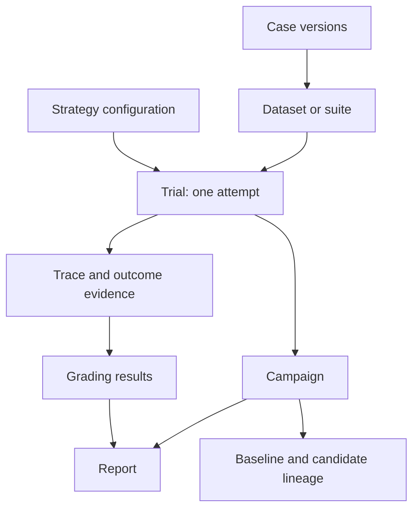
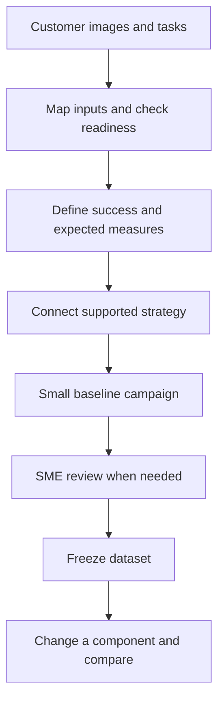

# ROVE Product Specification

**Version:** 0.5
**Updated:** 2026-09-12
**Status:** Current product vision and requirements. Capability status is explicit below; proposed features are not shipped functionality.

## 1. Core vision

**ROVE: Robot Observation & Vision Evaluation.**

**ROVE evaluates robotics agent pipelines on your task.**

Bring your task and data, configure the models and agents in your pipeline, and assess the outcomes that matter to your application. ROVE should make it quick to establish a baseline, inspect failed or uncertain cases, and compare a change under consistent conditions.

The unit being assessed is a configured robotics agent pipeline: its models, prompts, stage settings, tools and applicable action components. A strategy can combine vision-language reasoning, tool-using agents and action policies such as VLAs through supported adapters. An agent is a running system, while VLM and VLA describe model capabilities; these are not mutually exclusive choices. Perception or planning assessments do not require every action or simulation stage. The evaluation stays anchored to the customer's robotics task and business outcome.

ROVE is an inference and evaluation workbench. It does not train models or choose a deployment on the customer's behalf. It records outputs, grades and evidence so a person can make that decision. Human review can assess scene understanding and plan quality; claims about physical task completion require associated episode outcome evidence.

## 2. Target users

The three founding personas remain the product foundation, with the platform role broadened beyond one cloud provider.

### Persona 1: Robotics Researcher

Works at a robotics company, academic lab or AI lab on manipulation tasks, often using Python, simulators and VLA frameworks.

**Need:** Compare complete configurations on a task suite, understand variability, and attribute a difference to a controlled change rather than changed test conditions.

**ROVE journey:** Import cases, run repeated trials, inspect traces and measurements, preserve a baseline, and compare an ablation with a complete configuration diff. Existing CLI/API campaigns provide the repeated-trial foundation; explicit baseline lineage is proposed.

**Value:** Less evaluation scripting; clear case-level evidence, uncertainty, missing observations and reproducibility limits.

### Persona 2: ML Engineer on a Manipulation Team

Builds a product such as bin picking, assembly or kitting, with requirements for completion, cycle time, human intervention and operating constraints.

**Need:** Assess the team's models or agents on a customer's data, including customers who have images and tasks but no labeled evaluation dataset.

**ROVE journey:** Onboard the data, define success, run an initial baseline, ask a subject-matter expert (SME) to review cases and outputs, freeze the resulting dataset, and compare a candidate against the same requirements. The review/freeze workflow is proposed.

**Value:** A reusable customer evaluation set and an evidence-backed explanation of which tasks improve, fail or still need assessment.

### Persona 3: Platform / AI Infrastructure Team

Provides model endpoints, agent runtimes and evaluation infrastructure to development teams across local and hosted environments. Azure is one integration example, not the definition of this persona.

**Need:** Connect supported endpoints, preserve model/configuration identity and make results usable across tools without coupling the evaluation to one provider.

**ROVE journey:** Configure adapters and strategies, check compatibility, inspect runtime/model/tool versions and traces, share versioned evidence, and integrate external analytics when required.

**Value:** Reusable integration contracts and traceable results. PostgreSQL, Fabric/Databricks connectors, MCP services and hosted collaboration are not implied by this persona; see the capability table and current implementation.

An SME is a collaborator in these workflows, not a fourth replacement persona. A local reviewer identity records attribution without claiming enterprise authentication.

## 3. Concepts and terminology

Use [Anthropic's evaluation terminology](https://www.anthropic.com/engineering/demystifying-evals-for-ai-agents) for tasks/test cases, trials, graders, traces and outcomes. Campaign is ROVE's organizational concept, not a term attributed to that guidance.

| Concept | Meaning |
| --- | --- |
| Task / test case | A concrete test with defined inputs and success criteria. ROVE calls it a **Case** in the proposed UI; the task instruction describes the robotics goal. |
| Trial | One attempt at one case using one strategy. Running three strategies creates three trials. Regrading the same output does not create a new attempt. |
| Grader | Logic or human review that assesses a declared aspect of the result. ROVE's configured verify stage hosts task evaluators, required constraints and diagnostics. |
| Trace | The recorded outputs, calls, observations and intermediate results available for an attempt. A predicted action trajectory is not proof that actions executed. |
| Outcome | The resulting state or artifact being assessed. Plan quality, an agent decision and observed robot completion have different evidence requirements. |
| Suite / dataset revision | A selected collection of case versions. A frozen reviewed dataset also pins annotations, rubrics and reference-output links. |
| Strategy | A reusable named configuration of stages and endpoints. Its mutable name is not sufficient identity for old results. |
| Campaign | A named evaluation of cases, strategies and repetitions. Proposed version lineage connects baseline and candidate campaigns. |
| Provenance | Configuration, input, version and evidence identity attached to records; not another navigation level. |

Keep Cases, Trials, Campaigns and History as the working vocabulary. Dataset revisions are managed with cases. Do not introduce overlapping Experiment or Session entities. Existing evaluation IDs remain compatibility/grouping identifiers where needed.

This is the target conceptual model. Frozen dataset revisions, independent quick-trial records and baseline lineage are proposed extensions; the current campaign runner already records attempts against configured tasks and strategies.

## 4. Primary customer workflow

This proposed guided workflow should deliver a useful first report before requiring a large benchmark or external analytics platform. Input readiness distinguishes whether a case can run from whether its requested outcome can be graded. An image-to-plan agent should not be asked for joint state or a URDF unless its assessment needs them.

The first report shows accepted/completed, failed and unknown cases; representative failures link to evidence. It shows what is unreviewed or unmeasured. A configurable pilot checks data and grading before the full campaign, with attempt count and available budget information shown before launch.

Quick evaluations remain easy. Proposed durable recording captures their inputs and configuration before dispatch, preserves interruption, and lets the user create a campaign from history without copying or rerunning the original attempt. Post-hoc selected trials remain exploratory references, separate from planned reliability repetitions.

## 5. Create datasets and validate cases

A customer without labels can run the initial campaign and have an SME review three distinct targets:

1. **Case validity:** usable input, clear instruction and sufficient evidence for the stated assessment.
2. **Reusable annotation:** expected properties, constraints, acceptable alternatives or corrected reference labels.
3. **Output rating:** assessment of one trial output under a versioned rubric, with rationale and evidence.

Freeze exact case membership, annotations and rubric revisions with links to reference outputs/reviews. Failed outputs remain useful examples; dataset membership is not limited to successes. Exclusions retain reasons and history. A reference answer is not automatically ground truth or the only acceptable solution.

Candidate outputs receive their own grades. Baseline evidence can be regraded under the same rubric without increasing trial counts; original grades remain available. New task inputs require new case versions. Missing evidence remains unknown. Private grading material and baseline answers are excluded from candidate inputs unless that use is explicitly part of the evaluation.

## 6. Success definitions and meaningful measures

The proposed campaign setup uses one validated success/measurement contract from configuration or UI. Before launch, show the criteria, required evidence, grading source, repetition budget and measures expected in the report. Case success criteria and campaign performance targets are separate: changing a dashboard target must not rewrite task grades.

Prioritize measures tied to robotics and agent work:

- **Task correctness and completion:** scene/decision correctness, rubric-based plan acceptance or observed robot completion, with assessment scope explicit.
- **Reliability:** pass^k across repeated attempts; pass@k as a secondary at-least-one-success view, not proof of deployed retry or recovery behavior.
- **Constraints:** violations of declared force, contact, workspace or task constraints when their evidence is available.
- **Autonomy and recovery:** human assistance, interventions and recovery under defined conditions, only when recorded.
- **Time and resource use:** robot task duration separately from pipeline latency, plus cost or usage where measured.
- **Evidence coverage:** completed, ungraded, unknown, interrupted and excluded observations, with units and source quality.

The final report should lead with task outcomes and comparable differences. Collapsible details contain definitions, formulas, denominators, uncertainty assumptions, units, grader versions and links to underlying trials. Precision, recall and F1 are out of this iteration's scope.

The existing reports already calculate pass@k/pass^k, coverage, latency and configured verification measurements. The guided metric setup and additional intervention/recovery measures are proposed, not automatically available from today's inputs. See [success and performance measures](product/metrics-and-success.md).

### Inspect traces and measurements

Every report should support **outcome → trial → measurement or grade → stage/call → supporting evidence**. A developer must be able to inspect what the system observed, returned, requested and actually executed, including errors and incomplete recording. Measurements carry values, units, source quality and the exact evidence used; timing distinguishes stage work, pipeline wall time and robot task time.

The proposed trial inspector combines a timeline, stage/tool inputs and outputs, measurement details and relevant image/video/trajectory ranges. Baseline comparison aligns matching cases and assessment scope, exposes changed components and links differences to their source records. It supports failure investigation without presenting correlation as a proven cause.

Today, final stage results and structured check measurements are retained, but some live tool substeps disappear from durable history. Complete event capture, managed evidence links and aligned trace comparison are follow-up requirements, not shipped telemetry. See [traces and measurements](product/traces-and-measurements.md) and [ADR-022](architecture/ADR-022-trial-telemetry.md).

## 7. Baselines, ablations and evidence

The initial campaign can be a baseline reference even while SME review is pending. A scored comparison identifies the exact baseline strategy, cases, grades and coverage. Proposed campaign lineage preserves earlier references when the user selects a new baseline.

An ablation copies cases, repetitions and grading conditions and exposes both the intended component change and incidental differences. Renaming a strategy should not sever its relationship to a baseline. A changed evaluator, dataset or environment may require regrading or new matching trials; do not silently call it model improvement.

Robotics episode evidence must identify the producing configuration and attempt. Reusing policy A's recorded outcome cannot demonstrate policy B's performance. Matching seed labels alone do not establish matching physical conditions or statistical independence. Curated development data remains distinct from an independent held-out assessment.

## 8. Storage and integration direction

Use SQLite for the current local product, including results, reviews and version relationships. Use relational constraints, migrations, short transactions, indexes and backup/restore. Consider PostgreSQL if shared deployment needs justify it. Store large images, video and sensor/trajectory recordings separately and reference their identity and relevant range.

Keep schemas and IDs portable for future Fabric/Databricks integration. Parquet or Delta export is optional when needed; neither is required to record local trials. Configuration snapshots identify accessible artifacts and declared model versions, but do not automatically archive remote weights or recreate a physical environment.

### Evaluation harness and agent runtime

ROVE already has the core evaluation services: configured trials, execution orchestration, grading, evidence and reporting. Copilot SDK is the accepted shared runtime for agent behavior ROVE hosts: the evaluation assistant, configured strategy agents and agent graders where they add value. ROVE still validates and freezes cases, strategies, repetitions and success contracts; records trial lifecycle and evidence; and calculates reports from authoritative records.

ROVE owns these evaluation contracts and execution services while reusing Copilot's agent loop, tool and telemetry capabilities. A customer's agent remains the system under test: its runtime, tools, prompts and action interface become versioned components of a strategy. Direct customer agents, VLMs and VLAs remain evaluable through supported adapters. Adding Copilot planning or recovery around one creates a different combined strategy and must be compared explicitly. See the [target architecture](architecture/target-architecture.md), [ADR-023](architecture/ADR-023-evaluation-and-execution-harnesses.md), [ADR-024](architecture/ADR-024-copilot-runtime-and-observability.md) and the [dated model assessment](product/model-landscape-2026-09.md).

SDK session events feed ROVE's durable trial timeline; native OpenTelemetry and
ROVE spans support optional operational monitoring. Session persistence and sampled
monitoring data do not replace trial records or robotics evidence. Azure Monitor,
Application Insights, Log Analytics and Grafana are future optional destinations.
Versioned Fabric/Delta export remains a separate analytical integration.

## 9. Capability and delivery status

| Capability | Status at source commit 3bfd485 |
| --- | --- |
| Configured optional stages, supported models/agents and local dashboard | Implemented; adapter availability depends on installed dependencies and endpoints |
| Repeated campaigns, frozen selected configuration, SQLite trial records and HTML/JSON/CSV reports | Implemented in PR #13 |
| Local task evaluators, required constraints, optional FK diagnostics and versioned evidence | Implemented in PR #14 |
| Durable shared quick-trial recording and asset references | Proposed |
| Durable tool/event timeline, measurement drill-down and aligned trace comparison | Proposed; final stage outputs and check measurements exist today |
| ROVE evaluation services and Copilot shared agent runtime | Accepted direction in ADRs 023–024; existing pipeline retained, SDK integration and lifecycle extensions pending |
| Guided customer-data onboarding and expected-metric preview | Proposed |
| SME review, reusable annotations and frozen datasets | Proposed |
| Baseline/ablation lineage, component diffs and campaign version timeline | Proposed |
| PostgreSQL backend or Delta Lake integration | Future, demand-driven |
| Real closed-loop robot/simulator integration, universal adapter compatibility or safety certification | Not provided by the current release |

First validate the SDK/runtime contract, then deliver shared recording and inspectable trial evidence, sample-case contracts and SME review/dataset freezing, baseline comparisons and the guided assistant. Acceptance is completion of the local import → baseline → review → freeze → candidate → comparison journey, with restart recovery, preserved versions and truthful missing-evidence handling. The [sequenced delivery plan](product/implementation-plan.md) defines the task gates.

## 10. Related specifications and decisions

- [Concepts](product/concepts.md): vocabulary and current/proposed mappings.
- [Customer workflows](product/evaluation-workflows.md): persona stories, onboarding, SME review and acceptance criteria.
- [Metrics and success](product/metrics-and-success.md): configuration/UI contract and report explanations.
- [Traces and measurements](product/traces-and-measurements.md): trial timelines, evidence inspection and baseline diagnosis.
- [Model and harness assessment](product/model-landscape-2026-09.md): dated research informing architecture, not a ROVE benchmark.
- [Current implementation](architecture/current-implementation.md): actual code paths, APIs, storage and tests.
- [Target architecture](architecture/target-architecture.md) and [system diagram](architecture/system-diagram.md): logical responsibilities, processes, data and optional integrations.
- [Implementation plan](product/implementation-plan.md): sequenced tasks, dependencies and milestone acceptance.
- [Architecture decisions](architecture/README.md): ADRs 017–024 with diagrams and implementation status.
- [Campaign usage](BENCHMARKS.md) and [configured verification](VERIFICATION.md): supported configuration today.

Earlier versions of this file remain in Git history. The core vision and personas are retained; historical claims about unimplemented commands, full simulation, universal reproducibility or future integrations are not release guarantees.
