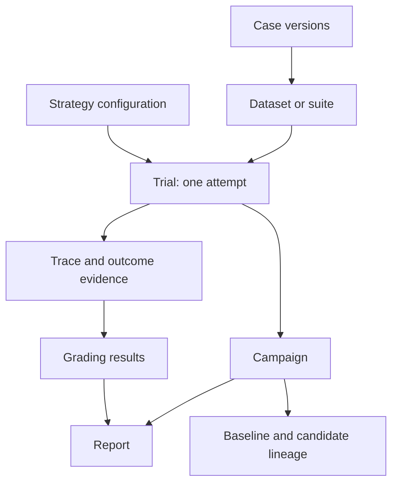
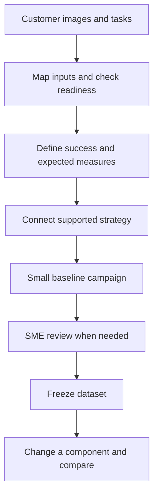

# ROVE Product Specification

**Version:** 0.8
**Updated:** 2026-09-12
**Status:** Current product vision and requirements. Capability status is explicit below; proposed features are not shipped functionality.

## 1. Core vision

**ROVE: Robot Observation & Vision Evaluation.**

**ROVE evaluates robotics agent pipelines on your task.**

Bring your task and data, configure the models and agents in your pipeline, and assess the outcomes that matter to your application. ROVE should make it quick to establish a baseline, inspect failed or uncertain cases, and compare a change under consistent conditions.

The unit being assessed is a configured robotics agent pipeline: its models, prompts, stage settings, tools and applicable action components. A strategy can combine vision-language reasoning, tool-using agents and action policies such as VLAs through supported adapters. An agent is a running system, while VLM and VLA describe model capabilities; these are not mutually exclusive choices. Perception or planning assessments do not require every action or simulation stage. The evaluation stays anchored to the customer's robotics task and business outcome.

ROVE is an inference and evaluation workbench. It does not train models or choose a deployment on the customer's behalf. It records outputs, grades and evidence so a person can make that decision. Human review can assess scene understanding and plan quality; claims about physical task completion require associated episode outcome evidence.

## 2. Target users

The three founding personas remain the product foundation, with the platform role broadened beyond one cloud provider.

### Persona 1: Robotics Researcher

Works at a robotics company, academic lab or AI lab on manipulation tasks, often using Python, simulators and VLA frameworks.

**Need:** Compare complete configurations on a task suite, understand variability, and attribute a difference to a controlled change rather than changed test conditions.

**ROVE journey:** Import cases, run repeated trials, inspect traces and measurements, preserve a baseline, and compare an ablation with a complete configuration diff. Existing CLI/API campaigns provide the repeated-trial foundation; explicit baseline references and component comparisons are implemented.

**Value:** Less evaluation scripting; clear case-level evidence, uncertainty, missing observations and reproducibility limits.

### Persona 2: ML Engineer on a Manipulation Team

Builds a product such as bin picking, assembly or kitting, with requirements for completion, cycle time, human intervention and operating constraints.

**Need:** Assess the team's models or agents on a customer's data, including customers who have images and tasks but no labeled evaluation dataset.

**ROVE journey:** Onboard the data, define success, run an initial baseline, ask a subject-matter expert (SME) to review cases and outputs, freeze the resulting dataset, and compare a candidate against the same requirements. The local review/freeze workflow is implemented.

**Value:** A reusable customer evaluation set and an evidence-backed explanation of which tasks improve, fail or still need assessment.

### Persona 3: Platform / AI Infrastructure Team

Provides model endpoints, agent runtimes and evaluation infrastructure to development teams across local and hosted environments. Azure is one integration example, not the definition of this persona.

**Need:** Connect supported endpoints, preserve model/configuration identity and make results usable across tools without coupling the evaluation to one provider.

**ROVE journey:** Configure adapters and strategies, check compatibility, inspect runtime/model/tool versions and traces, share versioned evidence, and integrate external analytics when required.

**Value:** Reusable integration contracts and traceable results. PostgreSQL, Fabric/Databricks connectors, MCP services and hosted collaboration are not implied by this persona; see the capability table and current implementation.

An SME is a collaborator in these workflows, not a fourth replacement persona. A local reviewer identity records attribution without claiming enterprise authentication.

## 3. Concepts and terminology

Use [Anthropic's evaluation terminology](https://www.anthropic.com/engineering/demystifying-evals-for-ai-agents) for tasks/test cases, trials, graders, traces and outcomes. Campaign is ROVE's organizational concept, not a term attributed to that guidance.

| Concept | Meaning |
| --- | --- |
| Task / test case | A concrete test with defined inputs and success criteria. ROVE calls it a **Case** in the UI; the task instruction describes the robotics goal. |
| Trial | One attempt at one case using one strategy. Running three strategies creates three trials. Regrading the same output does not create a new attempt. |
| Grader | Logic or human review that assesses a declared aspect of the result. ROVE's configured verify stage hosts task evaluators, required constraints and diagnostics. |
| Trace | The recorded outputs, calls, observations and intermediate results available for an attempt. A predicted action trajectory is not proof that actions executed. |
| Outcome | The resulting state or artifact being assessed. Plan quality, an agent decision and observed robot completion have different evidence requirements. |
| Suite / dataset revision | A selected collection of case versions. A frozen reviewed dataset also pins annotations, rubrics and reference-output links. |
| Strategy | A reusable named configuration of stages and endpoints. Its mutable name is not sufficient identity for old results. |
| Campaign | A named evaluation of cases, strategies and repetitions. Explicit references connect baseline and candidate campaigns. |
| Provenance | Configuration, input, version and evidence identity attached to records; not another navigation level. |

Keep Cases, Trials, Campaigns and History as the working vocabulary. Dataset revisions are managed with cases. Do not introduce overlapping Experiment or Session entities. Existing evaluation IDs remain compatibility/grouping identifiers where needed.

This is the target conceptual model. Independent quick and campaign trials now share durable identities, frozen configuration and history. Frozen dataset revisions, selected reviews and baseline references are now implemented locally.

## 4. Primary customer workflow

This local workflow is designed to deliver a useful first report before requiring a large benchmark or external analytics platform. Input readiness distinguishes whether a case can run from whether its requested outcome can be graded. An image-to-plan agent should not be asked for joint state or a URDF unless its assessment needs them.

The first report shows accepted/completed, failed and unknown cases; representative failures link to evidence. It shows what is unreviewed or unmeasured. A configurable pilot checks data and grading before the full campaign, with attempt count and available budget information shown before launch.

Quick evaluations remain easy. Durable recording now captures their inputs and configuration before dispatch and preserves interruption. Users can reopen a saved trial without running it again. Promotion preserves an existing quick trial as an exploratory reference and creates a reusable input case; a later campaign schedules fresh repetitions separately.

### Navigation and workspace design

The accepted navigation direction is **Start · Evaluate · Results · Configure**.
Start explains the workflow: cases and success → strategy and repetitions → results
and traces → baseline and improvement. Evaluate owns the Cases → Run → Review &
improve workspace, with one visible step and retained selections. Results owns
campaign reports/comparisons and subordinate trial inspection. Configure groups
strategies, models and settings. Quick run and manifest-based campaigns remain
secondary paths with their existing recording semantics.

Results returns to the exact campaign's review step through an explicit deep link.
Moving between steps never launches a trial or changes a frozen record. Existing
routes remain usable; navigation must preserve keyboard access, visible focus,
responsive layouts and both themes. This consolidation is being implemented;
browser acceptance is not yet claimed. See the [user journey](product/user-journey.md)
and [ADR-025](architecture/ADR-025-workflow-navigation.md) for route ownership,
compatibility and persona acceptance.

## 5. Create datasets and validate cases

A customer without labels can run the initial campaign and have an SME review three distinct targets:

1. **Case validity:** usable input, clear instruction and sufficient evidence for the stated assessment.
2. **Reusable annotation:** expected properties, constraints, acceptable alternatives or corrected reference labels.
3. **Output rating:** assessment of one trial output under a versioned rubric, with rationale and evidence.

Freeze exact case membership, annotations and rubric revisions with links to reference outputs/reviews. Failed outputs remain useful examples; dataset membership is not limited to successes. Exclusions retain reasons and history. A reference answer is not automatically ground truth or the only acceptable solution.

Candidate outputs receive their own grades. Baseline evidence can be regraded under the same rubric without increasing trial counts; original grades remain available. New task inputs require new case versions. Missing evidence remains unknown. Private grading material and baseline answers are excluded from candidate inputs unless that use is explicitly part of the evaluation.

The local implementation uses revision-checked drafts and immutable final reviews.
Dataset freezing checks its exact preview and preserves exclusions and disagreement.
The fully reviewed badge requires accepted validity and annotation reviews with
no unresolved disagreement; incomplete datasets expose their coverage. An explicit
contract binding can supply selected accepted frozen annotations to a participating
local verifier, retaining exact review IDs. Candidate stages and unrelated graders
receive none. Output ratings never become reusable labels automatically. Reviewer
names remain local attribution rather than authenticated organizational identities.

## 6. Success definitions and meaningful measures

The Cases workflow uses one validated, frozen success/measurement contract in its API and UI. Before launch, show the criteria, required evidence, grading source, repetition budget and measures expected in the report. Case success criteria and campaign performance targets are separate: changing a dashboard target must not rewrite task grades.

Prioritize measures tied to robotics and agent work:

- **Task correctness and completion:** scene/decision correctness, rubric-based plan acceptance or observed robot completion, with assessment scope explicit.
- **Reliability:** pass^k across repeated attempts; pass@k as a secondary at-least-one-success view, not proof of deployed retry or recovery behavior.
- **Constraints:** violations of declared force, contact, workspace or task constraints when their evidence is available.
- **Autonomy and recovery:** human assistance, interventions and recovery under defined conditions, only when recorded.
- **Time and resource use:** robot task duration separately from pipeline latency, plus cost or usage where measured.
- **Evidence coverage:** completed, ungraded, unknown, interrupted and excluded observations, with units and source quality.

The final report should lead with task outcomes and comparable differences. Collapsible details contain definitions, formulas, denominators, uncertainty assumptions, units, grader versions and links to underlying trials. Precision, recall and F1 are out of this iteration's scope.

Reports calculate pass@k/pass^k, coverage, pipeline latency and configured verification measurements. Versioned episode evidence supports completion time, autonomous completion, recovery and constraint aggregates with explicit denominators; missing evidence or zero eligible opportunities stays unavailable. HTML and JSON reports include aggregate measures and campaign targets; CSV remains one row per trial without repeated campaign aggregates. See [success and performance measures](product/metrics-and-success.md) and [robotics evidence](product/robotics-evidence.md).

### Inspect traces and measurements

Every report should support **outcome → trial → measurement or grade → stage/call → supporting evidence**. A developer must be able to inspect what the system observed, returned, requested and actually executed, including errors and incomplete recording. Measurements carry values, units, source quality and the exact evidence used; timing distinguishes stage work, pipeline wall time and robot task time.

The trial inspector combines saved configuration, verdicts, measurements, preserved stage outputs, producer-clock trace lanes and on-demand managed assets. Byte ranges and indexed JSON sample/frame/time ranges resolve through trial evidence identities; arbitrary video decoding and remote fetching are unsupported. Paired-trial views place baseline and candidate traces side by side while retaining separate unsynchronized clocks. Comparisons expose matching cases, assessment scope and changed components without presenting correlation as proven causation.

Quick and campaign paths retain events exposed by their orchestrator and optional Copilot runtime, alongside results and structured checks. Internal customer-agent calls still require adapter support; missing telemetry is not reconstructed. Native SDK spans, ROVE stage/tool ancestry and supplied clock identities remain inspectable locally. Cross-clock synchronization is never inferred from arrival order. See [Trial history](TRIAL_HISTORY.md), [traces and measurements](product/traces-and-measurements.md), [evidence and exchange](product/evidence-and-exchange.md) and [ADR-022](architecture/ADR-022-trial-telemetry.md).

## 7. Baselines, ablations and evidence

A completed initial campaign can be named and pinned as a baseline even while SME review is pending. Each immutable baseline revision captures its campaign/strategy, cases, contract, assessment revision set and outcomes, including unknowns. Renaming, unpinning or replacing a baseline creates a revision; later ratings do not rewrite a captured baseline. Candidate comparisons retain the selected revision. See [named baselines and confirmed assistance](product/named-baselines-and-assistant.md).

An ablation copies cases, repetitions and grading conditions and exposes both the intended component change and incidental differences. Renaming a strategy should not sever its relationship to a baseline. A changed evaluator, dataset or environment may require regrading or new matching trials; do not silently call it model improvement.

Robotics episode evidence must identify the producing configuration and attempt. Reusing policy A's recorded outcome cannot demonstrate policy B's performance. Matching seed labels alone do not establish matching physical conditions or statistical independence. Curated development data remains distinct from an independent held-out assessment.

## 8. Storage and integration direction

Use SQLite for the local product. The shared journal stores trials, snapshots, events, cases, reviews, frozen datasets, named baseline revisions, evidence references and operation identities with schema migrations and integrity checks. Observations, stage outputs and bounded auxiliary recordings are separate content-addressed assets. A complete backup preserves the journal, assets and separate campaign database together. The versioned exchange exports a validated relational manifest and assets and restores only into a fresh destination. It is a portable local format; PostgreSQL and cloud analytical connectors remain demand-driven.

The exchange manifest preserves schemas, identities, lineage and asset hashes for downstream transforms. Its JSONL tables are an interchange representation; SQLite remains the live store. Parquet and Delta/Fabric/Databricks connectors require justified workloads and target-specific validation. Configuration snapshots identify accessible artifacts and declared model versions, but do not archive remote weights or recreate a physical environment.

### Evaluation harness and agent runtime

ROVE already has the core evaluation services: configured trials, execution orchestration, grading, evidence and reporting. Copilot SDK is the accepted shared runtime for agent behavior ROVE hosts: the evaluation assistant, configured strategy agents and agent graders where they add value. ROVE still validates and freezes cases, strategies, repetitions and success contracts; records trial lifecycle and evidence; and calculates reports from authoritative records.

ROVE owns these evaluation contracts and execution services while reusing Copilot's agent loop, tool and telemetry capabilities. A customer's agent remains the system under test: its runtime, tools, prompts and action interface become versioned components of a strategy. Direct customer agents, VLMs and VLAs remain evaluable through supported adapters. Adding Copilot planning or recovery around one creates a different combined strategy and must be compared explicitly. See the [target architecture](architecture/target-architecture.md), [ADR-023](architecture/ADR-023-evaluation-and-execution-harnesses.md), [ADR-024](architecture/ADR-024-copilot-runtime-and-observability.md) and the [dated model assessment](product/model-landscape-2026-09.md).

SDK session events and captured native spans feed the durable trial record. The
configured Copilot adapter hosts perceive, plan and verify in fresh role-scoped
sessions; action stages use explicit integrations. Endpoint runtime contracts
describe memory, reset and telemetry coverage without attesting a customer reset.
The assistant prepares case import/revision, contracts, dataset freezing, named
baselines and campaign/ablation operations through validated services. Each write
requires its exact host confirmation; the assistant cannot manufacture SME reviews
or labels. Local telemetry copies can use a bounded loopback OTLP exporter, disabled
by default. Controlled real-SDK/CLI tests establish local infrastructure behavior,
not live-provider quality or a deployed cloud monitoring profile. Live provider,
Azure and hosted analytics validation remain specification-only in this delivery.
See [runtime lifecycle](architecture/runtime-lifecycle.md),
[local observability](architecture/runtime-observability.md) and the
[live-provider validation specification](product/live-provider-validation.md).

## 9. Capability and delivery status

| Capability | Status in the customer workflow implementation slice, 2026-09-12 |
| --- | --- |
| Configured optional stages, supported models/agents and local dashboard | Implemented; adapter availability depends on installed dependencies and endpoints |
| Repeated campaigns, frozen selected configuration, SQLite trial records and HTML/JSON/CSV reports | Implemented in PR #13 |
| Local task evaluators, required constraints, optional FK diagnostics and versioned evidence | Implemented in PR #14 |
| Durable shared quick/campaign trial recording and initial observation assets | Implemented; frozen snapshots, interrupted-work recovery and idempotent legacy quick-history import |
| Durable activity, evidence ranges and paired trace inspector | Implemented for supplied events and managed assets; separate source clocks, indexed JSON ranges and explicit missing coverage; no arbitrary remote fetch or video decoding |
| Copilot runtime for hosted perception, planning and verification | Optional pinned runtime with fresh role scopes, lifecycle contracts and controlled real-CLI validation; live-provider validation is specification-only |
| ROVE/native spans and optional monitoring | Local stage/tool correlation, native capture and bounded loopback OTLP export implemented; exporter disabled by default; no validated Azure/Grafana deployment |
| Evaluation assistant | Typed reads and host-confirmed case, contract, freeze, baseline and campaign/ablation operations implemented; no SME judgment or label-writing tools |
| Robot action integrations | Direct customer action adapters and the synthetic test world are supported; no Copilot hardware-action tools or hardware drivers |
| Customer intake, case revisions and expected-metric preview | Managed images and bounded auxiliary evidence, typed episode validation, deterministic action-dependent synthetic rollout and aggregate targets implemented |
| SME review, reusable annotations and frozen datasets | Optimistic drafts, immutable final reviews, atomic freezing and explicit frozen annotation-to-local-verifier bindings implemented |
| Baseline/ablation references, component diffs and quick promotion | Named/pinned immutable baseline revisions, captured assessments, paired traces and exploratory quick promotion implemented |
| Relational exchange; PostgreSQL or Delta Lake integration | Validated local exchange/restore implemented; PostgreSQL and cloud connectors remain demand-driven |
| Real closed-loop robot/simulator integration, universal adapter compatibility or safety certification | Not provided by the current release |

The local product connects durable trials to case contracts, approved labels, synthetic/recorded evidence, frozen datasets, named baselines and inspectable comparisons. The import → baseline → review → freeze → candidate → comparison journey preserves versions, restart recovery and missing evidence. The [sequenced delivery plan](product/implementation-plan.md) records current validation and separates local delivery from live-provider/cloud specifications, hardware drivers and demand-driven analytical integrations.

## 10. Related specifications and decisions

- [Concepts](product/concepts.md): vocabulary and current/proposed mappings.
- [Customer workflows](product/evaluation-workflows.md): persona stories, onboarding, SME review and acceptance criteria.
- [User journey and navigation](product/user-journey.md): primary destinations, staged evaluation, route ownership and accessibility acceptance.
- [Metrics and success](product/metrics-and-success.md): configuration/UI contract and report explanations.
- [Traces and measurements](product/traces-and-measurements.md): trial timelines, evidence inspection and baseline diagnosis.
- [Robotics evidence](product/robotics-evidence.md): action-dependent synthetic trials, typed recordings, frozen annotation bindings and aggregate targets.
- [Evidence and exchange](product/evidence-and-exchange.md): preserved ranges, clock-aware trace lanes and validated relational transfer.
- [Named baselines and assistance](product/named-baselines-and-assistant.md): immutable baseline assessments and confirmed workflow operations.
- [Runtime lifecycle](architecture/runtime-lifecycle.md) and [observability](architecture/runtime-observability.md): implemented role/reset boundaries and local telemetry.
- [Model and harness assessment](product/model-landscape-2026-09.md): dated research informing architecture, not a ROVE benchmark.
- [Current implementation](architecture/current-implementation.md): actual code paths, APIs, storage and tests.
- [Trial history and optional Copilot stages](TRIAL_HISTORY.md): local setup, inspector usage, privacy and complete backups.
- [Target architecture](architecture/target-architecture.md) and [system diagram](architecture/system-diagram.md): logical responsibilities, processes, data and optional integrations.
- [Implementation plan](product/implementation-plan.md): sequenced tasks, dependencies and milestone acceptance.
- [Architecture decisions](architecture/README.md): ADRs 017–024 with diagrams and implementation status.
- [Campaign usage](BENCHMARKS.md) and [configured verification](VERIFICATION.md): supported configuration today.

Earlier versions of this file remain in Git history. The core vision and personas are retained; historical claims about unimplemented commands, full simulation, universal reproducibility or future integrations are not release guarantees.
