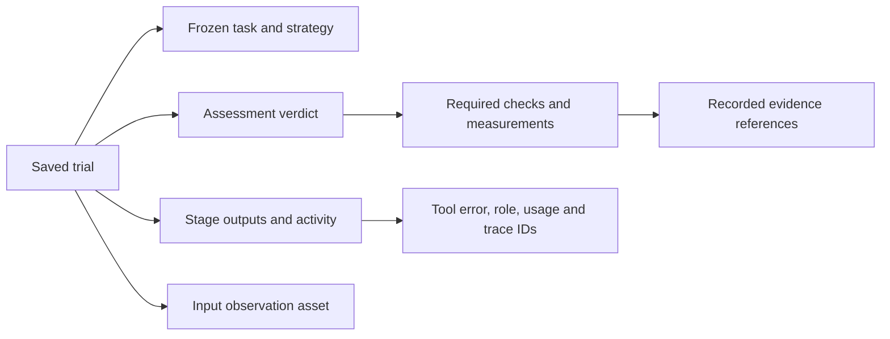

# Trial History and Optional Copilot Stages

ROVE saves one trial for each strategy attempt before execution starts. A quick
evaluation and a campaign attempt use the same history model. You can close the
page, restart ROVE and inspect a saved result without running the agent again.

## Start with an Existing Strategy

From the source checkout, install the normal local dependencies and start ROVE:

```sh
uv sync --frozen --extra dev --extra data --extra kinematics
uv run rove serve
```

Choose an image, task and strategy in **Evaluate**, then open **Trial history** in
the navigation. Copilot is optional: existing direct models, agents and synthetic
strategies do not require a Copilot installation or account.

The history view supports these workflows:

- **Robotics researcher:** reopen repetitions, inspect the saved configuration and
  required-check measurements, and follow the link to a campaign report.
- **Manipulation-team ML engineer:** inspect a failed or unknown assessment,
  its observation, stage outputs and supporting evidence references.
- **Platform / AI infrastructure engineer:** inspect endpoint settings and recorded
  stage/tool events, errors, supplied usage and trace identifiers.

Filter by quick, campaign or imported history, and use pagination for older trials.
Select a trial to obtain a shareable local URL ending in `?trial=ID`. **Refresh**
reloads saved state; it does not execute another attempt. Initial observation images
load only when requested. Non-image assets are downloadable. This is a local
application without user authentication, not an internet sharing service.

## Read the Evidence



Execution status and assessment verdict are different. A process can finish while
its outcome remains unknown. Required constraints override an optimistic task
judge; unavailable required evidence prevents a valid success claim. Synthetic or
estimated evidence does not establish observed robot task success. A cancelled
process does not prove that a robot stopped.

Expand the assessment, stage or event details to inspect the recorded payload.
Measurements preserve their units, source quality and references. The stage filter
helps follow one part of the pipeline. Arbitrary evidence strings are preserved;
they are not automatically fetched as remote files or resolved to video ranges.
Parallel trace graphs and aligned baseline comparisons are later work.

Usage is shown only when reported, and the summary covers **loaded event pages**.
Missing token counts are unknown, not zero. SDK content capture defaults off, so a
tool's arguments or response may be redacted even though its activity is recorded.
Some direct customer adapters expose only stage-level activity. No event stream can
reconstruct an internal call that its producer never supplied.

## Add an Optional Copilot Strategy

The current compatibility profile is Python SDK `github-copilot-sdk==1.0.13` with
Copilot CLI `1.0.81-9`. Install that CLI separately and make its executable available
on `PATH`, or configure `cli_path`. The runtime checks the CLI version and disables
automatic updates. Install the optional Python dependencies:

```sh
uv sync --frozen --extra dev --extra data --extra kinematics --extra copilot
copilot --version
uv run python scripts/probe_copilot.py
```

The probe uses the real SDK and CLI with controlled synthetic responses. It does
not contact a model service or establish model quality. It validates the local
image/tool/event/usage and trace contract. See the
[compatibility record](architecture/copilot-compatibility.md) for exact evidence
and remaining live-provider gates.

For a provider you have configured, add an agent endpoint and strategy to
`rove.yaml`. The following is a configuration template, not a tested provider:

```yaml
endpoints:
  hosted-reasoner:
    type: agent
    adapter: copilot_agent
    capabilities: [scene_analysis, task_planning, verification]
    config:
      model: your-image-capable-model
      cli_path: copilot
      timeout_seconds: 60
      provider:
        type: openai
        base_url: https://your-provider.example/v1
        wire_api: completions
        api_key_env: ROVE_MODEL_API_KEY

strategies:
  hosted-planning:
    display_name: Copilot planning assessment
    perceive: hosted-reasoner
    plan: hosted-reasoner
    verify: hosted-reasoner
```

Replace the example model and provider URL with your actual deployment. Set
`ROVE_MODEL_API_KEY` outside the configuration file; `api_key_env` resolves that
credential by name. The loader does not expand arbitrary `${VARIABLE}` placeholders
inside this configuration. The model must support the configured SDK protocol and
image input; an arbitrary VLA endpoint is not made compatible by this template.
Configured provider calls may incur model
charges. Azure identity and deployment profiles have not yet been validated.

Perception and planning use fresh candidate scopes; verification uses a fresh grader
scope. Every stage gets a separate session and temporary workspace, with no ambient
Copilot login, filesystem tools or cross-stage conversation memory. Structured stage
outputs still flow through ROVE's pipeline. The configured adapter currently exposes
no robot tools and rejects `act`; use a direct action adapter for that stage.
The shared runtime's role-scoped tool interface is a foundation for later assistant
and robot integration work, not an existing guided assistant.

## Storage, Recovery and Backup

By default, the local source checkout stores:

| Path | Contents |
| --- | --- |
| `.rove/benchmarks/trials.sqlite3` | Shared trial identities, snapshots, lifecycle, events and asset metadata |
| `.rove/benchmarks/assets/` | Private content-addressed observation files |
| `.rove/benchmarks/campaigns.sqlite3` | Existing campaign plans, slot results and reporting data |
| `.rove/benchmarks/quick-history.jsonl` | Private compatibility projection of new quick results, linked by trial ID |
| `data/output/history.jsonl` | Original legacy import source; new results are not appended here |

Snapshots redact recognized credentials and reduce inline media to references.
Tasks, observations, outputs and free text can still contain customer information;
the journal is not a sanitized publication artifact. Keep databases and assets
private. Managed assets are outside the public `/data` mount and are served through
validated content-addressed routes. A missing file remains unavailable.

On startup, one UI process owns the quick journal lock and marks abandoned quick
attempts interrupted. Legacy JSONL imports idempotently; missing original snapshots
remain unknown. Campaign resume reconciles shared IDs under the campaign lock and
does not replay a slot that may already have reached a model or robot integration.
Old campaigns remain available in reports; they are not all backfilled into the
new shared history automatically.

For a complete backup, stop the UI and campaign workers and copy the entire
`.rove/benchmarks/` directory to a private backup location. Preserve
`data/output/history.jsonl` separately if legacy history is needed. Restore the
directory while ROVE is stopped, keeping the database and its assets together.
`TrialStore.backup(path)` provides a consistent SQLite backup for the shared journal
only: it does **not** copy assets or `campaigns.sqlite3`. Copying just that database
is not a complete evaluation backup. The current store checks schema versions and
rejects unsupported revisions.

OpenTelemetry is optional. Installing the Copilot extra enables ROVE trial span
identities; exporters require configuration. SDK native telemetry settings are
accepted by the runtime, with content capture off by default. No Azure Monitor,
Grafana or external collector is required for local history. Real collector-outage
validation and export profiles remain pending; the initial controlled probe is not
proof of those integrations.

See [current implementation](architecture/current-implementation.md),
[ADR-024](architecture/ADR-024-copilot-runtime-and-observability.md) and the
[remaining delivery sequence](product/implementation-plan.md).
