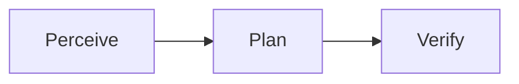
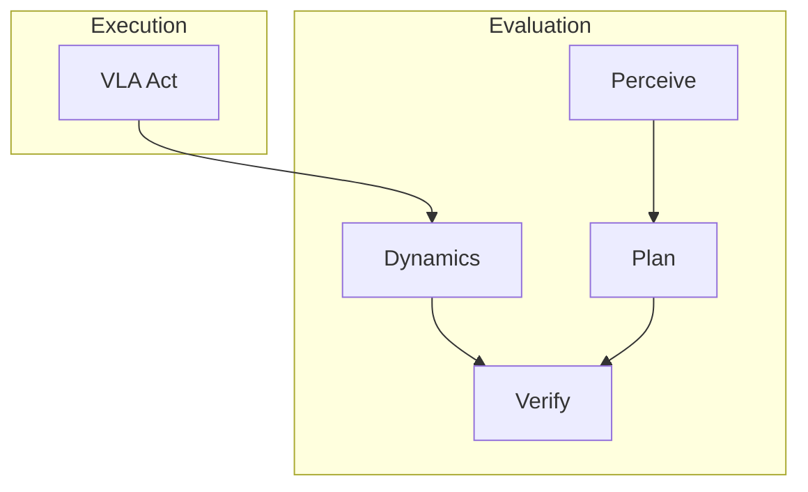

# ADR-014: Two-Phase Pipeline — Execution vs Evaluation

**Status:** Accepted
**Date:** 2026-03-01

## Context

The original pipeline visualizes perceive → plan → act → verify as a linear sequence, implying that perceive and plan outputs feed into the VLA. This is misleading for VLA strategies.

VLAs (pi0.5, SmolVLA, OpenVLA, CogACT) take only `image + short task string + proprioception` as input. They have 64-200 token context windows and never consume perceive or plan outputs. The perceive and plan stages actually serve the **verifier** as evaluation context, not the VLA as execution input.

Additionally, MuJoCo dynamics computation was embedded inside the act stage, inflating reported VLA latency and making dynamics invisible as a distinct evaluation step.

## Decision

Restructure the pipeline into two modes:

### Sequential Mode (no VLA)

Unchanged linear flow. Used when no VLA adapter is assigned to the act stage.

All stages may include an optional act stage (for agent-based tool calls). No phase labels are applied.

### Parallel Mode (VLA present)

VLA execution runs independently. Perceive, plan, dynamics, and verify run as evaluation steps that assess the VLA's output.

Key properties:
- **VLA runs first** — it only needs `image + task + proprioception`, not perceive/plan output
- **Perceive and plan are evaluation context** — they inform the verifier, not the VLA
- **Dynamics is a first-class stage** — extracted from act, with its own latency tracking
- **Phase labels** — each stage result carries `phase: "execution"` or `phase: "evaluation"`
- **Auto-detection** — `pipeline_mode` is set on the Strategy model; the RunManager reads it when building pipelines

### Pipeline Mode Detection

The `pipeline_mode` field on `Strategy` defaults to `"sequential"`. Strategies with a VLA assigned to the act stage should set `pipeline_mode: "parallel"` in `rove.yaml`. The dashboard uses this to choose between linear and two-phase layouts.

### Dynamics as a Separate Stage

`PipelineStage.DYNAMICS` is added to the enum. In parallel mode, dynamics runs as its own stage after the VLA completes, yielding a `PipelineStageResult(stage="dynamics", phase="evaluation")`. In sequential mode, dynamics remains bundled within the act stage for backward compatibility.

## Consequences

### Positive

- **Honest data flow** — the dashboard no longer implies VLAs consume perceive/plan output
- **Accurate VLA latency** — act stage latency reflects only VLA inference time, not dynamics computation
- **Dynamics visibility** — users see dynamics as a separate evaluation step with its own latency
- **Phase-aware dashboard** — VLA strategies display "Execution" then "Evaluation" headers
- **Extensible evaluation** — future evaluation layers (sim, world models) slot into the evaluation phase naturally

### Negative

- **Two code paths** — sequential and parallel pipelines must both be maintained and tested
- **Dashboard complexity** — phase headers add visual complexity for VLA strategies

### Neutral

- Sequential strategies are completely unchanged — no regression risk for VLM-only workflows
- Failure attribution updated to handle dynamics as both a standalone stage and embedded in act output
