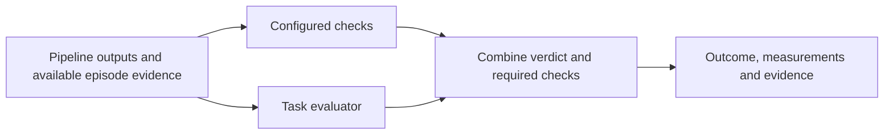

# ADR-017: Configure verification within existing pipeline stages

**Status:** Accepted, recorded retrospectively
**Implementation status:** Implemented in [PR #14](https://github.com/niksacdev/rove/pull/14)
**Date:** 2026-09-12
**Related:** [Concepts](../product/concepts.md), [evaluation workflows](../product/evaluation-workflows.md), [verification guide](../VERIFICATION.md)

## Context

ROVE already lets a strategy select perceive, plan, act and verify endpoints.
Robot developers need task-specific completion criteria and supporting checks without
making forward kinematics (FK) the definition of task success. A plausible trajectory
does not establish that an object reached its target or that a force limit was respected.
The extension must retain existing strategies and distinguish missing evidence from failure.

## Decision

Extend stage configuration with an endpoint and optional timeout. The verify stage also
declares its execution mode and checks. Developers provide a task evaluator through the
existing adapter registry; there is no separate pre/post hook system.

Each check declares `diagnostic` or `constraint`, and whether it is required. Required
checks run before the task evaluator in both precompute and agent-loop modes. Optional
checks are precomputed or exposed as tools; results are cached within the trial.
A failed required constraint vetoes success. Unavailable required evidence makes the
outcome unknown. Optional diagnostics cannot establish or override task completion.

Typed evaluator results retain pass/fail/unknown, reasoning, evidence references and
quality. Numeric measurements retain units and quality; unknown values remain absent.
Known verdicts require declared evidence. The orchestrator uses actual check results,
not check-shaped assertions supplied by an evaluated model.

FK wraps the existing dynamics calculation as diagnostic evidence. Configuration rejects
it as the primary task evaluator or a constraint. Its detailed computed/estimated/unknown
labels remain available without converting a kinematic estimate into observed completion.

Local evaluators run as trusted Python in cancellable child processes. Stage and check
deadlines bound their work. This is process isolation for execution control, not a sandbox
for untrusted code. Local task evaluators use precompute; legacy string stages remain valid.

## Alternatives and tradeoffs

- A new hooks framework would duplicate stage selection, ordering and configuration.
- A fixed built-in success test would exclude valid robotics tasks and evidence sources.
- Arbitrary developer evaluators offer flexibility but require explicit evidence contracts
  and trusted code. ROVE validates structure; it cannot authenticate supplied observations.
- Entry-module hashes, declared revisions and aggregation versions prevent some silent
  drift. Imported helpers, remote weights and external assets are not a complete snapshot.

## Implementation and validation

- [Typed configuration and evidence](../../src/rove/models/verification.py),
  [configuration validation](../../src/rove/models/config.py), and
  [verification orchestration](../../src/rove/orchestrator/pipeline.py).
- [Local evaluator adapter](../../src/rove/adapters/local_verifier.py),
  [FK adapter](../../src/rove/adapters/forward_kinematics.py), and
  [campaign freezing](../../src/rove/benchmarks/runner.py).
- [Regression tests](../../tests/test_configured_verification.py) cover required-check
  enforcement, caching, invalid output, timeouts, source drift and forged model evidence.
- [Synthetic placement examples](../../examples/verification/) cover success, force-limit
  failure and missing final sensing. Regrading these fixed observations tests evaluators;
  it does not demonstrate improved robot performance by a newly selected policy.
