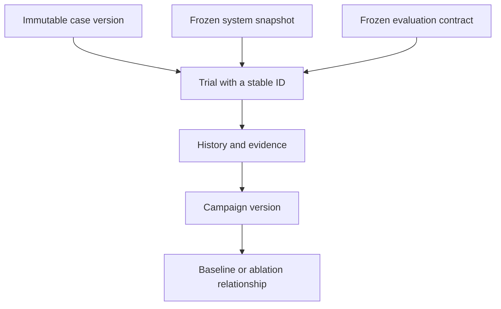

# ADR-018: Preserve trial identity and campaign version lineage

**Status:** Proposed
**Implementation status:** Follow-up design; shared quick-trial recording and lineage are pending
**Date:** 2026-09-12
**Related:** [Concepts](../product/concepts.md), [evaluation workflows](../product/evaluation-workflows.md), [ADR-019](ADR-019-relational-storage-and-assets.md)

## Context

Campaigns already freeze configuration and store attempts, but quick evaluations use a
separate history path and assemble provenance after execution. Configuration hashes do
not preserve the loaded configuration. Current trends depend on unchanged strategy IDs
and a broad runtime fingerprint, which limits comparison of renamed strategies and ablations.
Developers need to explain yesterday's result after changing today's system.

## Decision

Use Cases, Trials and Campaigns as the user-facing hierarchy. A case contains the task
instruction, inputs, conditions and criteria. One strategy attempting it once is a trial.
A campaign names a collection of cases, configurations and repetitions, with immutable
versions. Baseline and ablation are roles and links, not additional execution containers.
Do not add an Experiment or persisted Session entity; use Connection for connection state.

Capture the actual selected configuration, input references and trial ID before execution.
Persist lifecycle changes and terminal outcomes, including errors. Recovery marks unresolved
attempts interrupted/unknown; deliberate retries receive new linked IDs. Record requested
and applied/unsupported seed status separately. A seed is neither trial identity nor proof
of a reproducible physical reset.

Keep two immutable records. The **system snapshot** describes model/checkpoint identity,
prompts, stage settings, action normalization, controller, code and dependencies. The
**evaluation contract** describes exact case versions, grading and constraint definitions,
evidence mode, reset/environment conditions, budgets, repetition plan and aggregation.
Retain a full execution fingerprint for drift detection during attempts. Unknown versions
remain unknown; a hash does not archive weights or recreate a physical environment.

Related campaign executions retain their IDs and gain parent/root lineage. A baseline
reference selects an exact campaign version and strategy snapshot. Creating an ablation
copies its cases and evaluation conditions, records the intended change, and previews all
configuration differences. Changing the selected baseline preserves earlier references.

Promotion links a quick trial to a campaign without copying its evidence or changing its
snapshot. A trial selected after seeing its result remains an exploratory reference by
default; newly planned repetitions have a separate denominator. Three selected strategies
produce three trials, even when launched by one Run action.

## Alternatives and tradeoffs

- Strategy names alone are convenient labels but cannot identify past configurations.
- A new experiment/session container adds navigation without resolving immutable identity.
- Removing the runtime guard would enable misleading comparisons. Separate comparison
  rules from execution identity, and remain conservative about unattributed shared-code changes.
- Compare matching cases and conditions across configuration names. Pair trials only when
  the study supports pairing; matched seed labels alone are insufficient. A score difference
  does not prove causation, and regrading one recording does not create another robot attempt.

## Implementation boundaries and acceptance

Extend [campaign models/store](../../src/rove/benchmarks/store.py),
[snapshot preparation](../../src/rove/benchmarks/runner.py),
[report comparison](../../src/rove/benchmarks/report.py), and
[quick evaluation/history](../../src/rove/api/app.py). Existing
[campaign tests](../../tests/test_benchmarks.py) cover interruption and drift, not this full design.

- Restart retains every started quick trial; recovery never silently retries robot actions.
- Strategy or input edits cannot change an old trial's saved explanation.
- Promotion preserves IDs and does not double-count exploratory evidence.
- Renamed strategies compare under matching contracts; changed graders or conditions expose
  incompatibility. Missing evidence and unsupported seeds remain explicit.
- History shows baseline versions and component differences without loading heavy assets.
