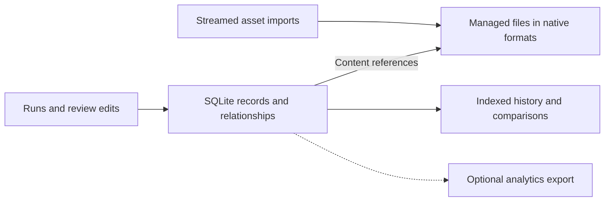

# ADR-019: Keep local records relational and large assets separate

**Status:** Accepted direction
**Implementation status:** Campaign SQLite exists; shared typed storage and asset migration are pending
**Date:** 2026-09-12
**Related:** [Concepts](../product/concepts.md), [evaluation workflows](../product/evaluation-workflows.md), [ADR-018](ADR-018-trial-lineage-and-snapshots.md)

## Context

ROVE is a local OSS application. Live attempts, history, baseline links and review edits
need durable transactions and indexed queries. Campaigns currently use SQLite with JSON
payloads, quick history uses JSONL, and benchmark cases embed base64 images. These patterns
need consolidation before large recordings or long-lived history become routine.

## Decision

Use SQLite as the authoritative local database for lifecycle state, completed results,
typed measurements, case/configuration identities, campaigns, reviews and dataset membership.
Keep a small data-access boundary and versioned schema. Introduce PostgreSQL only when a
shared deployment requires centralized access, multiple application instances or greater
concurrent-write capacity; do not maintain two backends for a hypothetical deployment.

Store searchable dimensions and scalar measurements in typed columns. Small heterogeneous
configurations and manifests may remain JSON documents. Preserve numeric nulls, units,
coordinate frames, evidence quality, producer/evaluator identity and UTC timestamps.
Use foreign keys, uniqueness/value constraints, transactional migrations, short transactions,
bounded lock waits and paginated queries. Review edits and dataset freezes need revision
checks. Keep the database on local storage; consider WAL for local reader/writer concurrency.

Store images, video, trajectories, sensor logs and large traces as separate asset files.
Stream imports, hash complete content and deduplicate by identity. Commit references only
after files are complete. References carry role, hash, size, media type, relevant schema,
and optional episode/frame/time range; signal metadata carries units and calibration.
Preserve source formats and read only the needed range. Encode one bounded image as base64
at an adapter boundary when required, rather than encoding a whole stored episode.

Managed assets belong outside the public example mount. External references declare
availability and immutability limits. A path locates data; a hash identifies bytes but does
not authenticate a producer. Shareable metadata excludes secret values, signed credentials
and private absolute paths. Import legacy JSONL idempotently, retaining IDs and a backup;
missing historical provenance stays missing. Accept legacy inline images at import.

## Alternatives and tradeoffs

- JSON/JSONL support small manifests and exchange, but whole-file scans and rewrites are
  unsuitable as authoritative history. SQLite adds migrations and backup responsibilities.
- Storing large media in database rows or base64 payloads simplifies packaging but increases
  copying and couples history queries to episode size. Separate assets require availability checks.
- Parquet/Delta can support later Fabric or Databricks delivery. They are optional export
  formats, not required local infrastructure or a second operational source of truth.
- If export is needed, publish typed batches from committed records with stable IDs,
  record/schema versions and a checkpoint. Avoid independent live dual writes and one file
  per trial. Plain Parquet must be ingested through a Delta writer to form a Delta table.

## Implementation boundaries and acceptance

Extend [CampaignStore](../../src/rove/benchmarks/store.py),
[case inputs](../../src/rove/benchmarks/models.py),
[worker input handling](../../src/rove/benchmarks/worker.py), and
[quick history](../../src/rove/api/app.py). These sources show current foundations, not the migration.

- Legacy import is repeatable without duplicate rows or invented snapshots; backup/restore works.
- Many trials reuse one asset; history and scalar comparisons never load its full contents.
- Interrupted imports expose no incomplete asset; unavailable external evidence is explicit.
- Database constraints and revision checks prevent lost reviews and mixed-version dataset freezes.
- Optional exports preserve counts, nulls, units and IDs on retry; cloud integration is not
  claimed tested until exercised against an actual supplied workspace.
