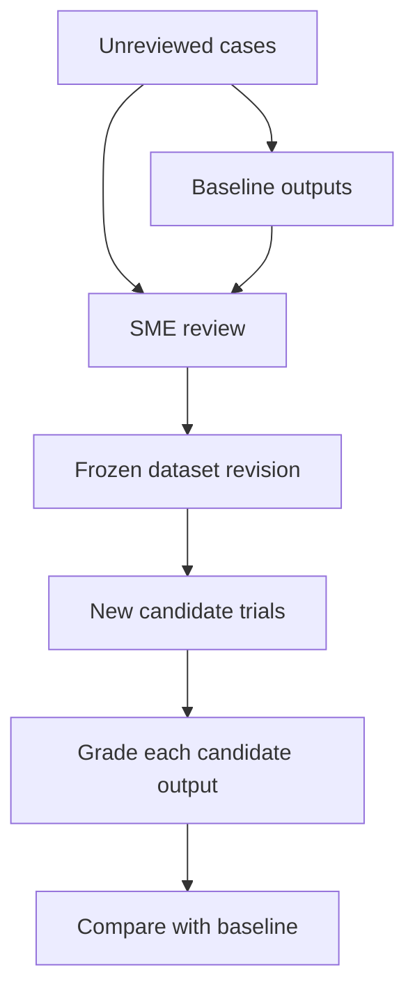

# ADR-020: Freeze reusable datasets through explicit SME review

**Status:** Proposed
**Implementation status:** Review records, review UI and dataset freezing are pending
**Date:** 2026-09-12
**Related:** [Concepts](../product/concepts.md), [evaluation workflows](../product/evaluation-workflows.md), [ADR-019](ADR-019-relational-storage-and-assets.md)

## Context

A robotics developer may start with camera images and task instructions, without approved
labels or recorded robot outcomes. Baseline outputs help a subject-matter expert (SME)
identify useful cases and assess perception or planning. Existing reference-label fields
can consume some annotations, but do not provide review history or a frozen dataset workflow.
Generated outputs must not silently become ground truth for subsequent strategies.

## Decision

Support import → baseline campaign → SME review → frozen dataset → candidate comparison.
Review lives within a campaign; dataset revisions live under Cases and supply campaign inputs.
They are selections of evaluation material, not another execution container.

Keep three review targets distinct:

| Target | Meaning | Reuse |
| --- | --- | --- |
| Case validity | Usable input/task for a declared scope; needs information or exclusion | Case eligibility and exclusion reasons |
| Case annotation | Approved labels, expected properties, acceptable alternatives or constraints | Grading material for that case version |
| Trial output | Rating of one output/trace against a specific rubric | Baseline assessment or grader calibration |

Save drafts and finalized review revisions with their target case version or output hash,
rubric revision, assessment scope, criterion values, rationale, evidence references,
reviewer identifier, timestamp and superseded-review link. Human/model/code grader identity
is separate from evidence origin. Unknown or not-assessable ratings remain available.
Single-SME local review is sufficient initially; a local name is not authenticated identity.
Preserve multiple reviews and expose disagreement rather than silently selecting the latest.

Dataset freezing previews exact case versions, approved annotation/rubric revisions,
reference-trial/review links and exclusions, then commits that selection atomically with
a content identity. Later corrections create new revisions. Invalid inputs may be excluded
with reasons; valid cases with failed outputs remain useful. Incomplete or disputed required
reviews prevent a fully-reviewed label, not preservation of the incomplete dataset itself.

An accepted output may illustrate one valid answer; candidates need their own ratings.
Keep approved answers and future observations out of candidate inputs unless explicitly
part of the evaluation. A plan-quality rating is expert judgment of a proposal, not evidence
of robot completion. Completion requires appropriate episode outcome evidence.

## Alternatives and tradeoffs

- Automatically treating baseline outputs as labels is easy but reproduces their errors and
  penalizes other valid answers. Explicit review separates labels from output-specific judgments.
- Overwriting grades after rubric changes destroys comparison history. Regrade stored baseline
  evidence under the selected rubric while retaining earlier grades; this creates a grading
  revision, not another trial. Missing evidence stays unknown or requires a fresh execution.
- Curation can bias results. Preserve exclusions and show the baseline's original and selected
  matching cohorts. A development dataset is not an independent held-out test after tuning on it.
- Team assignment, authentication, adjudication tooling and automatic judge training can follow
  actual demand. Human review alone does not configure a grader for future outputs.

## Implementation boundaries and acceptance

Build on [example inputs](../../src/rove/api/app.py), [ExampleData](../../src/rove/models/core.py)
and [the relational store](../../src/rove/benchmarks/store.py). The SME workflow does not exist yet.

- Restart restores review drafts and assessments; conflicting revisions cannot overwrite silently.
- Freezing preserves exact membership and reviews; later edits cannot alter previous reports.
- Candidate outputs are assessed independently, and different valid answers can pass.
- Plan-only review keeps physical completion unknown; regrading never increases trial counts.
- Complete import-to-candidate without manual database edits; show review coverage and unknowns.
