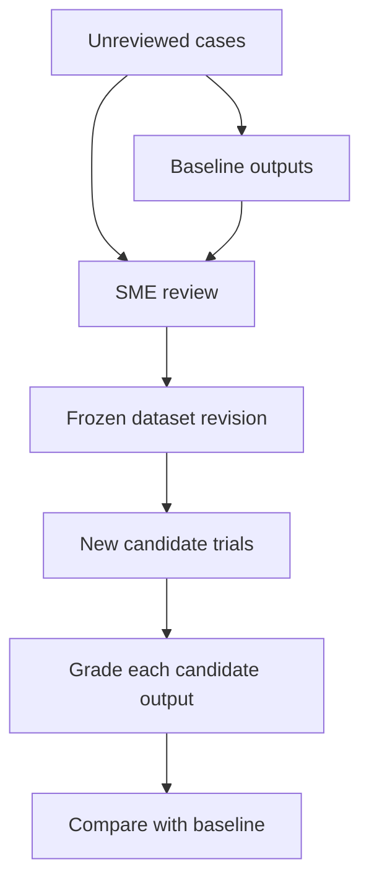
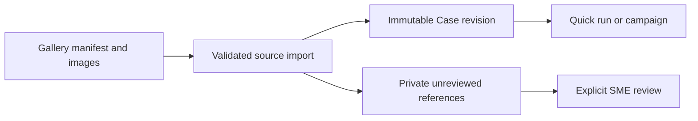

# ADR-020: Freeze reusable datasets through explicit SME review

**Status:** Accepted
**Implementation status:** Local attributed review drafts, immutable final reviews and previewed dataset freezing implemented
**Date:** 2026-09-12
**Related:** [Concepts](../product/concepts.md), [evaluation workflows](../product/evaluation-workflows.md), [ADR-019](ADR-019-relational-storage-and-assets.md)

## Context at proposal

A robotics developer may start with camera images and task instructions, without approved
labels or recorded robot outcomes. Baseline outputs help a subject-matter expert (SME)
identify useful cases and assess perception or planning. Existing reference-label fields
can consume some annotations, but do not provide review history or a frozen dataset workflow.
Generated outputs must not silently become ground truth for subsequent strategies.

## Decision

Support import → baseline campaign → SME review → frozen dataset → candidate comparison.
Review lives within a campaign; dataset revisions live under Cases and supply campaign inputs.
They are selections of evaluation material, not another execution container.

Keep three review targets distinct:

| Target | Meaning | Reuse |
| --- | --- | --- |
| Case validity | Usable input/task for a declared scope; needs information or exclusion | Case eligibility and exclusion reasons |
| Case annotation | Approved labels, expected properties, acceptable alternatives or constraints | Grading material for that case version |
| Trial output | Rating of one output/trace against a specific rubric | Baseline assessment or grader calibration |

Save drafts and finalized review revisions with their target case version or output hash,
rubric revision, assessment scope, criterion values, rationale, evidence references,
reviewer identifier, timestamp and superseded-review link. Human/model/code grader identity
is separate from evidence origin. Unknown or not-assessable ratings remain available.
Single-SME local review is sufficient initially; a local name is not authenticated identity.
Preserve multiple reviews and expose disagreement rather than silently selecting the latest.

Dataset freezing previews exact case versions, approved annotation/rubric revisions,
reference-trial/review links and exclusions, then commits that selection atomically with
a content identity. Later corrections create new revisions. Invalid inputs may be excluded
with reasons; valid cases with failed outputs remain useful. Incomplete or disputed required
reviews prevent a fully-reviewed label, not preservation of the incomplete dataset itself.

An accepted output may illustrate one valid answer; candidates need their own ratings.
Keep approved answers and future observations out of candidate inputs unless explicitly
part of the evaluation. A plan-quality rating is expert judgment of a proposal, not evidence
of robot completion. Completion requires appropriate episode outcome evidence.

## Alternatives and tradeoffs

- Automatically treating baseline outputs as labels is easy but reproduces their errors and
  penalizes other valid answers. Explicit review separates labels from output-specific judgments.
- Overwriting grades after rubric changes destroys comparison history. Regrade stored baseline
  evidence under the selected rubric while retaining earlier grades; this creates a grading
  revision, not another trial. Missing evidence stays unknown or requires a fresh execution.
- Curation can bias results. Preserve exclusions and show the baseline's original and selected
  matching cohorts. A development dataset is not an independent held-out test after tuning on it.
- Team assignment, authentication, adjudication tooling and automatic judge training can follow
  actual demand. Human review alone does not configure a grader for future outputs.

## Implementation boundaries and acceptance

The [dataset service](../../src/rove/datasets/service.py) implements case validity,
explicit annotations and trial-output reviews as distinct targets. Output reviews
must match a finished retained trial, its case revision and frozen rubric. The
server hashes the reviewed output. Draft updates require the expected revision;
final corrections retain the target, rubric and reviewer and create a superseding
record. Local reviewer names are attribution, not authenticated identity.

Freeze previews pin case/review membership and expose active disagreement,
including conflicting accepted annotation values. The exact preview hash is
checked inside the freeze transaction. Existing datasets cannot change when cases
or reviews are revised. The current fully reviewed badge requires selected accepted
case-validity and annotation reviews; incomplete datasets remain usable with
coverage shown. Output ratings alone do not create reusable labels.

Approved annotations are stored for inspection, not automatically injected into
future candidates or graders. Configured grading remains explicit. Automatic
annotation mapping, team adjudication and judge training remain follow-up work.
Regression coverage is in [test_datasets.py](../../tests/test_datasets.py).

Build on [example inputs](../../src/rove/api/app.py), [ExampleData](../../src/rove/models/core.py)
and [the relational store](../../src/rove/trials/store.py). The following criteria
continue to guide extensions beyond the implemented local workflow.

- Restart restores review drafts and assessments; conflicting revisions cannot overwrite silently.
- Freezing preserves exact membership and reviews; later edits cannot alter previous reports.
- Candidate outputs are assessed independently, and different valid answers can pass.
- Plan-only review keeps physical completion unknown; regrading never increases trial counts.
- Complete import-to-candidate without manual database edits; show review coverage and unknowns.

## Existing sample library

The original gallery is imported idempotently into the same immutable Case store.
A source content change creates a revision; source refreshes preserve a manually
edited case head. Original source/license metadata stays attached, and reference
answers stay in private `reference_data`, separate from candidate input and recorded
episode evidence. Import creates neither trial results nor SME approvals.

See [library import](../../src/rove/datasets/library.py) and
[regression tests](../../tests/test_sample_library.py).
