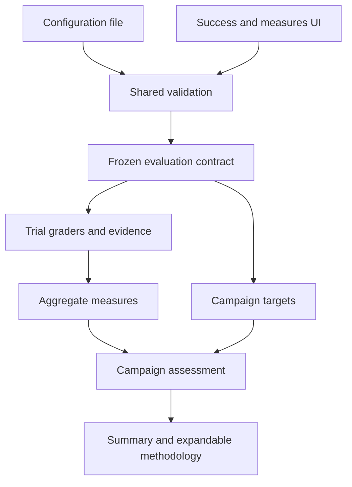

# ADR-021: Campaign success definitions and report explanations

**Status:** Accepted; local contracts, explicit frozen-label bindings, synthetic episode measures and aggregate target evaluation implemented. Real provider/robot validation remains separate.

## Context at proposal

ROVE already grades trials through configured verification and summarizes repeated
attempts with pass@k/pass^k. Developers also need to declare desired campaign results
before running and understand why a measure is available. Duplicating grading
definitions in the dashboard would let configuration, execution and reports disagree.

The [product specification](../product/metrics-and-success.md) defines the intended
experience. This decision extends [trial lineage and snapshots](ADR-018-trial-lineage-and-snapshots.md)
and [SME-reviewed datasets](ADR-020-sme-reviewed-datasets.md).

## Decision

Use one backend-validated, versioned evaluation contract for configuration files,
the UI and execution. It references the case/dataset revision and existing verify
stage configuration, and adds selected aggregate measures and optional campaign
targets. Freeze it before the first trial; every resulting assessment references
that immutable revision. No new hook or alternate verifier is introduced.

Task grading and campaign assessment remain separate:

- **Task grading** applies the selected evaluator and required checks to trial
  evidence. Its pass/fail/unknown result remains independently inspectable.
- **Campaign assessment** compares aggregate measures and evidence coverage with
  declared targets. It returns met, not met or insufficient evidence without
  changing the underlying grades. Undefined required measures and insufficient
  coverage cannot be reported as meeting a target.

Store metric identity, definition version, selected k values, aggregation and
missing-evidence rules with the contract. Measurements identify observable inputs,
units, counting population, reset conditions, horizon and observation window.
Per-case grading thresholds stay distinct from aggregate targets. Targets add
comparison operators, values and coverage requirements. Changing grading criteria or targets
creates a new revision; distinguish re-grading evidence from reassessing aggregates.

Preflight returns the expected measures and their input requirements to both CLI
and UI. A measure may be ready, conditional on collected trial evidence or
unavailable with a reason. Unknown outcome evidence discovered during execution
remains part of the report. Reports must retain the contract used at execution
instead of reinterpreting history with updated configuration.

## Preserve implemented statistical behavior

[`metrics.py`](../../src/rove/benchmarks/metrics.py) computes each fixed
case/strategy separately, with planned repeat count `n` and observed successes `c`:
`pass@k = 1 - C(n-c,k)/C(n,k)` and `pass^k = C(c,k)/C(n,k)`.
The latter is a without-replacement estimator, not `(c/n)^k`. Case estimates receive
equal weight. Configurations are not pooled into one agent's repeatability score.

Unresolved trials withhold the point estimate; lower/upper bounds retain planned
`n` and treat unresolved outcomes as failures/successes. `k > n` stays unavailable.
Those bounds are not confidence intervals. Preserve the existing conditional
case-level pass@1 Wilson interval and its independence caveat; add no universal
confidence interval or significance claim for other aggregates.

Headline measures are task completion, repeatability and constraint outcomes.
The task may assess a scene answer, an agent decision, a plan rubric or physical
robot execution; only the last requires physical outcome evidence. Select measures
for that customer outcome rather than for a specific model architecture.
Episode completion time, autonomous completion, criterion-based progress and
recovery appear when their declared evidence exists; they are not all mandatory
in the first implementation. Progress cannot be inferred from plan length;
autonomy needs complete intervention records; recovery needs a declared trigger,
eligible episodes, criterion and horizon. pass@k describes retry capability, not
an implemented recovery policy. Pipeline latency and stage/tool errors remain
diagnostics, and cost requires metering. Precision/recall/F1 and classification
infrastructure are out of scope.

## Evidence and report contract

Case validity, reusable task annotations and ratings of particular outputs remain
different review subjects. An output-specific SME rating cannot silently become
the ground truth for future outputs. Report the selected review/label revisions
where relevant. Preserve evidence origin separately from assessment method and
leave unknown provenance explicit. Human plausibility ratings, model judgments
and synthetic fixtures do not establish observed physical success.

Baseline and candidate assessments must use the same relevant grading contract
for a direct comparison. Re-grade retained baseline evidence when that contract
changes, preserving the original result. Uncaptured required evidence stays unknown;
changing the contract cannot manufacture an outcome observation.

Summary views remain compact. Expandable methodology contains formulas, metric
definitions, denominators, coverage, unknown reasons, evidence quality, measurement
units/time windows, version identities and links to raw trial evidence. Include
the same information in exported reports. Controls need keyboard access, clear
labels and status text that does not rely on color.

Aggregate measures must link to their contributing trials. A per-trial measurement
links to the exact check, grader version and source output or recording range;
the inspector preserves missing evidence and clock-alignment uncertainty.
[ADR-022](ADR-022-trial-telemetry.md) defines the proposed durable event and evidence
contract. The report must distinguish recorded usage from pricing-derived cost
estimates and requested actions from observed execution.

## Alternatives considered

- **UI-only metric settings:** simple to display, but CLI/configuration runs could use different definitions. Use one validated contract for all entry points.
- **Adjust trial grades to satisfy campaign targets:** would change the meaning of historical results. Assess aggregate targets separately from task grading.
- **One universal headline score:** hides differences between plan quality, observed completion, constraints and missing evidence. Select measures for the declared task and show their coverage.

## Consequences and validation

The local customer workflow now freezes validated scope, evidence mode, criteria
and metric requests. Automated criteria must bind to configured verification;
human criteria require per-output reviews. The preview explains pending review,
unsupported measures and k values above the repetition count. Static episode
recordings are explicitly regraded evidence, not fresh candidate robot outcomes.

The [workflow service](../../src/rove/benchmarks/workflow.py) derives assessment
views from retained trials and referenced reviews without adding attempts or
overwriting original execution results. The
[comparison service](../../src/rove/benchmarks/comparison.py) checks case, rubric,
verification, repetition and runtime compatibility and exposes component changes.
Structured campaign targets and general episode autonomy/recovery aggregation
remain unimplemented; requesting a metric does not create its evidence.

This adds configuration and report metadata rather than a new evaluation engine.
It avoids silently changing historical grades or overstating measured reliability.
Developers must supply measurement sources and task criteria; ROVE cannot infer a
universal robotics success definition.

Validate configuration/UI equivalence, frozen-history behavior, target changes
that leave trial grades intact, unavailable metrics and incomplete coverage,
case/strategy denominators, and re-grading with missing evidence. Verify report
details remain accessible and preserve evidence distinctions in exports. These
are full acceptance criteria; aggregate targets and richer evidence aggregation
remain beyond the implemented local setup and comparison UI.

## Report presentation

The offline HTML report now leads with outcome and verdict-coverage cards, strategy
comparisons and reliability bounds. Expandable sections retain exact estimates,
check measurements and trial evidence; dark/light themes match the workspace.
The presentation consumes existing report data and does not change scoring, treat
unknown as zero, or reinterpret uncertainty bounds as confidence intervals.
See [presentation tests](../../tests/test_report_presentation.py).

## Local robotics implementation decision, 12 September 2026

The [robotics evidence specification](../product/robotics-evidence.md) implements
aggregate targets over evidence-qualified measures. `campaign_targets` freeze
metric, operator, threshold and units in the success contract. Summary APIs and
portable reports retain the measured numerator/denominator, planned coverage and
`met` / `not_met` / `unknown` result. Full planned evidence coverage is required;
missing interventions or recovery opportunities cannot imply autonomy or recovery.

Action-dependent synthetic episodes reuse the existing simulator reset/step and
configured local verifier interfaces. A one-dimensional reaching fixture makes
candidate actions causally observable without adding robot drivers or claiming
physical realism. Archived episodes remain a separate regrading mode. Managed
recordings retain explicit clock/frame/units and content identity.

Reusable annotations enter a grader only through a contract binding to selected
accepted reviews in a frozen dataset. Inputs are scoped to the configured local
verifier and retain immutable review IDs; candidate stages and unrelated endpoints
do not receive them. The supplied structured-field annotation grader reports
estimated rubric correctness. It cannot turn a baseline output rating into a
label or into observed robot success. This bounded binding implements label use
without introducing an automatic annotation-to-grader inference system.

The original metric definitions and evidence gates above remain authoritative.
[Robotics regressions](../../tests/test_robotics_evidence.py) include actual local
campaign workers, causal action changes, resets, evidence archival, private-label
isolation and incomplete denominators. These tests do not validate hardware or
real model providers.
