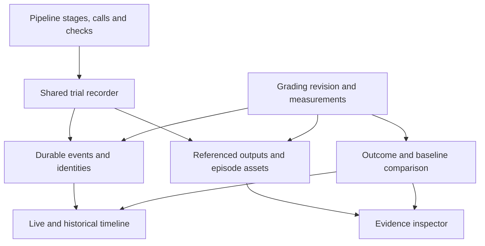

# ADR-022: Retain Trial Events and Link Measurements to Evidence

**Status:** Proposed
**Implementation status:** Durable event recording and linked trial inspection are pending
**Date:** 2026-09-12
**Amended by:** [ADR-024](ADR-024-copilot-runtime-and-observability.md), which adds Copilot SDK events and OpenTelemetry as sources
**Related:** [Trace and measurement specification](../product/traces-and-measurements.md),
[ADR-018](ADR-018-trial-lineage-and-snapshots.md),
[ADR-019](ADR-019-relational-storage-and-assets.md),
[ADR-021](ADR-021-campaign-success-and-reporting.md)

## Context

ROVE already streams stage activity and retains final outputs and verification
measurements. However, its saved stage list contains only completed/error results.
Live verification turn/tool/check notifications disappear from durable history,
and the campaign worker ignores intermediate events. Tool arguments and results
used inside the verification conversation are not a saved call transcript.

An engineer investigating a failed case or a baseline difference needs a direct
link from the assessment to the measured value, grading rule, producing call and
source evidence. Durations without event identity or clock context cannot supply
that explanation, especially when agent work and robot observations overlap.

## Decision

Make recorded events and evidence links part of the trial record shared by quick
runs and campaigns. Persist events independently of the UI stream, using the
relational recording boundary from ADR-019. Keep outcome and measurement summaries
small; large outputs, recordings and continuous signals use asset references.

This is proposed architecture. It extends the existing execution path; it does
not introduce another pipeline or require a hosted observability service.

ROVE records its evaluation-harness activity and events explicitly exposed by the
agent-under-test runtime. Preserve the producer and role of each event so candidate
activity remains distinct from grading/check activity. Do not claim access to hidden
reasoning or internal runtime traces merely because ROVE called an agent endpoint.

Events identify their trial, stage/call and parent, event type, source sequence,
time and lifecycle state. Record retries as calls within the same attempt unless
the evaluation contract explicitly defines a fresh trial. Retain events already
recorded when a trial is interrupted, and identify gaps or unsupported telemetry.
Stable event identity makes repeated delivery safe without duplicating history.

For a Copilot-hosted role, ingest the SDK's session events into the same recording
boundary. Preserve the SDK event ID, session/agent/tool-call identity, ephemeral
flag and available timestamps, then assign ROVE trial/stage/call and actor-role
links. Essential ephemeral events such as per-call usage must be captured live;
session resume cannot reconstruct them. The SDK event `parentId` is a previous-event
link, not an OpenTelemetry parent span.

Use the SDK's native OpenTelemetry export for runtime traces and propagate W3C
trace context into ROVE tool handlers. Store trace/span correlation on the trial
record, while keeping durable event identity separate. Avoid duplicating model or
tool spans when SDK-native instrumentation already represents the operation.
Exact span coverage and schema compatibility need validation against the pinned
SDK/runtime pair before they become a supported contract.

Measurements and assessments reference the producing evaluator/version, criterion,
case and system identities, relevant event IDs and available evidence assets or
ranges. Preserve original grades when another grader assesses the same evidence.
Record source quality and the method of assessment separately. A human rating,
synthetic observation and observed physical outcome must remain distinguishable.

## Recording and Interpretation Boundaries

- **Calls and actions:** distinguish agent-proposed calls/trajectories from
  dispatched operations, acknowledgments and observed outcomes where supported.
  A response's tool-call field alone is not proof that its operations executed.
- **Time:** retain summed stage work, pipeline wall time, enclosing attempt time
  and robot task time with their definitions. Parallel work must not be added up
  and presented as elapsed time.
- **Clocks:** preserve source event time, ingestion time, sequence and clock
  identity. Keep clock mappings and alignment uncertainty explicit. Without a
  valid mapping, show separate time domains rather than infer physical ordering.
- **Usage:** attach supplied provider usage to the relevant call/trial. Display
  cost only with a recorded usage/pricing basis, labeling estimates. Missing
  usage, retries or device telemetry remain unavailable, not zero.
- **Assets:** load the required image or time range on demand. Record omissions,
  truncation and unavailable references. Exclude credentials from stored/shareable
  call material and retain the separation between candidate inputs and grader-only
  evidence.

The first slice uses the existing stage, verification and adapter boundaries.
Adapters may expose only a final response; that limited coverage is valid when
labeled. Complete instrumentation of remote agent internals, robot drivers or a
general monitoring platform is outside this decision.

External OpenTelemetry export is optional and operational. Sampling, exporter
failure or backend retention must not change the authoritative local trial record
or the population used for evaluation metrics. Start with message-content capture
disabled and apply explicit content/redaction policy before exporting prompts,
tool arguments, images or outputs.

## Alternatives and Tradeoffs

- **Retain only final stage JSON:** already useful and inexpensive, but loses
  intermediate failures, calls and ordering needed to explain outcomes. Keep final
  summaries and add event references rather than replace summaries with logs.
- **Use the browser event stream as history:** simple while connected, but cannot
  recover lost substeps or a closed browser. The durable recorder must feed both
  live inspection and historical views.
- **Require an external telemetry service:** can help a later deployment, but
  adds setup and does not establish ROVE's case, grader or episode relationships.
  Keep the initial evidence path local and allow later integration when needed.
- **Embed every recording in each event:** makes records self-contained but
  duplicates large data and slows history. Shared assets require availability
  checks, but preserve small indexed records and selective reads.

Durable events add storage, ordering and retention responsibilities. Their recorded
coverage must be honest: a process crash can leave an incomplete interval, a
provider can hide retries, and a robot clock can be unsynchronized. A useful
inspector exposes these limits instead of implying a complete causal trace.

## Implementation Boundaries and Acceptance

Extend [stage result/event handling](../../src/rove/orchestrator/pipeline.py),
[RunManager retention](../../src/rove/orchestrator/run_manager.py),
[quick recording](../../src/rove/api/app.py) and
[campaign worker recording](../../src/rove/benchmarks/worker.py). Build linked
inspection on [configured measurement evidence](../../src/rove/benchmarks/evidence.py)
and [existing report output](../../src/rove/benchmarks/report.py). These references
are implementation starting points, not evidence that the proposed recorder exists.

- Persist a quick and campaign trace across restart, including calls, failures,
  recorded retries and interrupted work, without duplicate events or execution.
- Navigate from an outcome/measurement to its criterion and available source
  evidence; preserve units, quality, omissions and clock-alignment uncertainty.
- Inspect baseline and candidate records under matching case/assessment conditions,
  preserving configuration differences and separate timing definitions. Unknown
  telemetry and regraded recordings cannot inflate performance or trial counts.
- Keep history/summary queries independent of recording size; load large asset
  ranges only when requested and retain equivalent evidence links in exports.
- For an SDK-hosted trial, retain per-call usage received live, correlate a ROVE
  trial span through a custom tool span, tolerate collector outage and expose a
  recorder failure or telemetry gap instead of silently completing the trace.
