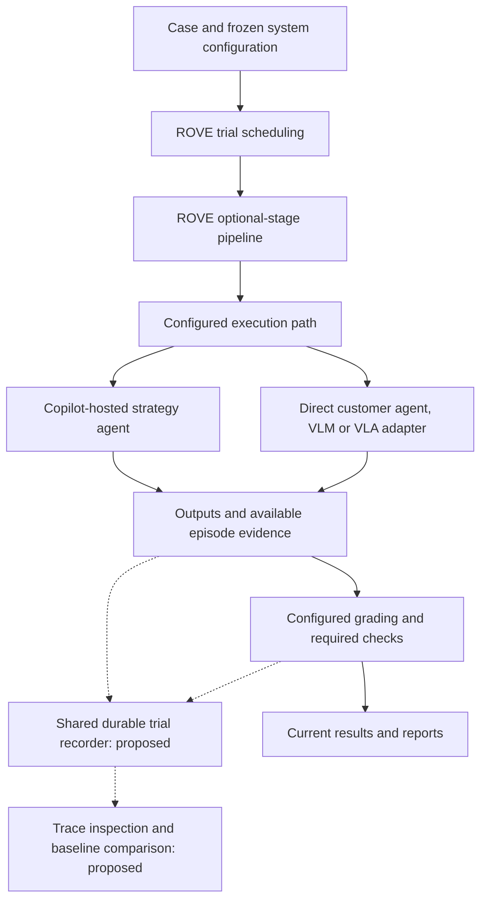

# ADR-023: Own ROVE's Evaluation Semantics and Execution Services

**Status:** Accepted direction
**Implementation status:** Existing pipeline retained; shared recording and lifecycle extensions pending
**Date:** 2026-09-12
**Amended by:** [ADR-024](ADR-024-copilot-runtime-and-observability.md), which selects Copilot SDK for ROVE-owned agent workflows
**Related:** [Concepts](../product/concepts.md), [evaluation workflows](../product/evaluation-workflows.md), [target architecture](target-architecture.md), [current implementation](current-implementation.md)

## Context

ROVE already schedules campaign attempts, captures selected configuration, runs
optional pipeline stages, applies graders and reports repeated-trial metrics.
Developers need those capabilities to form a consistent evaluation workflow across
quick runs and campaigns, with inspectable evidence and baseline comparisons.

The customer supplies the system under test: its models, agents, tools and applicable
action components. ROVE must evaluate that configuration. Substituting another agent
to solve the case would change what is being evaluated.

## Decision

Develop ROVE's evaluation semantics and execution services from its existing
pipeline and adapter contracts. Keep responsibility for trial scheduling, durable
recording, grading contracts, metric calculations and reporting within ROVE.
Extend the current stage configuration as needed instead of introducing another
user-facing hooks framework.

[ADR-024](ADR-024-copilot-runtime-and-observability.md) selects Copilot SDK as the
shared agent infrastructure for ROVE-owned assistants, hosted strategy agents and
agent graders. This refines the earlier phrase "ROVE's own harness": ROVE owns the
product contracts and robotics evaluation behavior, while it reuses the SDK for
agent loops, tools, session events and trace propagation. Direct customer agents,
VLMs and VLAs remain evaluable without adding Copilot decisions to their strategy.

Separate responsibilities within this architecture:

| Responsibility | Owner |
| --- | --- |
| Case selection, repetitions, frozen conditions and trial identity | ROVE evaluation layer |
| Stage/trial dispatch, deadlines, progress and terminal state | ROVE execution services |
| ROVE-owned agent loop, tool invocation and exposed runtime events | Copilot SDK integration |
| Customer model behavior, tools, memory and recovery choices | Configured system under test; Copilot only when the strategy declares it |
| Actual observations, action execution, reset and hardware fault handling | Configured robot/environment integration, when supplied |
| Grading, evidence inspection, reviews and baseline comparison | ROVE evaluation and product layers |

The diagram shows existing execution foundations and proposed shared recording and
inspection. It does not imply that a closed-loop robot driver or the new UI exists.
A customer's agent may manage its own internal tool loop; those decisions and
settings belong to the system under test, not ROVE's grader. Record the activity
that its adapter exposes and mark unavailable internals explicitly. Adding a
Copilot planner or recovery loop creates a different strategy revision whose
combined performance is compared explicitly.

## Existing Foundations and Gaps

- [Campaign runner](../../src/rove/benchmarks/runner.py),
  [store](../../src/rove/benchmarks/store.py) and [reports](../../src/rove/benchmarks/report.py)
  already provide repeated execution, campaign records and result summaries.
- [RunManager](../../src/rove/orchestrator/run_manager.py) builds the
  [pipeline](../../src/rove/orchestrator/pipeline.py) from configured optional stages.
  Its generic agent dispatch exists, while verification still has provider-specific branches.
- [AgentAdapter](../../src/rove/adapters/protocols.py) exposes `run_stage`; memory
  reset, complete trace delivery and episode terminal reasons need explicit contracts
  when a supported task requires them.
- The current `SimAdapter.reset(task)` does not express a frozen reset state or
  acknowledge seed support. Generated actions and returned `tool_calls` do not
  establish robot execution. Physical stopping needs execution-side acknowledgement;
  cancelling a worker is not proof that a robot stopped.
- [Quick evaluation](../../src/rove/api/app.py) needs the shared durable recording
  and pre-execution snapshots proposed in [ADR-018](ADR-018-trial-lineage-and-snapshots.md).
  [ADR-022](ADR-022-trial-telemetry.md) defines the missing event and evidence links.

## Alternatives and Consequences

- **Build one fixed model pipeline:** simpler initially, but would exclude useful
  image-to-plan agents and other valid stage combinations. Preserve optional stages.
- **Require one agent runtime for every strategy:** would change direct customer
  systems and add inference where it provides no evaluation value. Use Copilot for
  ROVE-owned agent behavior while evaluating other systems through supported adapters.
- **Create separate engines for quick runs and campaigns:** could optimize each
  entry point, but would duplicate recording and grading behavior. Share the same
  trial and evidence contracts.

Owning the evaluation services gives ROVE control over product behavior and
integration contracts. It also makes ROVE responsible for lifecycle handling,
trace durability, versioning and failure semantics. Copilot session persistence
does not replace these records or restore a physical environment. Deliver the
capabilities incrementally and retain explicit implementation boundaries.

Azure model and agent integration and Microsoft Fabric data integration are future
product directions. Keep identity, evidence and export contracts independent of
provider APIs. Existing Azure adapters do not imply that all proposed integrations
or a Fabric connector are implemented.

## Acceptance and Delivery

1. Preserve the existing optional-stage and configured-verification behavior.
   Ordinary local use must continue without cloud credentials or hardware.
2. Share pre-execution snapshots and durable trial/event recording across quick
   runs and campaigns, including errored, interrupted and incomplete work.
3. Identify the configured model/agent, prompts, tools, memory/reset settings and
   applicable action conventions; unavailable versions or telemetry remain unknown.
4. Retain outcome, required-constraint and planned-attempt semantics across reports.
   Regrading evidence adds an assessment, not a new attempt.
5. Validate lifecycle extensions with action-dependent synthetic cases, explicit
   timing, interruption and reset support before claiming fresh robot outcomes.
6. Make each outcome or measurement inspectable back to its grading rule and source
   evidence. Preserve these identities for baseline comparisons and future exports.
7. Validate the selected Copilot SDK/runtime before depending on its event, usage,
   isolation or OpenTelemetry behavior. Preserve a direct strategy fixture that
   introduces no Copilot model call.

These are implementation acceptance criteria. This ADR and ADR-024 record the
architecture direction; they do not implement the runtime, lifecycle, inspection
or integrations.
