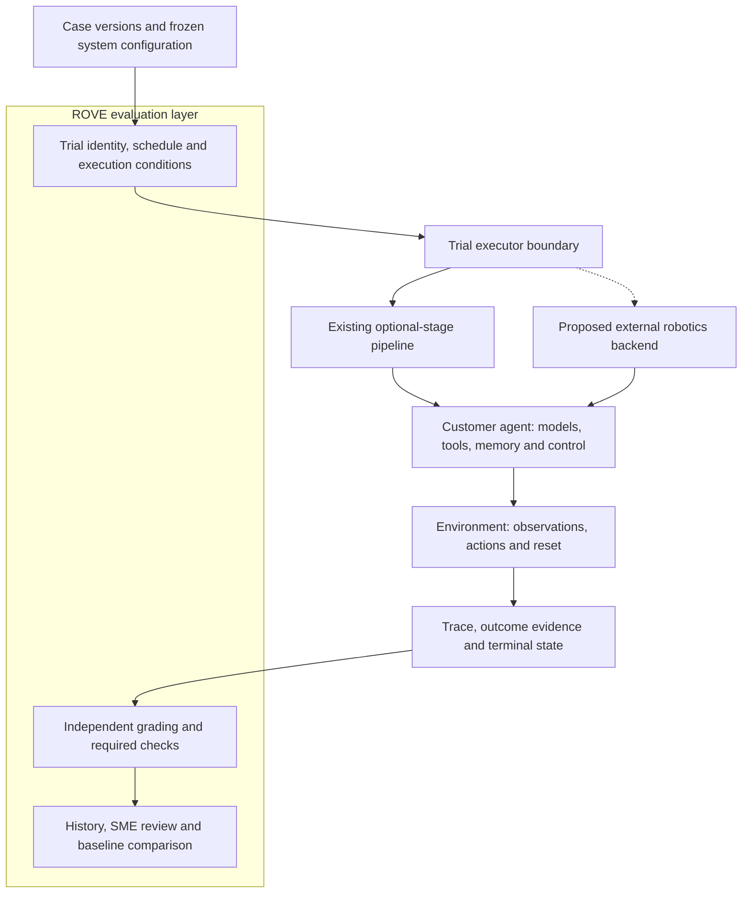

# ADR-023: Separate evaluation ownership from agent execution

**Status:** Proposed
**Implementation status:** Architecture proposal only; no external harness integration or runtime replacement
**Date / research checked:** 2026-09-12
**Related:** [Concepts](../product/concepts.md), [evaluation workflows](../product/evaluation-workflows.md), [current implementation](current-implementation.md)

## Context

ROVE already performs evaluation-harness work: scheduling attempts, capturing campaign
configuration, collecting evidence, applying graders and reporting repeated-trial metrics.
It also runs an execution pipeline that calls models and agents through optional stages.
Available agent runtimes and robotics evaluation frameworks create an opportunity to reuse
execution machinery, but they do not all own the same responsibilities.

The system under test is the customer's configured agent, including its tools, memory,
models and control behavior. ROVE must measure that system. Substituting another agent to
solve the case would change what is being evaluated, even if it produced a better result.

## Decision

Formalize the evaluation boundary and assess an optional robotics execution backend before
building additional low-level rollout machinery. Retain the existing stage pipeline for
supported perception, planning and action assessments. Do not require a provider's agent
runtime, add a parallel hooks framework or select a new dependency through this ADR.

ROVE owns case selection, trial IDs, repetition plans, evaluation contracts, grading,
review and comparisons. The chosen execution system owns the customer's agent behavior.
The robotics backend owns the observation/action interface, reset protocol, control timing
and hardware fault handling. Evaluator labels and future outcome observations remain
separate from candidate-visible inputs. Hardware stopping must be acknowledged through
the execution boundary; killing a worker process is not proof that a robot has stopped.

## Existing foundations and gaps

- [Campaign runner](../../src/rove/benchmarks/runner.py),
  [store](../../src/rove/benchmarks/store.py) and [reports](../../src/rove/benchmarks/report.py)
  already implement part of the evaluation harness.
- [RunManager](../../src/rove/orchestrator/run_manager.py) builds the
  [pipeline](../../src/rove/orchestrator/pipeline.py) from configured optional stages.
  Its generic agent dispatch exists, but verification still contains provider-specific branches.
- [AgentAdapter](../../src/rove/adapters/protocols.py) exposes `run_stage`, not a complete
  episode lifecycle. It does not define memory reset, full trace delivery or terminal reasons.
- `SimAdapter.reset(task)` cannot describe an immutable case/reset state or acknowledge seed
  support. The pipeline predicts an action sequence; it does not execute returned agent
  `tool_calls` as robot tools. These are boundaries to extend or delegate, not shipped capabilities.
- [Quick evaluation](../../src/rove/api/app.py) still needs shared durable trial recording
  and snapshots captured before execution, as proposed in [ADR-018](ADR-018-trial-lineage-and-snapshots.md).

## Options and tradeoffs

| Option | Benefit | Limitation / direction |
| --- | --- | --- |
| Keep and extend every ROVE execution component | Complete control and familiar code | Duplicates robotics reset, control, compatibility and logging work; retain only where justified |
| Require a particular agent runtime | Reuses its model/tool/memory loop | Changes the supported system boundary and does not alone supply robot execution or evaluation contracts |
| Keep the workbench and add an optional robotics backend | Reuses rollout machinery while preserving evaluation workflows | Requires explicit trace, identity, lifecycle and grading mappings; investigate first |

A customer may already use a general agent runtime. An adapter should evaluate that actual
configuration without forcing all other strategies into it. Stage-level adapters remain
appropriate for stage assessments; a complete external episode needs an episode-level boundary.

## Inspect Robots as a candidate

Inspect Robots documents a Policy/Embodiment separation, compatibility checks, a controller
and approver within the rollout, and recorded trials consumed by scorers. This substantially
overlaps with machinery ROVE would otherwise build. Its embodiment contract includes
observations, actions, control rate and reset capabilities. These are reasons to investigate
reuse, not evidence that its integrations work in ROVE.
[Concepts](https://docs.inspectrobots.org/guide/concepts/),
[policy and embodiment interfaces](https://docs.inspectrobots.org/guide/policies-and-embodiments/).

Start by importing its canonical, versioned evaluation log and referenced frame/action
assets. Its documentation distinguishes those records from Rerun visualization streams,
which can drop data under backpressure. A visualization recording must not silently become
the authoritative trajectory. One log may contain multiple trials; preserve their source
run, scene and repetition identities rather than counting one imported file as one attempt.
[Logging documentation](https://docs.inspectrobots.org/guide/logging-and-rerun/).

Semantic differences need explicit translation. Inspect Robots documents errored trials as
unscored; ROVE retains planned attempts and unresolved bounds. Import raw errors and trials,
not just aggregates. Its `success_at_end` reads a success termination, whereas operator
judgments need a judgment-reading scorer. Preserve the scorer, rubric and evidence origin;
never map every positive value to observed robot completion.
[Concepts](https://docs.inspectrobots.org/guide/concepts/),
[scoring documentation](https://docs.inspectrobots.org/guide/scoring/).

The project identifies its API as early and subject to change. Pin an exact tested version
for the investigation. No adoption, hardware compatibility or performance validation is
claimed by this documentation. [Repository](https://github.com/robocurve/inspect-robots).

## Smallest future boundary and acceptance

Define a trial executor receiving the frozen case, system configuration and execution
conditions, then emitting progress, terminal state and trace/outcome asset references.
The existing pipeline is its first implementation. Record backend identity, requested and
supported reset/seed behavior, interventions, timing, partial evidence and stop acknowledgement.
Include agent runtime, tool and memory settings in system identity; unavailable versions stay unknown.

1. Prove a pinned-version importer against successful, failed, errored, cancelled and
   missing-asset examples. Preserve native IDs and grading records; reimport is idempotent.
2. Recompute ROVE summaries from individual attempts. Retain unknowns and required-constraint
   semantics. Regrading a recording adds an assessment, never another robot attempt.
3. Validate a mock-world backend with action-dependent outcomes, reset acknowledgement,
   cancellation, partial evidence and separate observation/action timestamps. An intentional
   candidate change must be visible in its snapshot and associated episode.
4. Confirm optional-stage diagnostics and existing configured-verification tests still work.
   Do not require hardware, cloud credentials or an external runtime for ordinary local use.
5. Decide whether to adopt the dependency only after those mappings and tests demonstrate
   reduced maintenance without losing ROVE's evidence and comparison semantics.
