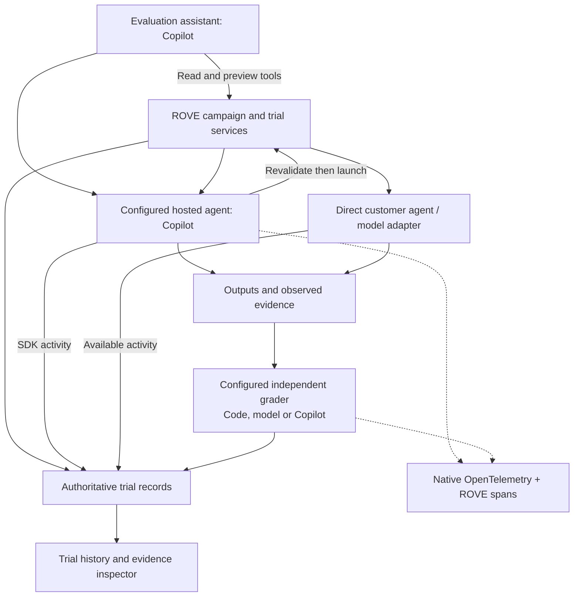

# ADR-024: Use Copilot SDK for ROVE-Owned Agents and Reuse Its Telemetry

**Status:** Accepted direction
**Implementation status:** Controlled SDK/CLI proof, optional hosted stages, shared trial journal, local inspector and scoped evaluation assistant implemented. Live-provider/export validation and broader assistant mutations remain future work.
**Date:** 2026-09-12
**Supersedes in part:** [ADR-023](ADR-023-evaluation-and-execution-harnesses.md), for runtime ownership; ROVE retains its evaluation responsibilities
**Amends:** [ADR-022](ADR-022-trial-telemetry.md), with SDK events and OpenTelemetry as telemetry sources
**Related:** [Architecture diagram](target-architecture.md), [system diagram](system-diagram.md), [delivery plan](../product/implementation-plan.md)

## Context

ROVE needs agent capabilities for preparing evaluations, hosting configured
strategies and investigating evidence. Implementing separate tool loops for these
workflows would duplicate runtime work. Copilot SDK is the selected shared agent
infrastructure, with Azure/Foundry provider alignment as a practical consideration.
Selection does not establish that every SDK capability is useful or that every
customer model should execute inside a Copilot agent.

At decision time, the system had optional pipeline stages, agent adapters,
configured verification and repeated-trial reporting, but no Copilot dependency
or shared durable event recorder. The first implementation now provides those
foundations. The implementation record below distinguishes delivered behavior from
the broader accepted direction.

## Decision

Use the Python Copilot SDK integration as the shared runtime boundary for
ROVE-owned agent workflows: an evaluation assistant, hosted strategy agents and
configured agent graders where warranted. ROVE's application services remain
responsible for frozen configurations, scheduling, trial identity, deadlines,
required checks, durable evidence, metric arithmetic and baseline relationships.

The original direction allowed an assistant to start a campaign through a tool; the tool's service validates the
request and records its identity before dispatch. The assistant does not count
trials from conversational memory. A model-based grader is permitted, but its
rubric, role and evidence are independently identified; required checks and report
arithmetic remain explicit code. Adaptive case selection must be a declared
evaluation protocol, not an unrecorded assistant choice within a fixed campaign.

**Local implementation amendment, 12 September 2026:** the assistant receives read
and preview tools. A separate host confirmation revalidates the exact prepared
campaign and starts it with a stable operation ID. Media uploads, case edits and
SME judgments remain explicit user actions. This completes the local prepare,
launch and inspect interaction without permitting an agent to manufacture expert
review. Broader mutation tools remain optional extensions of the original direction.

## Customer System Boundary

Direct adapters preserve a customer's existing VLM, VLA or agent behavior. An
additional Copilot planner, changed preprocessing, action conversion or recovery
policy forms a new strategy revision. It must not be silently inserted into the
baseline. Compare the combined pipeline explicitly, under stated time/action
budgets, without attributing its improvement to the underlying model alone.

Use separate sessions and scoped tools for assistant, candidate and grader roles.
Independent repetitions start with the declared fresh memory/reset state; memory
carried across trials is allowed only as an explicit protocol condition. SDK
session IDs are internal runtime references, not a new product-level Session
entity. Preserve Case, Trial, Campaign and Strategy terminology.

The SDK does not own low-level robot control or prove physical stopping. An
environment integration supplies resets, observations, action acknowledgements
and faults. Cancelling an SDK turn is not proof that a robot stopped. Existing
recorded evidence can be regraded; it cannot establish a new system's physical
performance without a fresh execution source.

## Telemetry Reuse

Reuse two complementary surfaces:

- SDK session events provide observable messages, tool activity, errors and usage
  for the product timeline. Preserve source identities and map events to ROVE
  trial, stage, call and actor-role records.
- Native OpenTelemetry export provides runtime traces; add ROVE spans and use
  propagated context across the SDK/tool boundary. Preserve trace/span IDs in
  trial records instead of inventing another distributed tracing protocol.

The SDK documents native OTLP/file export and Python trace-context propagation.
This supports connecting application and tool spans to runtime activity. Exact
span coverage still needs validation on pinned SDK/runtime builds.
[Source: SDK OpenTelemetry guide](https://docs.github.com/en/copilot/how-tos/copilot-sdk/observability/opentelemetry).

Per-call usage events are ephemeral. Capture them live; accumulated totals cannot
reconstruct missing call history. The documented cost multiplier is not currency,
and some usage-summary RPCs are experimental. Keep missing values unknown and
record pricing/billing units when reporting estimated spend.
[Source: usage guide](https://docs.github.com/en/copilot/how-tos/copilot-sdk/features/usage-and-billing).

The SDK event `parentId` identifies the preceding event, not an OpenTelemetry
parent span. Maintain event ordering and causal call/span relationships separately.
Message/tool content is subject to the configured capture and export policy.
[Source: event schema](https://docs.github.com/en/copilot/how-tos/copilot-sdk/features/streaming-events).

Persist evaluation evidence independently of sampled monitoring exports. Retain
existing non-SDK adapter events and mark coverage gaps. External exporters are
optional; collector failure must not lose or invalidate already recorded trials.
The local inspector must remain usable without a monitoring account. See the
[updated recording decision](ADR-022-trial-telemetry.md).

## Azure and Deployment

The SDK's provider configuration supports Azure/Foundry endpoints and bearer-token
callbacks for identity integration. This is model access, not automatic provision
of Azure resources or Fabric integration.
[Source: provider guide](https://docs.github.com/en/copilot/how-tos/copilot-sdk/auth/byok).

Start with a local application and a controlled child runtime. The first profile
pins SDK `1.0.13` and CLI `1.0.81-9` after a controlled compatibility proof; upgrades
require revalidation. Record accessible versions and configuration. A remote
deployment's claimed model revision is not a weight
archive. Keep ordinary mock/direct evaluations available without SDK startup or
cloud credentials. Add hosting complexity only when measured concurrency or
customer deployment needs require it.

## Alternatives and Tradeoffs

| Option | Decision and rationale |
| --- | --- |
| Build every agent loop ourselves | Reject for ROVE-owned workflows; spend effort on robotics evidence and evaluation behavior |
| Force Copilot into every customer trial | Reject; changes the evaluated system and can add unnecessary inference latency/cost |
| Use Copilot only as an isolated demo adapter | Too narrow; assistant, configured strategy and grader workflows should share runtime integration |
| Use SDK session logs as the database | Reject; runtime context lacks ROVE's full revision/assessment model and ephemeral history |
| Require cloud monitoring for trace inspection | Reject; retain local evidence and make external observability optional |

SDK reuse adds dependency/version risk and runtime process overhead. New features
must justify their latency, cost, complexity and effect on evaluation semantics;
availability alone is not a reason to adopt them. Do not introduce sub-agents,
MCP, persistent cross-trial memory or automatic recovery by default. Revisit the
selected runtime if measured limitations prevent the required customer workflow.

## Acceptance and Migration

### Implementation record — 12 September 2026

- **Compatibility:** the real pinned SDK and CLI passed a controlled synthetic
  transport probe for image input, host-tool execution, usage and native trace
  propagation. It did not call a live model provider. Azure authentication,
  provider quality and external monitoring remain unverified. Exact evidence is
  in the [compatibility record](copilot-compatibility.md).
- **Execution:** `copilot_agent` supports perceive, plan and verify. Each stage has
  a fresh child runtime/session/workspace with host-selected candidate or grader
  scope. The shared runtime validates role-scoped tools; the configured adapter
  exposes no tools and rejects robot `act`. Assistant read/preview tools share the
  runtime while launch confirmation belongs to the host. Cross-stage agent memory
  is unsupported. Explicit endpoint memory/reset/coverage contracts are frozen;
  customer reset declarations remain attributed claims. Actual adapter/check/reset
  calls have stage spans. Existing direct adapters remain directly callable.
- **Recording:** quick and campaign attempts receive durable IDs and sanitized
  snapshots before dispatch. Available stage and SDK events are retained in a
  shared SQLite journal; initial observations have private managed assets. Legacy
  quick-history import is idempotent and preserves missing provenance. The campaign
  journal remains separate and recovery reconciles known IDs under ownership.
- **Tracing:** ROVE trial/stage/named-tool spans and structural native SDK spans
  retain actual trace/parent identities and explicit source clocks. Native traces
  are captured locally before workspace deletion; ephemeral usage is persisted.
  A disabled-by-default bounded OTLP/HTTP JSON profile targets an explicit local
  collector. Real pinned SDK/CLI tests establish application → native runtime →
  named tool ancestry in the journal and healthy collector; HTTP 503, blackhole
  and queue-overflow tests preserve local evidence and bounded export shutdown.
  Hosted monitoring and live providers remain unvalidated. See
  [runtime observability](runtime-observability.md) and
  [lifecycle contracts](runtime-lifecycle.md).
- **Inspection:** local history shows lifecycle, assessment, measurements,
  stage-filtered activity, trace details, configuration and on-demand initial
  observations. Arbitrary remote evidence resolution, parallel trace graphs and
  aligned baseline comparison remain pending.

See [current implementation](current-implementation.md) for code/test links and
[Trial history](../TRIAL_HISTORY.md) for setup and backup. The following criteria
continue to govern remaining implementation; this slice does not complete every
criterion.

1. Validate a pinned SDK/runtime pair with a controlled tool call, image input,
   cancellation, isolated sessions and captured usage/events. Report provider
   capabilities that remain untested; do not claim universal model compatibility.
2. Save an agent trial before dispatch; retain intermediate events and terminal
   state across refresh/restart. Duplicate deliveries cannot duplicate attempts.
3. Preserve direct customer/model paths and optional stages. A paired fixture
   demonstrates that selecting a direct strategy introduces no Copilot inference.
4. Link a ROVE trial span through Copilot to a custom tool span. Persist ephemeral
   usage, test missing fields and avoid duplicate spans or usage aggregation.
5. Demonstrate separate candidate/grader contexts and required-check enforcement.
   Version runtime, tool, prompt, preprocessing and memory/reset configuration.
6. Reopen a failed trial with its evidence locally while the collector is offline.
   Capture failures and telemetry gaps remain visible; no actions are replayed.
7. Add assistant tools only after the underlying services pass the same tests
   through the UI/API. Keep the [sequenced delivery plan](../product/implementation-plan.md)
   and implementation status updated with each feature PR.
