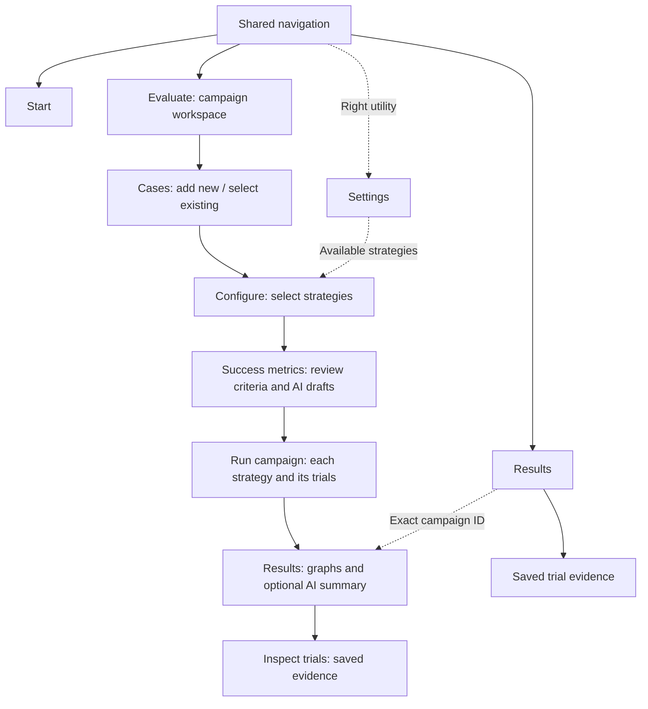
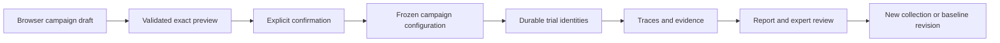
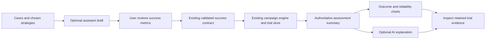

# ADR-025: Organize navigation around the evaluation journey

**Status:** Accepted and implemented; five-stage mock campaign and narrow Results layout verified locally. Live AI and hardware validation excluded.
**Date:** 2026-09-12
**Product contract:** [Campaign workspace](../product/user-journey.md).

## Context

The first implementation consolidated navigation but retained disconnected case,
contract, dataset and execution forms. User feedback found an unbounded case dropdown,
unclear campaign actions, competing quick evaluation, unexplained trial identity and
configuration without a clear place in the journey. Route correctness did not resolve
these usability problems. This amendment supersedes the earlier four-primary-tab and
three-workspace-step presentation; existing durable records and API meanings remain.

A researcher needs repeated trials and controlled comparisons. A manipulation engineer
needs to turn customer images and tasks into a useful assessment. A platform engineer
needs reusable strategy and endpoint configuration. The shared goal remains:
**ROVE evaluates robotics agent pipelines on your task.**

## Decision

Use **Start, Evaluate, Results** as primary destinations, with **Settings** visually
separate on the right. Evaluate is one campaign workspace with **Cases → Configure →
Success metrics → Run → Results**. Settings maintains reusable strategies/connections;
Configure selects them and Success metrics establishes the assessment. The separate
metrics stage is a presentation boundary over the existing success contract.

Use **Create a campaign** consistently for creation and **Run campaign** for execution.
The latter is an action on the campaign, not a third entity alongside campaign and
trial. **Review results** reads retained evidence. Comparison setup previews a changed
strategy; only **Start comparison campaign** dispatches new trials.

Expose **Set as baseline** as a primary action for a completed campaign strategy.
Saving captures the existing immutable reference and assessment model; it does not
reclassify every first campaign automatically or rerun the pipeline. Results derives
its **Baseline** badge from actual persisted references, never from campaign naming or
an open draft. Pinning and revision history remain secondary management details.

Use the existing gallery interaction in a bounded case-selection dialog. Selected
image/task cards remain in the campaign workspace. Success suggestions are editable
drafts with explicit source and evidence limits. Plain-language success controls map
to versioned contracts; advanced JSON remains available in details. Configure supports multiple selected strategy cards for the same cases. Creating a
changed strategy revision is a configuration operation governed by
[ADR-026](ADR-026-versioned-strategy-catalog.md). The optional
assistant helps configure this same evaluation, using existing host validation and
confirmation boundaries. It cannot create expert judgments or silently start work.

Run shows the configuration and planned count before launch, then per-strategy
progress with nested trial evidence. A trial is one attempt
at one case with one strategy; pipeline stages are nested execution evidence. Show
that identity during execution and preserve it through results and trace inspection.
Use **Save case collection** and **Add to an existing collection** for dataset actions.
Adding creates a new immutable revision retaining prior membership. The UI wording
changes; snapshot and review integrity do not.

Use warm neutral/slate surfaces and restrained teal accents across the workspace.
Shared navigation styles establish consistent spacing, focus and active state. Theme
changes do not alter semantics or substitute color for labels and status text.

## Compatibility and state

Retain existing pages, API routes and saved case/campaign/trial IDs. Add a Success
metrics stage route within the existing workspace; preserve the existing Configure,
Run and Review deep links. Results returns to
`/static/datasets.html?step=review&campaign=ID`. Settings uses the existing root
strategy/model/settings views. Legacy quick-run and sample-library URLs remain usable,
but new case browse actions stay within the campaign. No new Experiment/Session entity
or scoring denominator is introduced.

Stage changes and browser Back/Forward retain in-memory selections without execution.
Explicit saves and launches establish durability. Missing saved identities are visible
errors; navigation must not substitute another campaign. Unsaved full-reload recovery
is a separate capability and must not be claimed without implementation.

## Alternatives and consequences

| Option | Trade-off |
| --- | --- |
| Only restyle the prior menus | Does not explain campaign creation, trial identity or the relationship between forms |
| Expose every storage entity as a primary menu | Forces customers to reconstruct the evaluation workflow |
| Keep quick evaluation as a competing first action | Splits onboarding and obscures the reusable campaign path |
| Rewrite the engine and routing framework | Adds migration risk without addressing the central interaction problem |
| One staged campaign workspace over existing services | Chosen: coherent task flow while retaining recording, validation and compatibility |

The workspace must synchronize manual controls and assistant proposals without stale
previews. Collection extension needs explicit identity and membership checks. Gallery
selection must scale without unbounded page growth and must support keyboard use.
The design adds interaction responsibility to the existing pages; shared components
and end-to-end regression checks are needed to prevent future divergence.

## Acceptance and evidence

Require the [journey acceptance checks](../product/user-journey.md#acceptance-and-delivery-evidence),
including selected-case cards, collection revisions, success-draft boundaries, configured
strategy selection, identifiable live trials and exact result-to-trace return paths.
Use isolated mocks; live provider validation remains excluded by user direction.

The earlier PR #21 tests establish its route behavior only. New DOM regression tests
cover the amended case-selection workflow, immutable collection reuse, exact criteria,
configuration staleness and trial evidence inspection. The
[journey specification](../product/user-journey.md#acceptance-and-delivery-evidence)
records that coverage and the desktop three-trial mock journey. The 390px case gallery was checked in light and dark themes: bounded scrolling, visible search and category controls, image cards and a fixed selection footer.

Campaign progress polls every two seconds while active and visible; active trials also
feed recorded stage events to the strategy overview. Expanded inline stage events
and recorded output load on disclosure expansion or explicit refresh, with a bounded
200-event view and a route to the full inspector. This does not claim token streaming.
The [older dashboard journey](../ux/dashboard-user-journey.md) remains historical.

## Five-stage refinement: assessment and explanation boundaries

Separating Success metrics makes the customer approve what will be measured before
execution. Optional AI assistance can draft assessment settings and later explain
results, using the existing host-validation boundary. It does not become the campaign
scheduler or authoritative scorer. No new database, trial entity or execution engine
is introduced by this refinement.

Results leads with charts derived from the assessment summary, then a compact optional
AI explanation, followed by expandable trial inspection. Pass/fail/unknown counts,
execution completion and evidence coverage remain distinct. Curves preserve per-strategy
and per-case sampling boundaries; unresolved bounds are not confidence intervals.
Missing robotics metrics stay unavailable, and output acceptance is not promoted to
physical completion. Narrative explanations cannot mutate results or manufacture
causal claims. All manual setup, reports and evidence remain usable without a provider.

The five-stage refinement has local regression coverage and browser evidence: an
isolated campaign with one case, two mock strategies and three repetitions retained
six completed trials, while Results correctly showed all six as unassessed. Per-strategy
stages were visible, trial inspection began collapsed, and the 390px Results page had
no horizontal overflow. The [journey evidence](../product/user-journey.md#five-stage-browser-verification-13-september-2026)
records scope and limitations. Assistant generation is tested with a fake runtime;
these checks do not validate live model behavior or physical robot performance.

## Trial-first entry amendment

The latest user journey restores the chat runner as the first trial experience and
connects saved trial results to **Add to campaign**. Campaign comparison still uses
the staged workspace described here. **Improve** in the campaign browser reopens a
populated draft with evidence-based recommendations; navigation alone never executes.
[ADR-027](ADR-027-trial-to-campaign-improvement.md) defines source trial/asset identity,
reference-strategy semantics and comparison boundaries. Its implementation has local regression coverage and a verified mock browser loop
from chat trial through promotion, three-trial campaign, saved baseline and Improve.
Cases and criterion editing were checked at 390px. Earlier campaign-only evidence
retains its narrower scope; live AI and hardware were not part of these checks.
