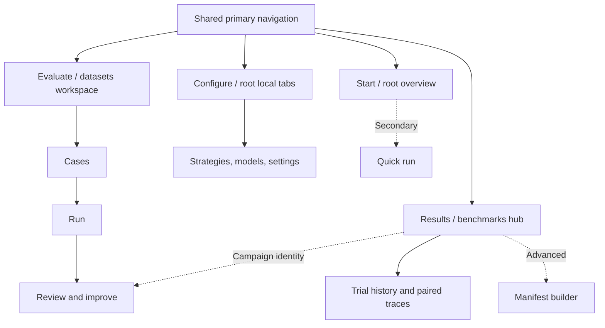

# ADR-025: Organize navigation around the evaluation journey

**Status:** Accepted and implemented; local navigation tests and browser inspection passed.
**Date:** 2026-09-12
**Product contract:** [User journey and navigation](../product/user-journey.md).

## Context

ROVE grew from a quick-run dashboard into a workbench with cases, campaigns, reviews,
frozen datasets, baselines and traces. Exposing each addition as a peer navigation
item makes the user assemble the workflow. The root page also starts with an older
execution/configuration model while the customer workflow lives elsewhere.

A researcher needs a path from selected cases to a controlled comparison. A
manipulation engineer needs customer intake, success setup and review. A platform
engineer needs endpoint configuration without making that the first step for everyone.
The founding vision remains: **ROVE evaluates robotics agent pipelines on your task.**

## Decision

Use one shared primary navigation: **Start, Evaluate, Results, Configure**. Existing
pages own those destinations. Keep Trials subordinate to Results and strategies,
models and settings subordinate to Configure. Keep Quick run and the manifest-based
campaign builder available as secondary paths.

Evaluate shows one workspace step at a time: Cases → Run → Review & improve.
Selections and in-progress context survive local step changes; explicit save/launch
operations remain the boundary for durable changes. Results links to
`/static/datasets.html?step=review&campaign=ID` when the next task is review or
improvement. The URL identifies the requested destination and saved record, not a
permission to execute or modify it.

The root URL becomes Start. Existing configuration views use
`?view=strategies`, `?view=models` and `?view=settings`; Quick run uses `?view=quick`.
Existing static page URLs, sample links, identifiers, reports, CLI and API contracts
remain compatible. This decision changes information architecture; it does not add
an Experiment/Session entity or change trial counts, grading or baseline semantics.

## Alternatives and consequences

| Option | Trade-off |
| --- | --- |
| Add another dashboard above the existing peer menus | Leaves duplicate navigation and unclear ownership of the next action |
| Make every entity a top-level item | Mirrors storage but fragments the customer's evaluation journey |
| Rewrite routing and pages around a new framework | Adds migration risk without being necessary for this navigation problem |
| Shared destinations and staged existing workspace | Chosen: clear ownership, retained services/URLs and a bounded compatibility surface |

Configuration and advanced inputs remain reachable, but receive less visual priority.
The staged workspace must retain form/context state and keep hidden panels out of
focus order. Shared navigation must have the same labels, ordering and active state
across every page. Results-to-review links must carry exact identity; missing records
must be visible rather than silently replaced. Browser history and old deep links
are part of the compatibility contract.

The [older dashboard journey](../ux/dashboard-user-journey.md) remains historical
design material. This decision supersedes its root-page and navigation priority,
not its underlying configuration, quick evaluation or comparison capabilities.

## Acceptance and implementation evidence

Require navigation and DOM regression checks for route selection, invalid-parameter
fallback, hidden-panel semantics, retained selection, review deep links and unchanged
quick/advanced entry points. No navigation test may need to launch a paid model.

Browser acceptance covers all three persona journeys, direct and back/forward entry,
keyboard operation, narrow-screen layouts and both themes. Existing regression suites
must keep quick execution, campaign recording, review and comparison behavior intact.
A successful DOM assertion alone does not establish that the interaction is usable.

Delivery evidence is recorded in the [journey specification](../product/user-journey.md#delivery-evidence): 52 UI tests and browser checks across desktop, narrow screens and both themes. Required repository checks remain merge gates.
