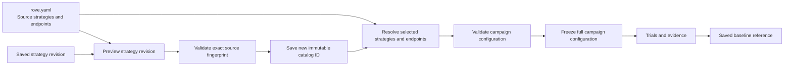
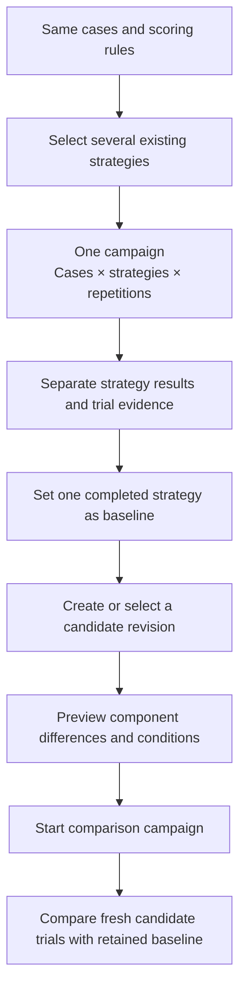

# ADR-026: Keep UI-created strategy revisions in an immutable local catalog

**Status:** Accepted and implemented; local mock browser integration verified.
**Date:** 2026-09-12
**Product contract:** [Campaign workspace](../product/user-journey.md).

## Context

ROVE strategies are reusable pipeline configurations. Customers need both to compare
several existing strategies on the same cases and to test a component change against
a saved baseline. A single-strategy selector removes the first capability. Editing
`rove.yaml` in place obscures the second: a familiar strategy name can refer to a
different definition tomorrow, while old trial evidence must remain attributable.

The strategy catalog must support UI-created revisions without treating every edit as
a new evaluation concept, overwriting the customer's source configuration, or relying
on browser storage for durable identity. SQLite already serves ROVE's local transactional
records and fits this workload; a file-format or external warehouse migration is not
needed for strategy metadata.

## Decision

Keep YAML strategies as source configurations. Store UI-created strategy revisions in
a configuration-specific SQLite catalog beneath the adjacent `.rove` directory. Each
saved revision has a new immutable selectable strategy ID and records its source and
fingerprint. Resolve this catalog with the configuration used for evaluation so saved
revisions can be selected again after an application restart.

Creating a revision starts from the **current selected strategy definition**. The
preview fingerprint covers the source strategy, its referenced endpoint definitions
and defaults. Save requires the exact preview fingerprint; if those inputs changed,
the user must preview again. The original YAML strategy and endpoint definitions
remain unchanged. The catalog stores the strategy definition and endpoint fingerprints;
it does not privately clone the customer's endpoint configuration into an independent
provider registry.

Endpoints resolve from the current configuration when the campaign is created. The
campaign then freezes its complete resolved configuration using the existing recording
boundary. A strategy revision ID identifies the saved strategy definition; it does not
by itself freeze remote provider behavior, model weights or every later endpoint setting.
Old reports and saved campaign resume use their retained configuration and evidence,
not a fresh lookup of the catalog's live contents.

## Two user workflows over the same model

**Compare existing strategies** selects several strategy cards in Configure. All
receive the same selected case cohort and scoring contract. Four cases, three strategies
and two repetitions produce 24 trials in one campaign. Results remain separated by
strategy; combining models into a single success count would hide which system helped.

**Test a component change** starts with a saved baseline strategy, prepares a candidate
revision and previews its differences. The editor uses the current available definition,
so a source changed since the baseline must be shown as drift rather than described as
editing the archived baseline itself. The comparison preview preserves the existing
checks for cases, scoring, verification and repetition conditions. A different grader
or evidence scope is a changed assessment, not automatically an improvement.

No new Experiment, Session or Run entity is introduced. A strategy revision is a saved
configuration; a trial is an attempt; a campaign groups attempts; a baseline references
one completed campaign strategy and its assessment snapshot. Review and revision saving
do not execute the candidate. **Start comparison campaign** remains the execution action.

## Alternatives and consequences

| Option | Trade-off |
| --- | --- |
| Rewrite `rove.yaml` for each UI edit | Overwrites the source configuration and makes old names ambiguous |
| Keep variants only in browser state | Loses durable identity across refresh, restart and non-browser execution |
| Add a separate experiment/version container | Adds vocabulary without solving configuration identity |
| Clone all endpoint credentials into each variant | Duplicates sensitive configuration and confuses ownership |
| Immutable local catalog plus frozen campaign configuration | Chosen: durable revision identity while preserving YAML ownership and existing recording |

The loader must avoid collisions between YAML strategy IDs and catalog revision IDs.
Preview/save validation must detect stale definitions and unavailable endpoints. The
catalog is local project state; back it up alongside the configuration and evaluation
records if future reuse of saved variants is required. Its deletion must not invalidate
already recorded campaign reports or replace their original identities.

The fingerprint is a reproducibility aid, not proof that a physical environment or
remote model can be recreated. Endpoint metadata can detect declared/configured changes;
it cannot make a mutable hosted model immutable.

## Validation

Before calling this implementation complete, verify multi-strategy campaign counts and
per-strategy results; immutable revision save/restart; unchanged YAML and source strategy;
stale preview rejection; invalid endpoint rejection; and exact campaign snapshots.
Verify the same revision is selectable through the supported evaluation entry paths.
A baseline comparison must reveal current-source drift and preserve reference conditions.
Stored reports and resume must remain usable from frozen campaign data without re-resolving
a deleted live catalog revision. UI tests must show that creating/saving/preparing a
revision never dispatches trials until the explicit execution action.

The [catalog service](../../src/rove/strategies/revisions.py) is consumed by the shared
[configuration loader](../../src/rove/models/config.py). Its configuration-filename
partition stores revisions at `.rove/strategy-revisions-<hash>.sqlite3` beside the YAML;
relocating both preserves the catalog association.

The [API](../../src/rove/api/strategy_revisions.py) exposes:

| Route | Purpose |
| --- | --- |
| `GET /api/strategy-revisions` | Saved revisions and their availability/configuration-drift metadata |
| `GET /api/strategy-revisions/parents/{identity}` | Current source definition, exact fingerprint and compatible existing endpoints |
| `POST /api/strategy-revisions/preview` | Validate parent ID, fingerprint and complete proposed definition; return differences and generated revision identity |
| `POST /api/strategy-revisions` | Save with the exact preview hash and operation ID |

The [editor](../../frontend/strategy-revisions.js) offers compatible per-stage endpoints,
pipeline/verification modes and explicit advanced full-definition editing. The server
generates the immutable strategy ID; the user names the revision. Saving refreshes the
existing campaign selection or candidate selector without dispatching trials.

[Backend tests](../../tests/test_strategy_revisions.py) cover a real four-trial local
multi-strategy campaign, source preservation, conflicts, validation, relocation and
idempotent resume after catalog removal. [Editor tests](../../tests/test_strategy_revisions_ui.cjs)
cover structured-setting preservation, compatible endpoint choices, explicit advanced
editing, stale previews, selection-only save and no duplicate save after a catalog-refresh
failure. Browser integration remains pending. Live provider behavior is outside this
local implementation validation.
