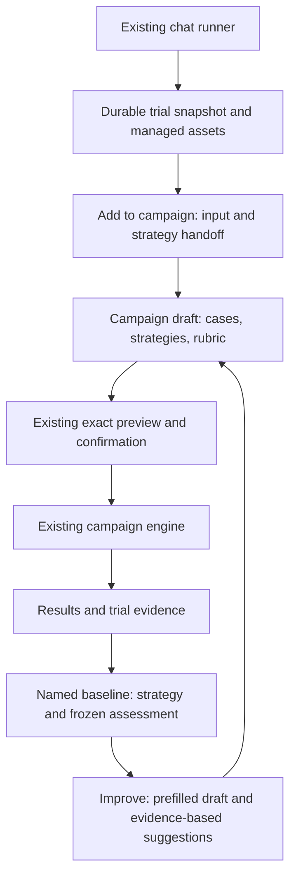
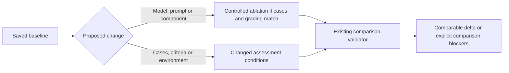
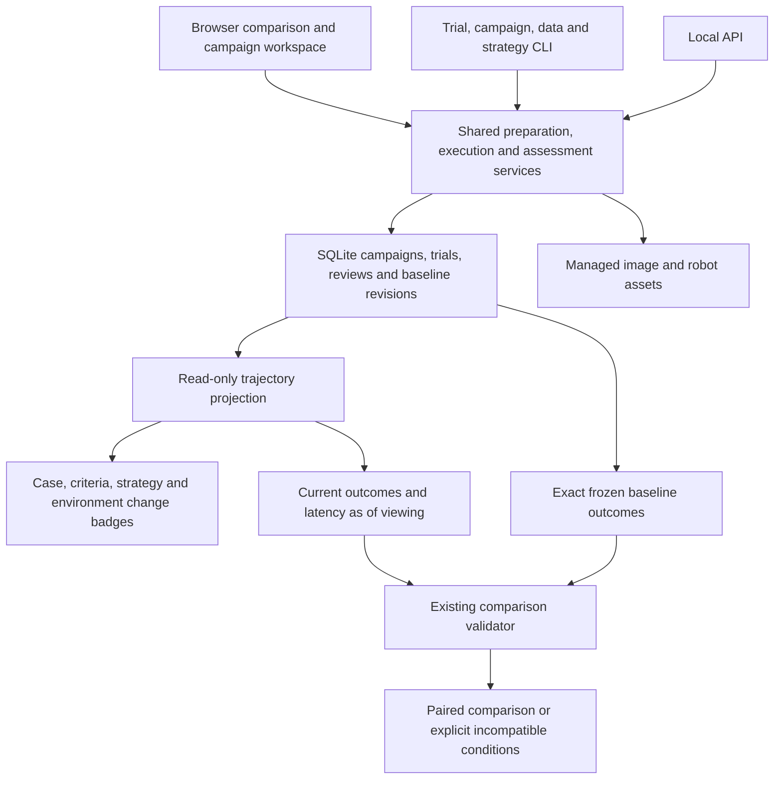
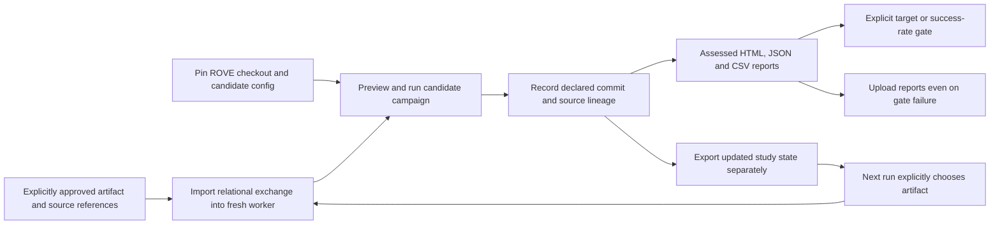

# ADR-027: Capture trials and versioned evaluation iterations

**Status:** Accepted and implemented. Shared CLI/service tests and the mock browser improvement loop/timeline are verified; hosted CI and live providers are not.
**Date:** 2026-09-13
**Product contract:** [Campaign journey](../product/user-journey.md#latest-entry-try-a-task-then-build-a-campaign).

## Context

The campaign workspace can compare repeated trials, but a customer begins by trying
the same image, task and robot description across several strategies in the existing chat runner. Asking that person to rebuild
the case and strategy in a separate workflow loses useful inputs and makes campaign
creation feel disconnected. Improvement also needs a prepopulated return path from
saved results, with suggestions that respect what the evidence actually says.

The ML engineer needs fast customer-data onboarding. The robotics researcher needs
controlled comparisons and reproducible configurations. The platform team needs the
same configured endpoints and durable records to serve both workflows. No additional
execution engine or overlapping experiment entity is required.

## Decision

Connect chat execution to campaigns through the existing durable Trial and Case
services. Use **Add to campaign** to prepare a case/strategy selection from a finished
trial. Preserve image, task, optional managed robot input and strategy identity; retain
the source trial as an exploratory reference. The campaign plans fresh trials rather
than retroactively increasing its repetition count.

An ad-hoc chat selection is not automatically a catalog strategy. Resolve it through
an explicit immutable revision or equivalent exact snapshot support. Never silently
substitute current endpoint/model configuration for the recorded system. Uploaded
URDF bytes are retained as a managed asset; handoff must preserve and consume that
identity before promising identical robot conditions.

Generate three to five editable rubric criteria appropriate to the task. Use the
existing assistant runtime and validation boundary; task-based templates remain
clearly labelled when AI is unavailable. Criteria drafts, explanations and
recommendations cannot grade trials, launch campaigns or prove physical completion.
Keep ordinary ROVE code responsible for scheduling, recording and scoring.

After foreground execution completes, open its saved Results. **Set as baseline**
retains one chosen strategy from a completed campaign and its assessment snapshot.
Multiple strategies require an explicit reference choice. The campaign browser's
**Improve** action opens a draft with source context and recommendations on the first
page; it never runs on navigation.

## Comparability

Low scores can motivate a candidate hypothesis; absent judgments motivate completing
reviews. Neither establishes a root cause. Adding cases changes coverage and must not
be disguised as a controlled model improvement. Preserve the original baseline,
selected exact revisions and existing comparison validators. No retrospective baseline
rewrite or silent denominator change is permitted.

## Existing foundation and implementation boundary

- [`promotion.py`](../../src/rove/datasets/promotion.py) already atomically links a
  finished quick-source trial to a reusable image/task case with idempotent operation
  IDs and an explicit exploratory-reference role.
- [`app.py`](../../src/rove/api/app.py) already saves uploaded URDF bytes under the
  trial configuration's managed `robot_asset` reference.
- [ADR-026](ADR-026-versioned-strategy-catalog.md) defines immutable strategy revisions;
  [ADR-018](ADR-018-trial-lineage-and-snapshots.md) defines durable trial lineage.
- [`comparison.py`](../../src/rove/benchmarks/comparison.py) remains authoritative for
  compatible evidence, case sets, configuration and repetition conditions.

Implemented handoff endpoints are `POST /api/trials/{id}/campaign-draft` and
`POST /api/campaigns/{id}/improvement-draft`, backed by
[`seeds.py`](../../src/rove/benchmarks/seeds.py). They return exact case revisions,
selectable source strategies, defaults, lineage, recommendation evidence and blockers.
A case is reused only when instruction, managed image and complete public context
match; robot-asset absence is meaningful. Private grading material stays out of the
new candidate context. Promotion is idempotent under the supplied operation ID.

[`robot_assets.py`](../../src/rove/datasets/robot_assets.py) validates the managed XML
asset type, size and content hash. Campaign preparation validates the reference and
its worker supplies the verified path to the existing RunManager. Standalone evaluation
also resolves a selected case's managed robot description into a disposable runner file.
This preserves a supplied robot description; it does not validate hardware execution
or promise external URDF mesh/package resolution.

A missing historical strategy ID can become a snapshot alias in the existing SQLite
catalog when its definition, referenced endpoints and defaults match. Changed components
are blocked rather than silently substituted. User-selected new strategy IDs are explicit
candidates, while launch validation rejects drift hidden behind historical IDs.

The browser guards seed responses against changed drafts, load versions and navigation.
Criterion Save/Cancel retains individual grading methods; advanced fields remain part
of the same validated contract. The foreground launched campaign alone triggers
automatic Results. An optional exact `baseline_revision_id` travels with the source
campaign; preview compares each selected candidate using the frozen reference outcomes.
Changed conditions are shown without claiming a controlled delta. Recommendations use
current reviews, and unresolved outcomes recommend evidence review before component changes.

Local tests cover these boundaries in
[`test_campaign_seeds.py`](../../tests/test_campaign_seeds.py),
[`test_case_trial_runner.py`](../../tests/test_case_trial_runner.py) and
[`test_evaluation_journey_ui.cjs`](../../tests/test_evaluation_journey_ui.cjs).
Browser verification completed the full journey with a saved mock chat trial carrying
a Panda URDF, three editable template criteria, a three-trial campaign, automatic
Results and a saved baseline. Improve retained the exact baseline, criteria and defaults;
a second campaign's comparison reported matching conditions, zero component changes
and pending expert outcomes. Cases and criterion editing had no horizontal overflow
at 390px. See the [recorded browser evidence](../product/user-journey.md#trial-to-campaign-to-improve-browser-verification-13-september-2026).
This demonstrates lineage and no-change comparison, not model improvement, live AI
behavior or physical robot execution.

## Versioned iterations and one service layer

Keep the campaign as the durable iteration identity. Cases, strategies and success
criteria may all change in the next campaign; this needs no new Experiment or Task
entity. A task remains the objective within a case. The timeline service traverses
explicit campaign-source hashes and exact validated baseline references, not names,
similar inputs or a shared exploratory trial. It fails explicitly above its bounded
history limits rather than silently truncating a purported complete trajectory.

The timeline is a projection over saved evidence, not a new event store or a fitted
improvement curve. Node scores use current assessed trials and carry an as-of time;
review corrections may change them. Exact baseline edges use frozen saved outcomes.
Configuration identity includes case/dataset revisions, contracts, metric scope,
local evaluators, runtime and referenced strategy endpoint/default settings. Mock or
mixed evidence stays visibly labelled. Hashes identify captured settings; they do
not preserve remote weights or recreate a physical scene.

CLI commands call these services directly for headless execution and data/evidence
management. Dashboard history and ephemeral assistant confirmation use the owning
local server. CLI and API share configuration overlays and assessed reports, preventing
the CLI from omitting saved strategy revisions or post-run expert judgments. Preview
hashes, expected revisions, operation IDs and explicit assistant confirmation remain
required at their existing boundaries. See the [command capability table](../product/cli-ui-parity.md).

## Continuous evaluation without assumed persistent workers

The [manual workflow example](../../examples/ci/README.md) is outside enabled workflows
and installs the locked source checkout. A new worker restores an explicitly chosen
exchange artifact; a mutable cache or an implicit latest-run lookup is not a baseline
identity. Report artifacts exclude credentials/configuration, while study exchange
contains customer evidence and needs appropriate artifact access. Local strategy
catalog files are not implicitly transported by exchange; candidate definitions must
be checked in or explicitly restored through their reviewed revision workflow.

Reports are written before explicit acceptance gates fail. Unknown planned outcomes
fail enabled gates; a disabled gate does not mean acceptance. Run/resume errors exit
unsuccessfully even without a gate, while report-only export can inspect a failed run.
Absolute success/target gates do not claim a statistically significant baseline gain.
A declared commit label identifies the checkout claim, not immutable remote weights.

The trajectory service and DOM suites cover reference integrity, disconnected studies,
changed cases/rules/components, current-versus-frozen assessments, synthetic labels and
stale UI responses. Browser verification displayed two linked completed mock campaigns
with chronological markers, outcome bars, p95 latency, collapsed details and usable
actions; the 390px layout had no horizontal overflow. Both campaigns still had unknown
expert outcomes, so this demonstrates history and comparability rather than improvement.

## Validation

Exercise a saved chat trial with managed image and URDF, hand it into a campaign,
verify strategy/asset identity, add cases/strategies, edit individual criteria, confirm
and run, then verify automatic Results. Save an explicit baseline and open Improve
without creating trials. Confirm suggestions cite actual low or unresolved outcomes,
controlled ablations preserve assessment conditions and added cases block misleading
comparisons. Retry a handoff without duplicate cases and retain original trial counts.
Use isolated mock/fake-runtime validation; live providers and physical robots remain
outside this slice.
