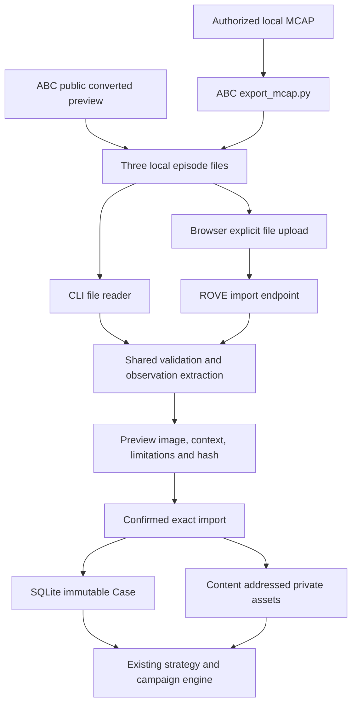
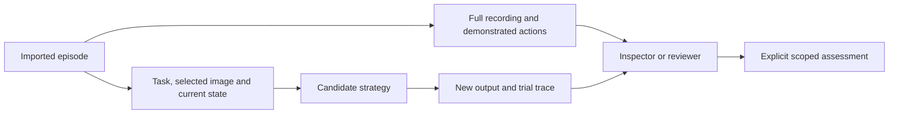

# ADR-028: Import ABC observations through the existing case service

**Status:** Implemented; local episode, transport, pipeline and browser validation completed.
**Date:** 2026-09-13.
**Product contract:** [ABC dataset support](../product/abc-dataset-support.md).

## Context

The ABC team publishes bimanual manipulation recordings and converters. ROVE users
want to evaluate their own strategies on these observations, then preserve reviewed
cases and track changes over time. The source dataset is much larger than a useful
initial evaluation selection. Import must preserve provenance and separate candidate
inputs from the demonstrated answer without adding another evaluation engine.

## Decision

Accept the upstream converted episode boundary: `episode_metadata.json`,
`combined_camera-images-rgb.mp4` and `states_actions.bin`. Reuse upstream tools for
MCAP decoding and synchronization. Select one exported frame and camera per case,
retain current robot state as context, and preserve source files as private managed
references. Do not copy ABC's model or training code into ROVE.

Preview performs no durable mutation. Import revalidates the preview identity and
uses artifact hashes plus selection/source identity to make repeated imports
idempotent. Source revision is declared by the caller; local hashes identify actual
bytes. Existing case revisions, reviews, dataset freezing, trials and campaign
reports own their respective lifecycle after import.

The API exposes `POST /api/cases/import/abc/preview` and
`POST /api/cases/import/abc`. Multipart requests contain the three files and an
`options` JSON form field with episode/source identity and selection settings. Import
requires the returned `preview_hash`. The CLI exposes the same options through
`rove data case import-abc`.

### Evidence boundary

Only the selected observation/current state belongs to candidate input. Full
recordings and actions remain private reference data. Demonstration completion is
not a new candidate's outcome. The import cannot infer a simulator, reconstruct
calibration or convert the dataset's MJCF station description into a verified URDF.

## Constraints and consequences

- CLI, API and UI call the same importer. The browser supplies file bytes; it cannot
  select arbitrary server paths. CLI paths are explicitly supplied by the caller.
- Metadata, array shape, video layout and frame/camera selection are validated before
  case creation. Metadata is limited to 256 KiB; each other source artifact to 64 MiB.
- The exporter aligns observations before ROVE sees them. Modern causal timing and
  legacy preview profiles need separate validation; source timestamps must not be
  invented when unavailable.
- Converted state channels may include upstream zero-fill. Preserve the resulting
  completeness limitation. Do not claim raw channel verification from a derived file.
- Raw calibration, optional annotations and original robot assets remain out of
  scope unless explicitly supplied by a later supported interface.
- Video extraction uses locally installed `ffmpeg` and `ffprobe`. The core application does
  not acquire the ABC training, GPU, checkpoint or telemetry stacks.
- SQLite holds relationships and immutable identities; large bytes remain managed
  assets. No new Parquet database is necessary for episode import.

## Alternatives considered

**Import raw MCAP directly.** This would duplicate upstream handling of camera codecs,
timing and station variations. The existing converter gives a smaller compatible
boundary. Direct raw ingestion can be added when retaining raw calibration or
annotations is needed and has real fixture coverage.

**Import only a screenshot and task.** Easy to demonstrate, but loses state, source
identity and reproducibility. The chosen boundary keeps those without exposing future
actions to the candidate.

**Adopt the entire ABC runtime.** Unnecessary for comparing existing agents and adds
training/model dependencies. A future external rollout adapter can reuse its
simulator and task evaluator in a separate environment.

**Create a special ABC campaign type.** Duplicates case, strategy, review and history
semantics. Imported data should participate in ordinary ROVE workflows.

## Verification requirements

Cover metadata profiles, current-state extraction, camera/frame selection, malformed
and oversized data, source hashes, idempotency and absence of future-action leakage.
Exercise CLI and API preview/import parity with isolated SQLite stores. Verify the
imported case is usable by the ordinary campaign pipeline and UI. Validate a public
preview episode separately from synthetic fixtures, identifying which source was
actually tested. Mock execution does not validate a live policy or physical outcome.

Local validation decoded real and simulated episodes from the ABC team's public
preview archive, identified by SHA-256
`f087907bba19eeacf78c64dd1558d2f54b900e7d9818b1b132c8ed5bd77da2e6`.
A browser preview/import added a real episode to the selected campaign cases.
Two imported observations ran through an eight-trial, two-strategy mock campaign
and generated HTML, JSON and CSV reports. Tests also verify that all 14 current
state values reach a compatible action adapter and that an incompatible
seven-dimensional model fails explicitly. These checks do not validate model
performance, every ABC task, or the proposed external simulation evaluator adapter.

Implementation: [`datasets/abc.py`](../../src/rove/datasets/abc.py). Regression suites:
[`test_abc_import.py`](../../tests/test_abc_import.py),
[`test_abc_import_api.py`](../../tests/test_abc_import_api.py), and
[`test_abc_import_ui.cjs`](../../tests/test_abc_import_ui.cjs).

## Future extension

ABC's `eval_policy.py` is a useful upstream simulator/evaluator entry point. A future
adapter should preserve per-world evidence and rubric semantics rather than copy its
scoring. Retain current success, ever-success and progress separately; reject
aggregate-only data when the requested report requires independent attempt records.
This is a follow-up design direction, not implemented by the episode importer.

See the [upstream code](https://github.com/amazon-far/abc) and
[ABC dataset card](https://huggingface.co/datasets/XDOF/ABC-130k) for the current release
and format. No upstream data or model weights are redistributed by this decision.
