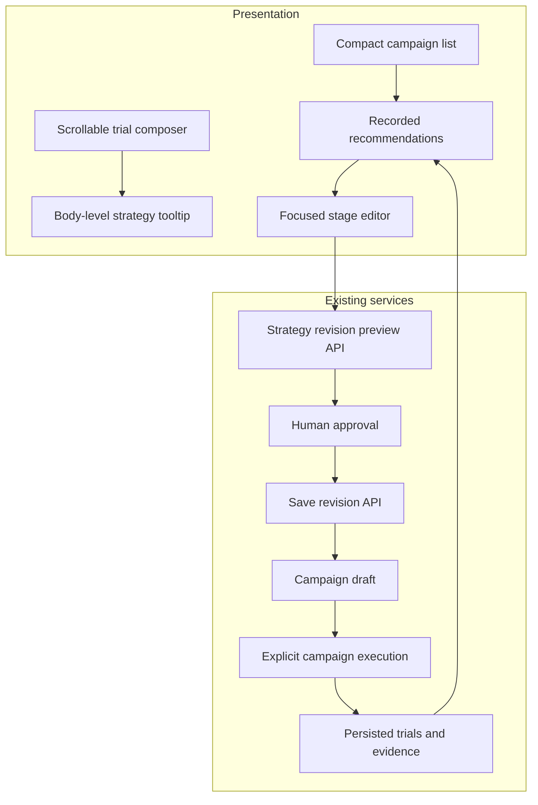

# ADR-029: Consistent workspace actions and reviewed improvements

- Status: Accepted, implemented
- Date: 2026-09-13

## Context

The trial composer clipped strategy details inside a scroll container. Separate
page styles used conflicting surfaces, while campaign cards mixed navigation,
exports and baseline details. Improving a campaign opened too many controls at
once and did not make the approval boundary obvious.

## Decision

Use shared neutral theme tokens and consistent action styling while retaining
semantic anchors for navigation, buttons for mutations and native disclosures for
secondary detail. Campaign lists prioritize name, status and trial counts.

Render strategy details as one fixed overlay attached to the document body,
bounded by the viewport. Hover and keyboard focus open it; Escape, external
scrolling, resizing and navigation dismiss it. Composer scrolling remains intact.
Native campaign dialogs and the sample view use short entry fades, disabled for
reduced-motion preferences.

Recorded stage failures may open a focused strategy revision editor. Compatible
endpoints come from the existing catalog. The user selects an alternative,
previews the existing API's exact diff and approves Save and use revision. Only
then is the new revision persisted and added to the draft. Running the campaign
requires the existing explicit execution action.

## Consequences and evidence

This changes presentation and makes the approval boundary explicit. It does not
change pipeline stages, parallel or sequential execution, scoring, SQLite
persistence, or baseline contents. A suggested stage is an investigation target,
not a claim that an alternative endpoint performs better. AI interpretation stays
separate from recorded findings.

Implementation: `frontend/tooltips.js`, `navigation.js`, `benchmarks.js`,
`datasets.js`, `strategy-revisions.js`, and shared styles. Regression coverage:
`test_tooltips_ui.cjs`, `test_navigation_ui.cjs`, `test_results_ui.cjs`,
`test_strategy_revisions_ui.cjs`, and `test_evaluation_journey_ui.cjs`.
