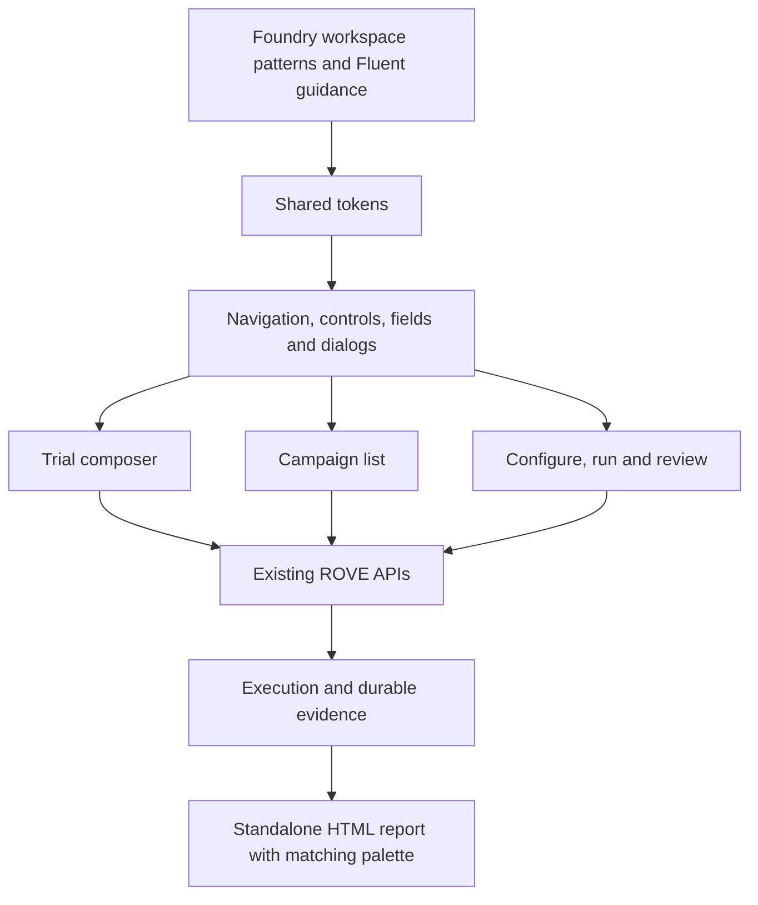
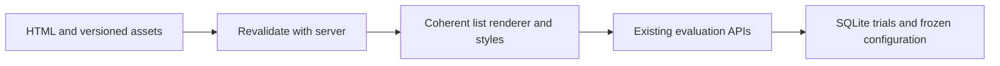

# ADR-030: Foundry-inspired visual language

- Status: Accepted, implemented
- Date: 2026-09-13
- Extends: [ADR-029](ADR-029-workspace-interaction-consistency.md)

## Context

ROVE's robotics developers compare strategies, inspect evidence and repeat those
comparisons. Inconsistent navigation, controls and page styling distract from
that work. The requested visual reference is Azure AI Foundry's AI workspace,
not Azure Portal's resource-management interface.

## Decision

Use `frontend/fluent.css` as the shared token and component layer, loaded after
page styles on all five workspaces. Centralize neutral light/dark colors,
restrained purple actions, Segoe UI/system typography, spacing, focus states and
control geometry. Remove conflicting legacy journey rules from `datasets.css`.

Keep ROVE's Evaluate and Campaigns navigation. Use an aligned campaign list with
name, status, trials, created date and View results / History / Export / Improve actions.
Collapse the columns into rows on narrow screens. Configuration steps use flat
navigation with a clear active underline; focused editors use native dialogs.
Preserve semantic links, buttons and disclosures and the user's saved theme.

## Alternatives and consequences

A React/Fluent component-library migration would replace working frontend
infrastructure without adding evaluation capability. This change adapts the
visual language in existing HTML/CSS; it does not claim to integrate Microsoft's
component library or reproduce Foundry exactly. Azure Portal navigation would
introduce unrelated resource-management concepts and is not adopted.

Exported reports embed matching colors and typography because they must remain
standalone. This small duplication must be updated with future theme changes.
Page-specific content layouts remain in their existing stylesheets. No changes
are made to pipeline execution, CLI operations, SQLite records or scoring.

## Validation

`tests/test_fluent_ui.cjs` checks text/action contrast in both themes and verifies
the shared layer loads last on every workspace. Campaign-list regression tests
cover dates, unavailable timestamps, progress and the existing actions. Browser
inspection covers the campaign list, trial composer, sample cases, results and
the reviewed strategy dialog. Existing UI and Python suites cover execution and
report behavior. A separate local Copilot draft probe confirms connectivity and
structured output, not recommendation quality or robotics performance.

## References

- [Foundry evaluation results](https://learn.microsoft.com/en-us/azure/foundry/how-to/evaluate-results)
- [Foundry navigation](https://learn.microsoft.com/en-us/azure/foundry/how-to/navigate-from-classic)
- [Fluent typography](https://fluent2.microsoft.design/typography)
- [Fluent color](https://fluent2.microsoft.design/color)
- [Fluent layout](https://fluent2.microsoft.design/layout)

## Browsing and actionable improvement refinement

Trials and Campaigns both start with full-width lists. Opening a trial reveals
its inspector; Back to trials restores the source filter, page and focus.
Deep links still open the requested trial directly. Settings is a gear link in
the top-right shared navigation on every workspace, superseding ADR-029's sidebar
placement.

Improvement recommendations identify the strategy, affected-trial counts and
named case evidence. Execution failures and missing assessments produce separate
recommendations even within one strategy. Model changes open the existing
reviewed revision editor; unscored trials link to their evidence and success
metrics. A strategy with no recorded trials is never described as passing.
Missing error messages stay absent rather than being invented. These are
recorded findings; optional model-authored interpretation remains labelled.

Regression coverage includes `test_history_routes_ui.cjs`,
`test_evaluation_journey_ui.cjs` and `test_campaign_seeds.py` for browsing,
evidence actions, mixed failure/unknown results and empty history.

Configure's live budget is a presentation of case/strategy/repeat selection;
server preview remains the launch authority. Success controls expose the existing
scope, evidence and assessment fields without altering grading contracts. Run
shows a rollup derived from planned trial slots and recorded execution states,
using the same stage renderers as standalone trials. Configuration is disclosed
beneath active progress. Counter labels distinguish execution completion from
successful task assessment.

## Execution, results and asset coherence

Campaign execution has an overall progress rollup and per-strategy progress using
the existing durable trial slots. Results use Overview, Trials and Scoring details
within one selected campaign. Campaign history has its own exact-ID route and reuses
the existing lineage renderer. No execution or storage ownership moves into the UI.

The trial sidebar is 320 pixels wide on desktop and presents bounded recent history;
the full list retains source filters and pagination. Task names, strategy, stable
short IDs and timestamps distinguish attempts. Execution completion remains separate
from assessment acceptance.

`FrontendStaticFiles` sets `Cache-Control: no-cache`, retaining conditional ETag
responses while requiring revalidation. Root HTML follows the same policy. Static
asset query versions are updated together to invalidate previously cached bundles.
A same-URL regression verifies changed content replaces the old renderer; data assets
and SQLite storage are unaffected.

