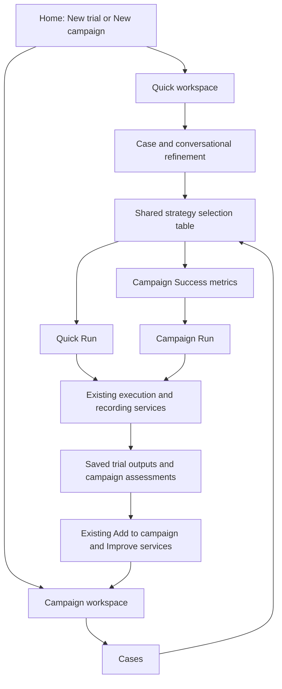
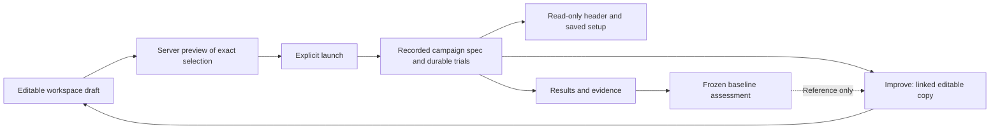

# ADR-031: Share evaluation setup while preserving saved execution identity

**Status:** Implemented; automated regression and desktop browser checks recorded below.
**Date:** 2026-09-13.
**Amended by:** [ADR-032](ADR-032-trial-review-and-navigation-state.md), which adds gated
quick-trial review, explicit execution and unsaved-work navigation.
**Product contract:** [Evaluation workspace](../product/user-journey.md).
**Supersedes:** Conflicting navigation, header placement and setup presentation in
[ADR-030](ADR-030-foundry-visual-language.md). Its shared visual tokens and historical
verification remain valid for their stated revision; no framework migration follows.

## Context

ROVE's first useful comparison uses one task, observation and optional robot
description across strategies. Campaigns extend that comparison across cases and
attempts, with declared scoring and retained history. Separate configuration controls,
moving campaign identity fields and ambiguous scoring widgets made these related
workflows harder to understand than their underlying services.

The robotics researcher needs repeatable comparisons. The manipulation-team ML
engineer needs an immediate output before building a broader evaluation. The platform
team needs existing configuration, scheduling and SQLite persistence to keep serving
both UI and CLI paths. Navigation and rendering must not create a competing engine.

## Decision

Make **Trials** and **Campaigns** peer record browsers. Use **New trial** and
**New campaign** consistently for creation. Keep Settings separate on the right.
Present quick work as **Case → Configure → Run → Results**, preserving conversational
task refinement and the original execution/results pipeline. Present campaigns as
**Cases → Configure → Success metrics → Run → Review and improve**.

Both Configure stages render the same strategy checkbox table with configured stage
endpoints. Selection data remains owned by its existing workspace; the shared
component displays options and reports selection changes. It does not schedule trials,
edit endpoint configuration or infer successful model execution.

### Campaign identity is global to the workspace

The campaign header holds name, attempts per case and the live
case × strategy × attempt total across every stage. A draft owns editable values.
A saved campaign owns none of those mutable fields: render identity and setup from
its recorded spec. Count attempts using `spec.seeds.length`, preserving nonconsecutive
seed values. Do not reconstruct history from current form defaults or current YAML.

Improve creates a linked editable copy of the source configuration through existing
services. Changes to that draft do not rewrite saved trials or baseline assessments.
Cases, strategies, scoring and seed identity remain available for exact comparisons.

Readiness feedback stays inline with configuration: pending, ready or blocked. A
changed selection invalidates stale readiness. The server remains the launch
authority; a successful configuration check only establishes the checks performed.

### Separate individual scoring rules from report statistics

Each criterion exposes **Pass condition** and **Checked by**, plus its evidence and
required/diagnostic role. A description is a rubric, not executable verifier logic.
Manual criteria need recorded human judgments. Configured criteria require an actual
verifier binding and compatible evidence; AI drafting does not make a check automatic.

Report statistics appear in a noninteractive explanation table: **How calculated**
and **When available**. Existing backend assessment defines task success, pass@k,
pass^k, timing and available robotics measures. Missing judgments or evidence stay
unknown. A criterion cannot convert predicted actions into physical completion.

Reuse criteria copies another evaluation's scoring setup into a draft for review.
It does not copy its outcome judgments. Contracts, targets and annotation bindings
remain available under **Technical settings** with their current service semantics.

The useful design reference is W&B Weave's separation of evaluation inputs, executed
systems and scorers, and its distinction between per-output scoring and aggregate
results. This is a conceptual reference only; no W&B dependency, data export,
credential requirement or runtime integration is introduced.

### Results always belong to their selected context

New-draft Results shows **No results yet** and **Go to Run**. It does not become a
second campaign browser or expose empty baseline comparison controls. Saved Results
uses the selected campaign and retains outcomes, inspectable trials, scoring details,
baselines and Improve. Foreground execution completion opens those results through
the existing path. Reading results, changing stages or regrading never reruns a
pipeline or adds another trial.

## Alternatives and consequences

**One campaign-only creation path.** This would again bury the immediate
single-observation comparison. Keep both entry points, sharing the stage controls
that actually perform the same job.

**Separate quick/campaign strategy widgets.** This makes endpoint display, selection
and accessibility drift. One presentational component avoids that duplication while
existing workspaces retain their own draft state.

**Editable saved campaign forms.** This misrepresents which configuration produced
the recorded evidence. Saved setup must remain historical; Improve is the editable
copy boundary.

**Make metric explanations configurable scorers.** This confuses aggregate report
statistics with trial-level acceptance logic. Preserve explicit verifier/review
bindings and backend calculations.

The change touches rendering, navigation and draft/saved-state presentation. It
retains existing APIs, CLI support, sequential/parallel execution, strategies,
SQLite evidence, case promotion and baseline semantics. Browser interaction tests
must cover both users of the shared strategy table and transitions between drafts,
saved execution and Improve.

## Implementation and validation

The strategy component is [`strategy-table.js`](../../frontend/strategy-table.js)
with [`strategy-table.css`](../../frontend/strategy-table.css). Campaign integration
uses [`datasets.html`](../../frontend/datasets.html) and
[`datasets.js`](../../frontend/datasets.js); quick workflow uses the existing trial
workspace and runner. [Browser evidence and verification limits](../product/user-journey.md#verification-of-the-shared-workspace-13-september-2026)
record the local mock execution and draft/saved setup checks. Narrow-screen browser
interaction and live provider/hardware validation are separate.

Regression coverage and browser acceptance criteria:

- Consistent browser/creation navigation and preserved quick task/image/URDF/chat
  state through Case, Configure, Run and Results.
- Shared strategy selection and endpoint display with inline readiness feedback.
- Live campaign totals on every draft stage; recorded name/count/setup on saved
  campaigns, including nonconsecutive seeds and configuration drift.
- Read-only saved state and editable source-linked Improve copies.
- Explicit manual/configured scoring semantics, retained technical bindings and
  noninteractive report-statistics explanation.
- Focused empty-draft Results, saved campaign scope and preserved pipeline progress,
  result inspection, history, case promotion and baseline actions.
- Mock trial-count/persistence checks plus desktop/narrow and light/dark interaction
  checks. API/model/hardware validation remains separate.

## References

- [W&B Weave scoring overview](https://docs.wandb.ai/weave/guides/evaluation/scorers)
- [W&B Weave evaluations overview](https://docs.wandb.ai/weave/guides/core-types/evaluations)
- [ROVE scoring and measures](../product/metrics-and-success.md)
- [ROVE CLI capabilities](../product/cli-ui-parity.md)
- [ADR-027: Saved trials and iteration identity](ADR-027-trial-to-campaign-improvement.md)
