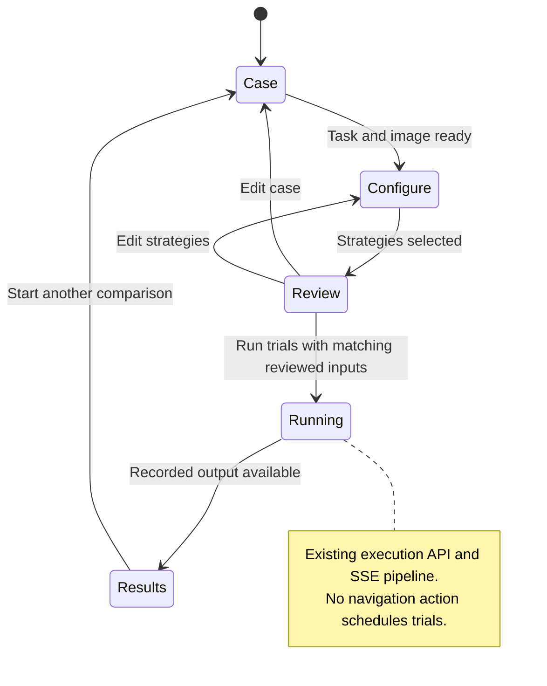
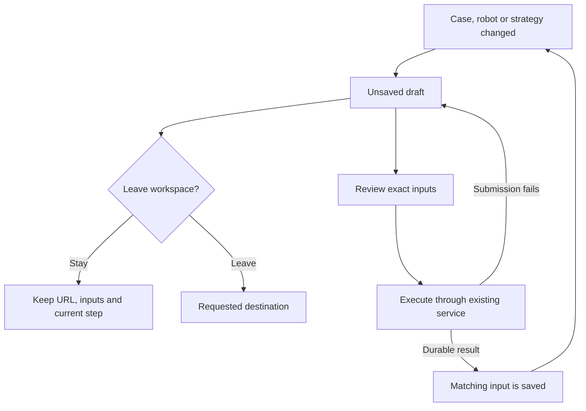

# ADR-032: Make trial review the execution boundary

**Status:** Accepted; implemented and verified.
**Date:** 2026-09-14.
**Amends:** [ADR-031](ADR-031-shared-evaluation-workspace.md) quick-trial progression.

## Problem

A navigation label is not an execution contract. The first shared workspace exposed
Run comparison throughout setup, allowed task Enter to execute, and provided no
Configure-to-review action. A user could see several apparently equivalent controls
without knowing what was ready, what would execute or whether leaving would lose work.

For the robotics ML engineer comparing pipelines, the decision to execute must be
based on one visible observation, task, robot description and strategy selection. The
researcher must be able to revisit inputs without accidentally scheduling another
attempt. The platform team needs those interactions to keep using the existing API,
parallel/sequential runner and durable trial store.

## Decision

Quick comparisons use **Case → Configure → Review & run → Results**. Each setup stage
has one primary next action. Stage buttons navigate; only **Run trials** on the review
screen executes. Task Enter inserts a line break.

| State | Primary action | Availability |
| --- | --- | --- |
| Case | Continue to Configure | Task and observation present; case loading finished |
| Configure | Review & run | Case ready and at least one configured strategy selected |
| Review & run | Run trials | The displayed input/strategy snapshot still matches the draft |
| Running | Execution progress | Setup and repeat launch locked; Results waits for available output |
| Results | Start another comparison | Returns to setup with retained inputs; does not execute |

The review presents the image, full task, optional URDF identity, selected strategies
and planned count together. Editing input or selection invalidates the reviewed
snapshot. Returning to Review must show the new configuration before it can execute.
Results belongs to the recorded attempt, even if the next draft subsequently changes.

## Leaving and unsaved work

Selecting or editing a case, robot file or strategy creates an unsaved draft. Step
navigation and opening sample selection retain that draft. Leaving for Trials,
Campaigns, Home or Settings opens a Stay/Discard dialog; cancellation keeps the URL,
inputs and focus. Confirming discard navigates away without implying the draft is saved. Reload/close uses the browser's native unsaved-work warning. Opening a link
in another tab retains the current page and does not need a leave confirmation.

Active execution has a distinct warning: its recorded work is not described as an
unsaved draft. Completion with durable trial identity makes the matching inputs saved;
editing them again creates a new unsaved draft. Failed submission must not silently
mark the draft saved. Approving one navigation must not disable future protection.

## Scope and verification

This is an interaction-state change, not a new runner, campaign model or draft-storage
service. SQLite trial persistence, case identity, strategy definitions, CLI execution
and campaign promotion remain authoritative. A browser confirmation does not imply
that an unsubmitted draft has been durably saved or can survive a reload.

Regression checks cover disabled future steps, navigation without execution, review
identity and invalidation, task keyboard behavior, a real SSE-shaped completion,
failed submission, unsaved/active navigation, cancellation and post-completion edits.
Browser verification exercised Case → Configure → Review → running progress → automatic
Results with one mock strategy, checked the visible sticky actions and cancelled
leaving without losing the case. The completed trial was durably saved and allowed
leaving without a draft warning. Live provider or robot performance is outside this
validation.
