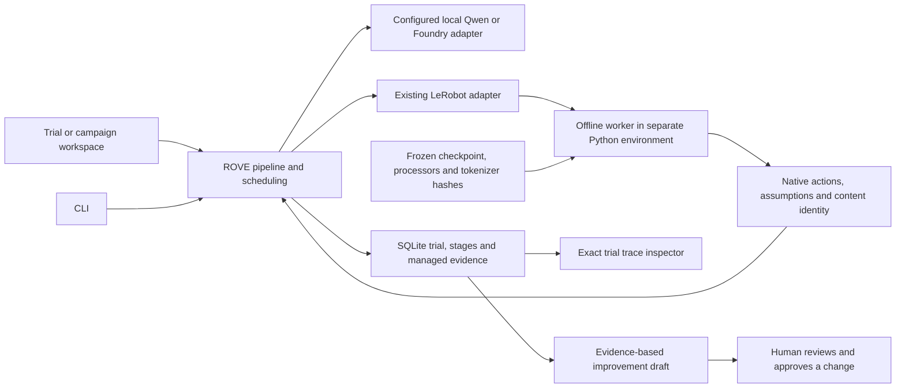
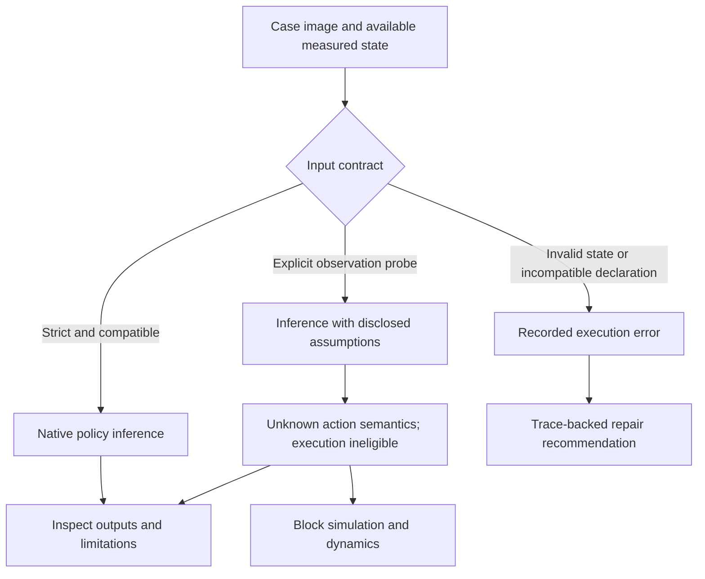

# ADR-033: Isolated VLA inference and connected trial inspection

**Status:** Implemented locally, 14 September 2026. Local Qwen Scene strategies and SmolVLA inference exercised; Foundry calls and Pi0.5 inference still require external configuration/access. This supplements ADR-016, ADR-022 and ADR-027.

## Problem

A robotics engineer must compare strategies on the same observation, inspect a failed stage, and return to the other strategies. Losing the comparison while opening one trial prevents that work. Missing optional SDKs and incompatible ML dependency ranges also made configured strategies fail before providing useful evidence.

A model producing an action vector is useful integration evidence. It is not evidence that the pictured robot completed its task, especially when a checkpoint expects measured state and multiple cameras that a supplied case does not contain.

## Decision

Keep campaign scheduling, pipeline stages, success contracts, SQLite records and trace identities in ordinary ROVE code. Add an explicit separate-process option to the existing LeRobot adapter for a trusted local checkpoint with its native preprocessing and independently locked dependencies. Do not weaken the main application's dependency constraints to accommodate this runtime.

The worker has bounded request/result files, a timeout, cancellation cleanup and a filtered environment without cloud credentials. It uses trusted local safetensors and native normalization/denormalization, resets the policy per trial and disables compilation. Its asset manifest identifies the actual weights, processor statistics and tokenizer contents. The endpoint pins the manifest digest and critical runtime package versions, so an in-place change fails before inference rather than silently reusing an old campaign identity. OS, drivers and remaining transitive dependencies are not a deterministic replay guarantee. Declared upstream revision names remain distinct from verified content hashes. Pi loading must fail on missing or incompatible weights rather than return a partially initialized model.

The dependency environment is **not a security sandbox**. It can access files available to the local OS user and retains known upstream dependency advisories. The experimental runtime guide records those constraints and the operations excluded from this inference path. This is not an approved production deployment.

## Observation and action contract

Strict mode requires the exact finite measured state vector and rejects declared embodiment conflicts. The current bridge supplies one actual image; missing views follow the native policy behavior and are disclosed. It does not claim complete multi-camera support or infer state from an image.

An explicitly selected observation probe may use labeled zero state. Its action coordinates remain unknown, its confidence is unavailable, and `execution_eligible: false` prevents both simulator execution paths and dynamics/FK analysis. Verifier context and campaign interpretation retain the assumptions. The verifier receives numeric scores only where supported; evidence quality and reasoning are separate string fields. Missing evidence remains unknown.

## Inspection and improvement

Run and Results retain an **All strategies** overview. Selecting a strategy shows its output without losing the other executions; **Inspect trial & traces** opens the exact durable trial in a separate inspector. Campaign progress has an explicit return to all strategy lanes. Inspecting evidence does not launch another inference.

Campaign explanations receive bounded saved stage/model identities, statuses, durations, check measurements and evidence anchors alongside scored aggregates. Raw prompts, action arrays, journal entries and private traces are not automatically sent to the assistant. Recommendations distinguish runtime repair from a model-quality hypothesis. They remain drafts: no automatic model edits, grading changes or reruns. Missing provider telemetry is never manufactured, and an unavailable assistant is not represented as AI analysis.

## Validation and consequences

Local validation ran a real Qwen Scene trial and a Scene/Plan campaign, and a SmolVLA trial and campaign through perception, native actions on Apple MPS and verification. The SmolVLA campaign persisted 17 events across its three stages and completed with its human-reviewed contract outcome still unknown. These establish execution and recording paths, not physical task success or model improvement. Foundry still needs a real project endpoint and agent; Pi0.5 needs authorized access to its gated tokenizer. Azure SDK imports are installed and health checks now resolve the configured agent instead of merely constructing a client.

Regression coverage includes progress return navigation, exact trace deep links, persisted insight evidence boundaries, runtime-error recommendations, process timeout/cancellation, asset mutation detection, strict weight loading and probe execution guards. See [runtime preparation and limits](../../examples/runtime/lerobot/README.md), [trial navigation tests](../../tests/test_trial_composer_ui.cjs), [worker tests](../../tests/test_lerobot_process.py), [probe boundary tests](../../tests/test_probe_execution_boundary.py), [insight tests](../../tests/test_campaign_insights.py) and [prompt tests](../../tests/test_verify_prompts.py).
