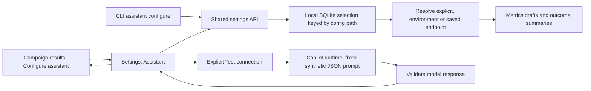

# ADR-034: Persistent assistant selection and explicit connection testing

**Status:** Implemented locally, 14 September 2026. Extends ADR-024 and ADR-033.

## Problem

Campaign results offered an Assistant settings link without a corresponding settings section. A configured local provider was not selected because selection depended on an environment variable. The UI hid that cause behind a generic unavailable message, and Retry could not fix missing configuration. Merely finding the SDK and CLI also did not prove the model could respond.

## Decision

Add an Assistant section to the existing Settings view, reached directly by `/?view=settings#assistant`. Users select an existing Copilot assistant endpoint, save it, test its connection explicitly and return to campaign results. Credentials remain in server-side endpoint configuration or environment variables; the settings response only displays provider origin and model identity.

Selection precedence is an explicit host endpoint, then `ROVE_ASSISTANT_ENDPOINT`, then the saved endpoint. A host/environment override appears read-only; Save returns a conflict rather than pretending it changed the effective provider. Disabled is a saved null selection. Endpoint choices must exist and use the Copilot adapter. The selection is local application state in `assistant-settings.sqlite3`, keyed by resolved configuration path, rather than a modification of a strategy or historical campaign snapshot.

GET settings, Save and runtime status do not send inference requests. **Test connection** sends a fixed synthetic prompt with no case data, images or tools, and requires a valid JSON response. SDK/CLI presence is labeled runtime availability, not provider connectivity. Failed, timed-out and malformed replies cannot report a successful connection. A later provider outage remains possible after a successful test.

## Summary behavior

Unconfigured campaigns offer Configure assistant, not an ineffective Retry. Configured generation failures remain retryable; unfinished campaigns explain that summaries become available after completion. The settings link preserves a validated local campaign return destination. Selection changes invalidate stale connection-test responses in the UI.

Summary prompts supply an explicit list of permitted evidence references and require a cited trial's exact anchor in the same finding. Unsupported nested paths and fabricated references are still rejected. Only validated AI summaries are cached against the evidence, assistant configuration and prompt version. The assistant does not alter scores or launch evaluations.

## Verification and limits

Tests cover selection across new service instances, configuration isolation, concurrent first-save, disable and override behavior, credential exclusions, shared CLI routes, explicit synthetic inference, malformed output and stale UI responses. A local Copilot/Qwen summary was generated from bounded saved campaign evidence with validated citations. This does not validate a cloud deployment or establish model quality.

Source and tests: [selection service](../../src/rove/runtime/assistant.py), [API](../../src/rove/api/assistant.py), [CLI](../../src/rove/ui/assistant_cli.py), [settings tests](../../tests/test_assistant_settings.py), [UI tests](../../tests/test_trial_composer_ui.cjs), [summary tests](../../tests/test_campaign_insights.py).
