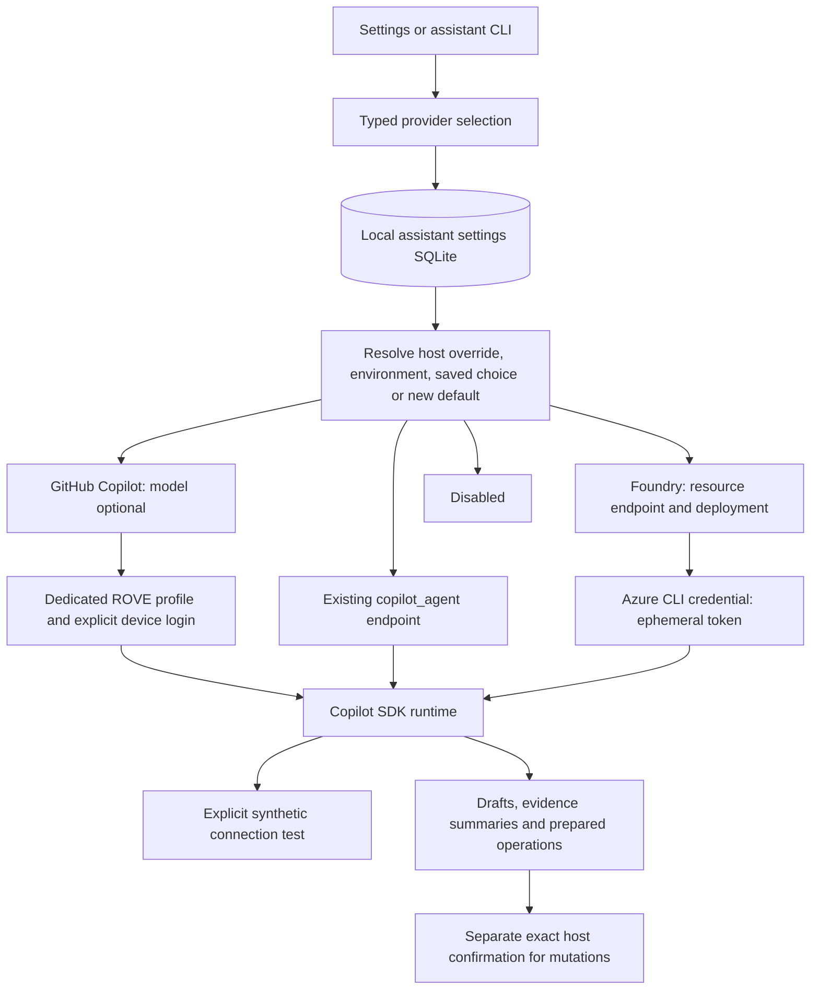

# ADR-035: Explicit assistant providers with isolated authentication

**Status:** Implemented; verification in progress. No authenticated GitHub or Azure
model inference claim is made by this implementation status.
**Date:** 2026-09-14.
**Extends:** [ADR-034](ADR-034-persistent-assistant-settings.md) and
[ADR-024](ADR-024-copilot-runtime-and-observability.md).
**Product guide:** [Assistant setup](../product/assistant-setup.md).

## Context

An existing-endpoint-only selector makes users configure a local model even when they
intend to use GitHub Copilot or an Azure model deployment. A new default must not
overwrite an existing local selection or re-enable a user-disabled assistant. Model
provider choice also must not blur the boundary between assistant configuration,
strategy configuration and authorization to change an evaluation.

## Decision

Persist a typed selection with four modes: `copilot`, `endpoint`, `foundry` and
`disabled`. A missing settings row defaults to Copilot; a saved null/disabled row
continues to mean Disabled. Existing endpoint selections migrate without changing
their effective model. Explicit host and environment endpoint overrides retain their
read-only precedence.

The settings schema adds `settings_json` while retaining migration of old endpoint
rows. It stores provider/model/endpoint/deployment choices, not provider secrets.
Authentication state belongs to the dedicated runtime profile or the Azure CLI
credential source, not the browser form or campaign spec.

### Copilot uses an explicit ROVE identity

The default Copilot session supplies neither a custom provider dictionary nor a model
ID unless the user selected one. It does not silently route through a local fallback.
A dedicated ROVE Copilot profile isolates the explicit login from ambient GitHub CLI
configuration/tokens. Device-flow start, status and cancellation are visible operations;
cancellation affects the pending ROVE login, not global GitHub identity.

SDK authentication status and model discovery are explicit. They are distinct from
runtime installation checks and from a successful inference. This extends the prior
custom-provider-only restriction without broadly enabling ambient credentials for all
agent or grader roles.

### Foundry uses an Azure model resource

Accept an HTTPS public Azure model host at `*.services.ai.azure.com` or
`*.openai.azure.com`, with no credential/query/fragment fields and only the root or
`/openai/v1` API path. Normalize to `/openai/v1/`; retain an explicit deployment name.
Reject a project/agent endpoint or arbitrary host before obtaining a credential.

At execution, `AzureCliCredential` obtains a token for
`https://ai.azure.com/.default`. The transient bearer token is supplied to the
configured model session, excluded from persisted settings and ordinary logs, and
not returned to the browser. The user must already have Azure CLI authentication and
deployment permission on the ROVE host. This does not provision Azure or validate all
sovereign/private endpoint variants. An existing Foundry Agent strategy remains a
different adapter path.

### Saving, testing and proposing remain distinct

Read/Save settings do not run inference. Test uses a fixed synthetic JSON exchange
without customer cases or tools. Timeout, malformed output and provider failure are
not successful tests. A selection change invalidates a late test result in the UI.
Provider changes do not modify historical campaigns; summary cache identity includes
the effective assistant configuration.

Assistant-generated workflow changes still pass through the operation preview and
exact host confirmation from ADR-034. Authentication or successful connectivity never
grants permission to alter grades, fabricate SME reviews or rerun a campaign.

## Interfaces

| Interface | Purpose |
| --- | --- |
| `GET/PUT /api/assistant/settings` | Read or save the typed selection; old endpoint requests remain compatible |
| `POST /api/assistant/copilot/status` | Inspect dedicated-profile authentication; optional `include_models` |
| `POST /api/assistant/copilot/login` | Start the explicit device flow |
| `GET/DELETE /api/assistant/copilot/login/{operation_id}` | Read/cancel that login operation |
| `POST /api/assistant/test` | Run the fixed synthetic connection test |
| `rove assistant configure` | Choose Copilot, existing endpoint or Foundry through the owning local server |
| `rove assistant login`, `login-status`, `cancel-login`, `auth-status`, `models` | Equivalent authentication/discovery controls |

See the [CLI setup examples](../product/assistant-setup.md) for exact flags. Assistant
CLI operations use a literal loopback server URL; ordinary campaign execution remains
available headlessly through shared services.

## Alternatives and consequences

**Overwrite local choices with a new default.** This would change working deployments
and undo explicit disablement. Apply the default only when no saved row exists.

**Reuse every ambient GitHub identity.** Convenient but difficult to explain and
isolate. A dedicated profile makes the user's sign-in and runtime identity explicit.

**Accept arbitrary Azure token destinations.** This would expose credentials to
untrusted hosts. Bound this first implementation to validated public model resources;
additional endpoints require a reviewed contract.

**Use a Foundry project/agent identifier as a model.** These are different API and
runtime contracts. Keep model-provider assistant setup separate from agent strategies.

## Validation boundary

Required checks cover migration/default/disabled preservation, override precedence,
typed option validation, dedicated-profile authentication, device-flow lifecycle,
explicit model discovery, synthetic test failures, token redaction and permitted
Azure destinations, UI stale-response handling and CLI parity. A preserved local
endpoint can be tested independently of GitHub/Azure credentials. Live authentication
and inference require actual user access and must be reported separately by provider.

Source: [selection](../../src/rove/runtime/assistant.py),
[runtime](../../src/rove/runtime/copilot.py),
[login lifecycle](../../src/rove/runtime/assistant_login.py),
[API](../../src/rove/api/assistant.py), and
[CLI](../../src/rove/ui/assistant_cli.py).
