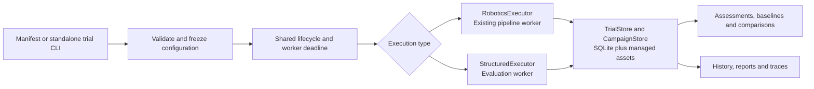
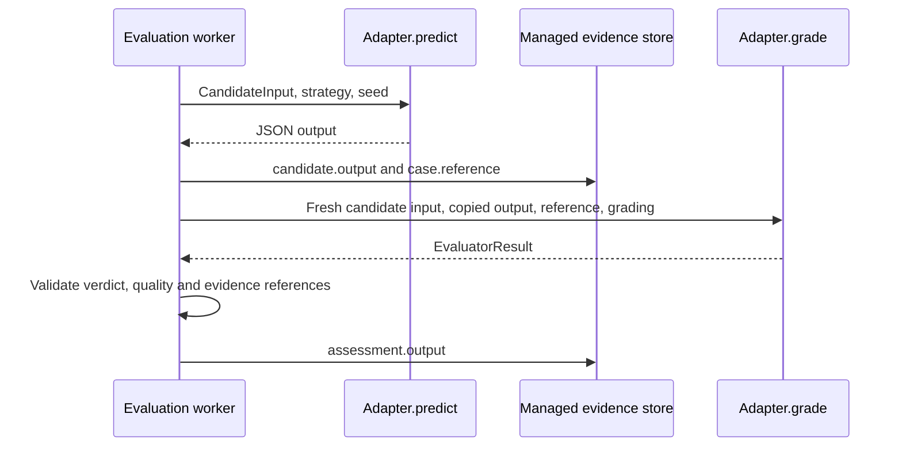

# ADR-036: Separate evaluation execution from the shared trial lifecycle

**Status:** Implemented locally, 14 September 2026; release checks are tracked with
the implementation. Extends the existing trial/campaign architecture.
**Product concept:** [Reusable evaluation core](../product/reusable-evaluation-core.md).

## Problem

Trials and campaigns already record attempts, configuration, evidence, reports and
baselines. Their execution preparation assumes robotics images and configured
pipeline stages. Reusing those services for another evaluation would otherwise
require fake images, fake stages or a second storage and scheduling system.

Preserve the robotics implementation and introduce a narrow execution boundary.
This change is not a new generic authoring UI or an ABC/cloud integration.

## Decision

`CampaignSpec.execution` selects an executor and defaults to `robotics`, preserving
existing manifests. Robotics uses `BenchmarkTask`, `RoveConfig` and
`verify_stage_judgment`. Other executors use `EvaluationCase`, `EvaluationConfig`
and `executor_assessment`; mixed task representations are rejected.

The shared runner retains campaign ownership, attempt recording, resume and process
cleanup. Standalone structured trials use the same attempt worker and `TrialStore`
without creating a campaign. This introduces no parallel database or hosted queue.

### Trusted executor discovery

`text-example` is a built-in offline demonstration. Other names resolve to exactly
one installed Python entry point in group `rove.evaluations`. Manifests choose a
name, not an import path, shell command or downloadable module.

The entry point names an `EvaluationAdapter` class with a declared revision and async
`predict`/`grade` methods. The registry records its distribution name and hashes
the inspectable Python source files for the adapter, predictor and grader. It
rejects ambiguous registration, missing source and changes to the recorded identity.
Construction happens only in the timed worker. Host discovery imports trusted
modules, so integration modules must keep model loading out of module-level code.

Installed adapters are trusted host code. A worker process provides lifecycle and
deadline control; it is not a container, microVM or untrusted-code security boundary.

### Separate candidate execution and assessment

`CandidateInput` excludes references. The worker reconstructs the validated case
before grading so mutation of the candidate input cannot replace the supplied
reference. Both methods still run in the same trusted adapter; method separation
does not guarantee independent model reasoning or prevent malicious access.

Candidate output is recorded before grading, so grader failure leaves its evidence
available. A success field in candidate output is not an authoritative verdict.
`EvaluatorResult` carries pass/fail/unknown, reasoning, evidence quality and typed
measurements. The current worker accepts grader references only to
`candidate.output` and `case.reference`; it records the validated grade as
`assessment.output`. Unsupported references fail execution rather than fabricate
evidence. Candidate and assessment events appear as trace lanes without robotics
stage names.

Structured cases/configuration are limited to 1 MB, candidate JSON output to 4 MB
and assessment JSON to 1 MB. References and raw outputs use managed assets;
public result summaries are sanitized. Canonical candidate inputs are retained
as a private managed asset whose digest participates in the trial snapshot,
preserving identity even when legitimate input keys resemble credential names.
Raw content hashes for the selected strategy, grading and environment also remain
in the redacted trial configuration, preventing the same ambiguity in settings. These bounds do not implement a remote
asset ingestion or access-control service.

### Comparison and provenance

Generic comparison keys include case content and references, suite version, seeds,
timeout, grading, declared environment, executor identity and runtime fingerprint.
Candidate strategy configuration is retained separately so compatible candidate
changes can be compared. Baseline snapshots retain the original assessments.

This deliberately prefers rejecting a questionable comparison to treating changed
grading or inputs as a candidate improvement. Because predictor source contributes
to executor identity, changing local adapter code can also make comparisons
incompatible. No automatic migration or declaration of equivalence is provided.

The environment field is a recorded descriptor, not an applied environment or
container specification. Source hashes do not establish immutable remote model identity or complete
environment reproducibility. Integrations must declare model/deployment revisions
and relevant dependencies. A supplied seed is recorded as supplied to the executor;
it does not prove the model used it or make repeated attempts independent.

### Existing user surfaces

Generic authoring uses CLI input documents and campaign manifests. Existing history
and report views display candidate output, executor assessment and measurements.
They omit fabricated images, pipeline stages and robotics-specific improvement
actions. Cases authoring, strategy catalog and the campaign wizard remain robotics
features; this ADR does not claim generic UI or API creation parity.

The robotics executor retains the existing task/image, endpoint selection,
verification, result and evidence behavior. Shared assessment types are re-exported
through the prior robotics module for compatibility.

## Alternatives and consequences

| Option | Decision |
| --- | --- |
| Represent every evaluation as four robotics stages | Rejected: invents inputs and obscures what was executed |
| Build another generic trial database and scheduler | Rejected: duplicates lifecycle, history and comparison behavior |
| Load arbitrary Python paths from a manifest | Rejected: requires installing and trusting an explicitly registered executor instead |
| Adopt an external execution platform now | Deferred: the boundary is local; ABC execution and Azure deployment require separate integrations |

The result is a reusable recording and evaluation lifecycle with a small extension
surface. Domain validity stays with the adapter and its evidence; the framework
cannot infer task completion, calibrate an LLM judge or turn a recording into a
simulated environment.

## Verification

[Core tests](../../tests/test_evaluation_core.py) exercise structured trials through
real subprocess execution and SQLite: pass/fail/unknown, resume without duplicate
trials, standalone history, baseline comparisons, reference separation, bounded
inputs, trusted entry-point loading, source drift and grader evidence validation.
[History tests](../../tests/test_generic_trial_history_ui.cjs) check generic
inspection and hide robotics-only controls. Existing robotics regression tests
remain required; the text example alone does not establish robotics compatibility.

Source: [models](../../src/rove/evaluation/models.py),
[protocols](../../src/rove/evaluation/protocols.py),
[registry](../../src/rove/evaluation/registry.py),
[executors](../../src/rove/evaluation/executors.py),
[worker](../../src/rove/evaluation/worker.py),
[robotics boundary](../../src/rove/evaluation/robotics.py),
[runner](../../src/rove/benchmarks/runner.py).
