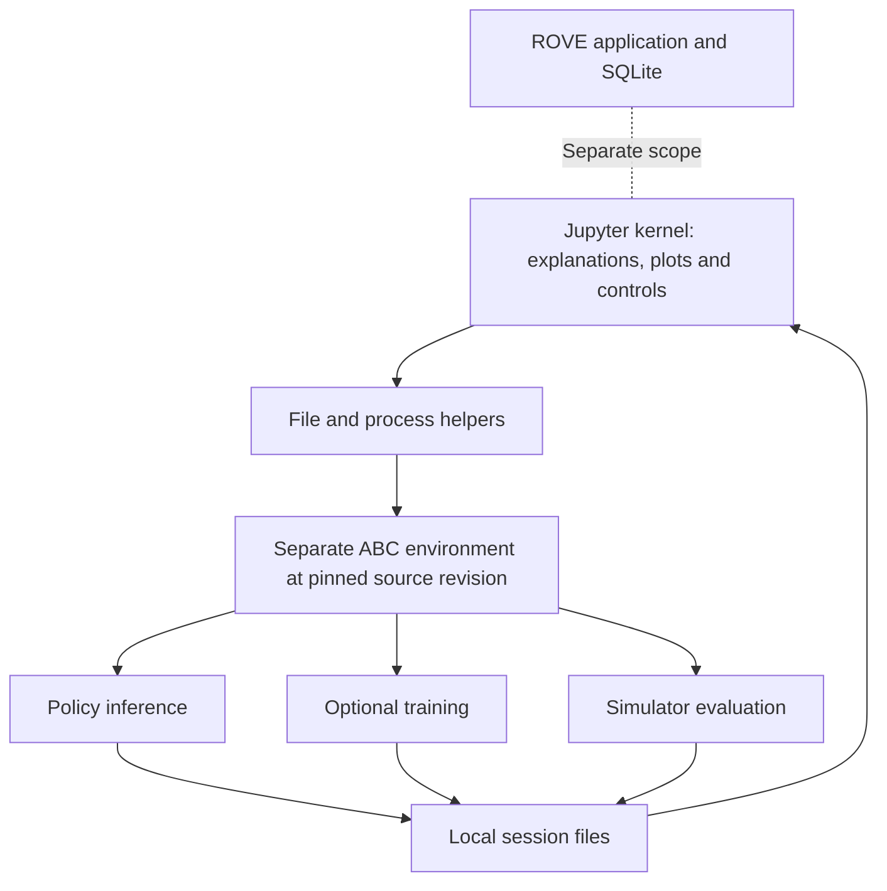

# ADR-037: Teach ABC and XDOF in a standalone Jupyter notebook

## Status

Accepted. Notebook and offline validation implemented; GPU execution remains
unverified on the local development host.

## Context

The user requested a Jupyter hello-world that follows an XDOF demonstration into
ABC policy inference, complete simulator evaluation and optional fine-tuning.
ABC already owns these capabilities. Its CUDA, PyTorch and MuJoCo requirements
are independent of ROVE's application dependencies and evaluation lifecycle.

## Decision

Keep the example under `notebooks/abc_xdof/`, with a lightweight notebook kernel
and a separate, pinned ABC checkout/environment. Invoke ABC's native tools in
subprocesses, preserving their output and exit status. Use native policy image
decoding and normalization. The ROVE application gains no training endpoint or
alternative execution engine from this tutorial.

Each execution gets fresh output paths. Full episodes are distinguished from
action-chunk diagnostics, and measured success is distinct from final success.
Independent processes reset each world; comparison notes surface differences in
prompts, actual resets and execution settings. Preview data is fingerprinted as
the prepared export rather than claiming an unavailable raw-dataset revision.

## Alternatives and consequences

Installing ABC into ROVE or the plotting kernel would create unnecessary
dependency conflicts and retain GPU memory between stages. Reimplementing the
ABC evaluator would create another scoring contract to maintain. A README alone
would not supply the requested executable, visual learning journey.

The subprocess boundary makes interruption and failure explicit and frees model
memory after each phase. Starting a fresh process per world adds model-loading
overhead; this is acceptable for a small tutorial, not a throughput benchmark.
Source pinning does not freeze all package resolution or prove GPU compatibility.
Actual GPU validation must precede any model-performance or resource-size claim.

See the [tutorial concept](../product/abc-jupyter-tutorial.md) for reader outcomes,
implementation pointers and verification scope.
