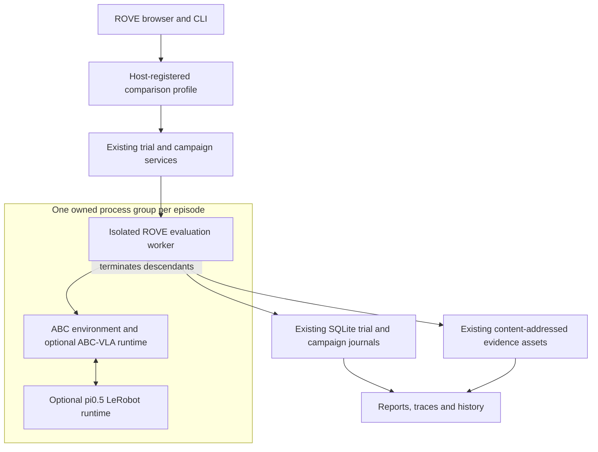

# ADR-038: Run ABC bimanual episodes through the shared evaluation lifecycle

## Status

Accepted. Experimental integration; GPU policy inference, simulator execution and
pi0.5 adaptation require validation on a suitable host before reporting model
performance. Local tests validate contracts, failure handling and durable records.

## Context

The user wants to compare ABC-VLA and pi0.5 on the same bimanual robot task and
measure whether adapting a checkpoint improves the results. The image-based
ROVE pipeline produces a single action chunk. It cannot establish completion of
a task requiring repeated observations and actions.

ABC already supplies the simulator and task evaluator. The reusable evaluation
core from [ADR-036](ADR-036-reusable-evaluation-core.md) already supplies isolated
trial workers, timeouts, campaign attempts, SQLite records, evidence and reports.
The standalone notebook in [ADR-037](ADR-037-standalone-abc-notebook.md) remains a
separate learning exercise; it does not provide the application lifecycle.

## Decision

Add the built-in `abc-bimanual` evaluation adapter. It uses the existing
`EvaluationAdapter.predict` and `grade` boundary and the existing campaign runner.
The candidate phase executes a complete episode; the grader interprets recorded
simulator evidence under the frozen success criterion.

ABC's environment and native VLA run in their pinned runtime. A pi0.5 strategy
uses a separate LeRobot runtime and compatible checkpoint. Interprocess messages
carry current observations and native action chunks. They do not turn ROVE's
application environment into a combined ML dependency installation.

## Preserve case and attempt semantics

A case fixes the task and scene reset. Campaign attempt seeds control policy
randomness separately. Each policy receives its own post-action observations,
starting from the same requested scene conditions. A fresh environment per trial
prevents prior robot state from leaking between policies or repeated episodes.

The environment revision, reset identity, task prompt, action interpretation,
budget and success mode are part of the comparison conditions. Checkpoint and
native processor contents identify the strategy. A different checkpoint can be
compared while keeping those conditions fixed; a changed evaluator or task is
reported as changed conditions.

ABC's `ever` and `final` success signals are separate measurements. The configured
signal supplies the binary outcome. Inference, simulated duration and complete
worker duration remain separate measures. No collision, intervention or physical
safety measure is inferred merely because the simulator executed.

## Optional evaluation context

Existing installed adapters keep their current `predict` and `grade` signatures.
An adapter may implement `bind_context(context)` to receive:

- A copied declaration of the frozen environment.
- A durable, clocked progress emitter.
- Bounded JSON, binary and local-file artifact recording through managed assets.
- The identities of currently recorded, integrity-checked evidence.

Core evidence IDs are reserved. An assessment may reference only evidence that
actually exists and remains available. Private case references are passed to the
grader separately, not included in the context environment or candidate input.
This contract separates responsibilities; trusted Python adapters still execute
on the host and are not a security sandbox.

The resolver fingerprints optional binding source as well as candidate/grader
source. Runtime fingerprints retain the surrounding ROVE implementation identity.
The worker records exception type and failed stage without persisting provider
exception strings that may contain credentials or customer inputs.

## Configuration and process ownership

Operator setup registers local paths and fingerprints outside the browser. Browser
requests select known strategies, scene seeds, policy seeds and bounded budgets.
Previews show readiness and planned trial count before execution. No arbitrary
Python module or executable path is loaded from a browser-supplied manifest.

Descendants inherit the ROVE worker's process group. They must not detach into a
new session, because the existing timeout/cancellation cleanup kills the owned
group. Evidence and progress are written before continuing so interruption does
not remove already-recorded observations. Unfinished trials retain unknown
outcomes and a distinct execution status.

## Alternatives and consequences

**Extend the image-only VLA adapter to emit a longer chunk.** This would still
omit observations after actions and would not establish completion. It would also
misrepresent a single model prediction as an entire episode.

**Add a second ABC-specific campaign runner.** This would duplicate identity,
resume, cancellation, persistence and statistical reporting. Reusing the generic
execution boundary keeps Trials and Campaigns consistent.

**Install both ML stacks in ROVE.** This creates dependency conflicts and couples
the UI/server environment to CUDA and model-specific versions. Separate runtimes
add process overhead but make ownership and validation explicit.

Fresh model processes are slower than a persistent serving pool. This is an
acceptable initial tradeoff for reproducibility and bounded resource use.
Checkpoint loading is therefore visible in worker duration and excluded from
reported policy-call latency. Throughput optimization requires its own design
and must preserve episode reset and mutable policy-state isolation.

## Validation and delivery

Local tests cover environment binding, reference separation, managed artifact
limits, evidence integrity, inherited binding provenance, error/cancellation
records, report measurement coverage and existing generic executor compatibility.
The real ABC CPU environment completed a 30-control-step smoke test with rendered
observations. Conversion and LeRobot readback also passed for two genuine ABC
training episodes containing 1,870 frames. Neither check ran a learned policy.
Live GPU validation must demonstrate both policies controlling the same supported
ABC robot, compatible native preprocessing, matched resets, finite actions,
complete episode evidence and correct success grading.

GPU inference and training remain unrun. No published-model comparison is
established until those episodes actually run.
Fine-tuning remains an explicit preparation activity, not a hidden action triggered
by evaluation. See the [product workflow](../product/abc-pi05-comparison.md) for
personas, outcome meanings and the customer's checkpoint-improvement journey.
