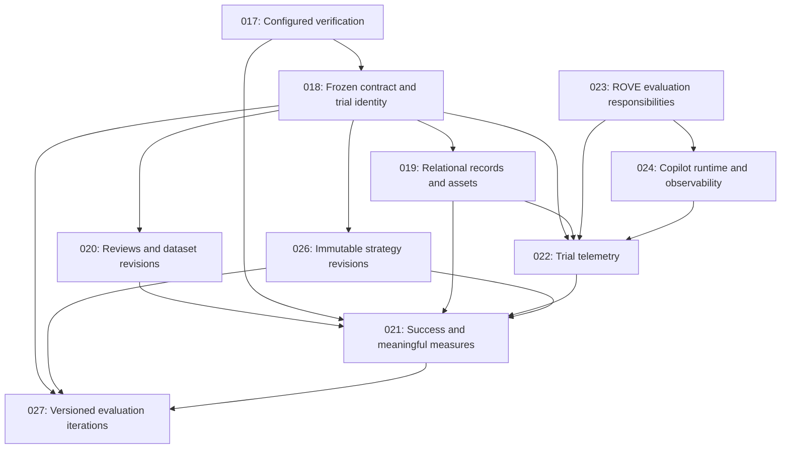

# Architecture decisions

Use [current implementation](current-implementation.md) to explain the shipped code,
the [target architecture](target-architecture.md) and [system diagram](system-diagram.md)
to explain the accepted direction, and [the product specification](../PRODUCT_SPEC.md)
to explain its purpose. An accepted direction can still have pending implementation.
Each new decision includes a diagram, alternatives, consequences and validation criteria.

| ADR | Decision status | Implementation |
| --- | --- | --- |
| [017: Configured verification](ADR-017-configured-verification.md) | Accepted, retrospective | Implemented in PR #14 |
| [018: Trial lineage and snapshots](ADR-018-trial-lineage-and-snapshots.md) | Accepted | Shared trial recording, case revisions, baseline references and exploratory promotion implemented |
| [019: Relational storage and assets](ADR-019-relational-storage-and-assets.md) | Accepted direction | Shared trial/case/review schema and managed images implemented; campaign journal remains separate |
| [020: SME-reviewed datasets](ADR-020-sme-reviewed-datasets.md) | Accepted | Local review drafts, immutable corrections and previewed dataset freezing implemented |
| [021: Campaign success and reporting](ADR-021-campaign-success-and-reporting.md) | Accepted | Success contracts, preview and assessment comparison implemented; aggregate targets pending |
| [022: Trial telemetry](ADR-022-trial-telemetry.md) | Proposed | Durable event and inspector foundation implemented; aligned traces and complete external export pending |
| [023: Evaluation semantics and execution services](ADR-023-evaluation-and-execution-harnesses.md) | Accepted direction, amended | Existing pipeline and shared recording retained; complete robot lifecycle contracts pending |
| [024: Copilot runtime and observability](ADR-024-copilot-runtime-and-observability.md) | Accepted direction | Optional pinned runtime and controlled transport proof implemented; live provider/collector validation pending |
| [025: Workflow navigation](ADR-025-workflow-navigation.md) | Accepted | Campaign workspace, local mock journey and responsive gallery verified |
| [026: Versioned strategy catalog](ADR-026-versioned-strategy-catalog.md) | Accepted | Immutable local strategy catalog and multi-strategy execution tested; editor browser integration pending |
| [027: Versioned evaluation iterations](ADR-027-trial-to-campaign-improvement.md) | Accepted | Shared CLI, managed trial handoff and validated iteration timeline implemented; full mock browser loop and narrow timeline verified |

## How the decisions connect

This diagram shows decision dependencies, not a statement that every component is implemented.

## Historical decisions

ADRs 001–016 record earlier choices. They are retained to explain context, and may contain planned behavior that differs from current code. The [older architecture overview](high-level-architecture.md) is also historical. In particular, [ADR-012](ADR-012-evaluation-provenance-and-failure-attribution.md) has a current implementation note about quick-history provenance and reproducibility limits.

| Earlier decisions | Subject |
| --- | --- |
| [001](ADR-001-stage-graph-orchestrator-and-mcp-topology.md), [002](ADR-002-lerobot-plugin-architecture.md), [003](ADR-003-simulation-and-external-dependency-strategy.md) | Orchestration, adapters and external dependencies |
| [004](ADR-004-pipeline-data-flow-strategies-concurrency.md), [005](ADR-005-src-layout-and-test-suite.md), [006](ADR-006-azure-default-credential-and-local-inference.md) | Data flow, layout/testing and model access |
| [007](ADR-007-config-restructure-endpoints-pydantic.md), [008](ADR-008-optional-pipeline-stages.md), [009](ADR-009-dashboard-plain-html-sse.md) | Configuration, optional stages and dashboard |
| [010](ADR-010-pipeline-generalization-agent-adapter.md), [011](ADR-011-simulation-adapter-strategy-and-dual-mode-verify.md), [012](ADR-012-evaluation-provenance-and-failure-attribution.md) | Agent stages, verification and provenance |
| [013](ADR-013-evaluation-categories-and-structured-reasoning.md), [014](ADR-014-two-phase-pipeline-execution-vs-evaluation.md) | Case categories and execution/evaluation separation |
| [015](ADR-015-action-space-normalization-and-dof-handling.md), [016](ADR-016-robot-embodiment-contract-and-vla-brokering.md) | Action conventions and embodiment |

When an implementation changes a decision, add its replacement or superseding note, update the product behavior and redraw affected diagrams in the same PR. Link implemented claims to code and tests; keep proposed contracts clearly labeled.
