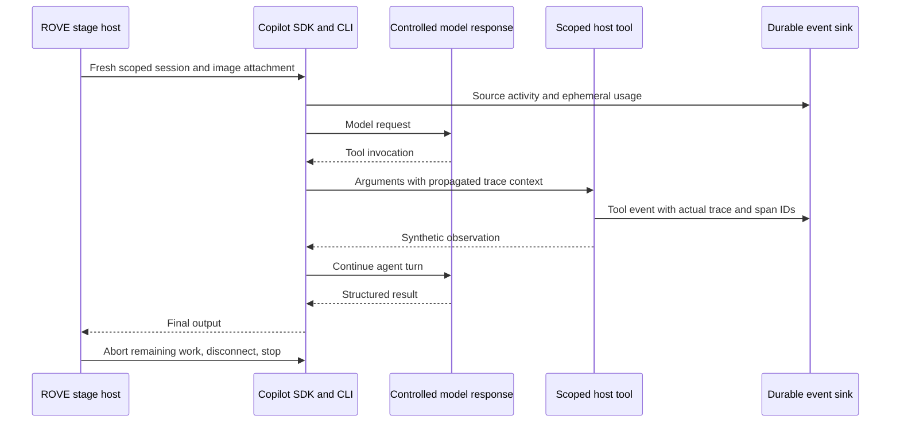

# Copilot Runtime Compatibility

**Updated:** 2026-09-12
**Status:** A controlled runtime proof and optional stage-host foundation are implemented. Live model quality, Azure identity, remote collectors and a production deployment are not validated by this proof.
**Decision:** [ADR-024](ADR-024-copilot-runtime-and-observability.md)

## Version Profile

| Component | Validated version | Rationale |
| --- | --- | --- |
| Python Copilot SDK | `github-copilot-sdk==1.0.13` | Official stable release dated 2026-09-04; keyword-based client/session API |
| Copilot CLI | `1.0.81-9` | Installed runtime explicitly checked by the host; automatic updates disabled |
| Python | 3.11 and 3.12 | Offline host tests and controlled runtime proof |
| OpenTelemetry instrumentation | `opentelemetry-sdk==1.44.0` | Supplies a real tracer provider for the installed-wheel correlation proof; the initial source probe also passed with 1.39.0 |

The optional `copilot` installation includes the OpenTelemetry API and SDK. A real
OpenTelemetry tracer provider/exporter still requires application configuration;
installing `opentelemetry-api` alone does not create spans. The host accepts the
native SDK telemetry configuration, with content capture governed by ROVE's
explicit capture setting.

The SDK package requires Python >=3.11, `python-dateutil>=2.9.0.post0`,
`pydantic>=2.0`, and `httpx>=0.24.0`; its telemetry extra adds
`opentelemetry-api>=1.0.0`. Package dependency resolution is recorded in `uv.lock`.
The CLI is separately selected by path and checked against the runtime profile.
Do not assume that upgrading one component preserves compatibility with the other.

Sources: [official release](https://github.com/github/copilot-sdk/releases/tag/v1.0.13),
[package metadata](https://pypi.org/project/github-copilot-sdk/1.0.13/),
[release source](https://github.com/github/copilot-sdk/tree/v1.0.13/python).

## Implemented Host Boundary

`src/rove/runtime/copilot.py` imports the SDK lazily. Each stage invocation starts
a fresh SDK session, child runtime, working directory and Copilot state directory.
Candidate, grader and assistant roles are fixed by host configuration; prompt
context cannot change role, tools, provider or deadlines. Fresh per-stage memory is
an explicit initial limitation: a future multi-stage agent episode must declare
its memory policy and be evaluated as a different configuration.

The SDK's `empty` mode disables ambient runtime behavior. The host supplies an
explicit tool allowlist (including an empty list), disables instruction/config
discovery, file hooks, Git operations and skills, and does not inherit account
credentials from environment variables or logged-in Copilot sessions. Tools must
be explicitly permitted for the actor role. Host tools validate their own domain
arguments. This is application scope control, not a hardware safety controller.

Inputs contain the stage, task and caller-provided context. Images are native blob
attachments, not base64 text in the prompt. The host requires a JSON object output;
the existing pipeline remains responsible for each stage's schema and grading.
A completed model turn is never automatically graded as a successful robot task.

An overall deadline covers client startup, session creation and model execution.
Timeout, cancellation, malformed output and recording failure abort the turn,
disconnect the session and stop the child client. Each cleanup operation has its
own bounded deadline. SDK `send_and_wait` timeout by itself does not abort work;
ROVE performs that abort explicitly. SDK cancellation does not establish physical
robot stopping or environment reset.

## Event and Trace Contract

The synchronous event sink receives an envelope with source event ID, previous
event ID, session, role, stage, event type, source timestamp, receipt timestamp and
normalized data. The recorder:

- Captures live per-call usage and retains missing fields as unknown.
- Deduplicates identical source events within a stage, independently of storage-level deduplication; conflicting content with the same source ID fails recording even if that content would be redacted.
- Preserves unknown SDK event names when supplied by the SDK's `raw_type` field.
- Gives normalized durations explicit seconds units; raw provider cost is not converted to currency.
- Captures content only when configured; metadata mode redacts unknown data fields as well as message/tool content.
- Always redacts credential-shaped keys, including when content capture is enabled. This does not guarantee arbitrary free-text content contains no sensitive material.
- Signals size/count-limit and persistence failures to the supervising coroutine. The SDK swallows subscriber exceptions, so raising only inside the callback would lose this signal.

Previous-event IDs describe ordering. They are never treated as span parents.
ROVE tool callback events record the actual OpenTelemetry context established by
the SDK. Native CLI tracing must be enabled for the tested distributed correlation
path; events alone do not produce distributed spans. A ROVE trial root span and
an external Collector are application integrations beyond this runtime proof.



## Reproducible Controlled Probe

Install the optional runtime and run the controlled probe:

```bash
uv sync --extra dev --extra copilot
PYTHONPATH=src .venv/bin/python scripts/probe_copilot.py
```

The probe runs the real SDK and CLI. A `CopilotRequestHandler` supplies synthetic
OpenAI-compatible responses entirely in process; it never forwards requests to a
live model service. The case is a generated one-pixel PNG and a synthetic red-cube
observation. The final JSON validates against ROVE's `TaskPlan` schema for a hosted
planning stage. A real external tool callback executes, with two model transport
requests and two ephemeral usage events. The tool callback receives the same trace
ID as the probe's root span when native telemetry is enabled. Native file export
produced 16 trace records in the controlled source-release run. The first probe
without native telemetry failed correlation; the runtime profile must enable it
when distributed traces are required.

The initial source test used the exact SDK release commit
`f13e4a2cc7e4e220974d2333142234e162a3252e`, followed by a passing installed-wheel check on Python 3.12.
Its sub-second warm completion is a single local transport observation, not a
model latency or robot throughput benchmark.

`tests/test_copilot_runtime.py` independently exercises missing usage, duplicate
events, role restrictions, content capture, recorder failure, size/count limits,
malformed output, partial startup, timeout, cancellation, resource cleanup, image
delivery and trace identity handling. The offline unreachable-collector fixture
checks the host's separation from export transport; it is not proof of a live
Collector outage or Azure/Grafana interoperability.

## Remaining Validation Gates

- One explicitly configured real provider, including image handling and supplied usage.
- Azure endpoint and bearer-token refresh against an authorized customer environment.
- ROVE trial root spans connected to native runtime/tool spans and persisted identities.
- Actual Collector outage, bounded export shutdown and external trace navigation.
- Long-running tool cancellation and declared environment acknowledgement semantics.
- SDK/CLI upgrade matrix, supported platforms and measured startup overhead under concurrent campaigns.

No Microsoft Fabric, Application Insights, Log Analytics or Grafana account was
accessed for this proof. These integrations remain optional subsequent tasks.
