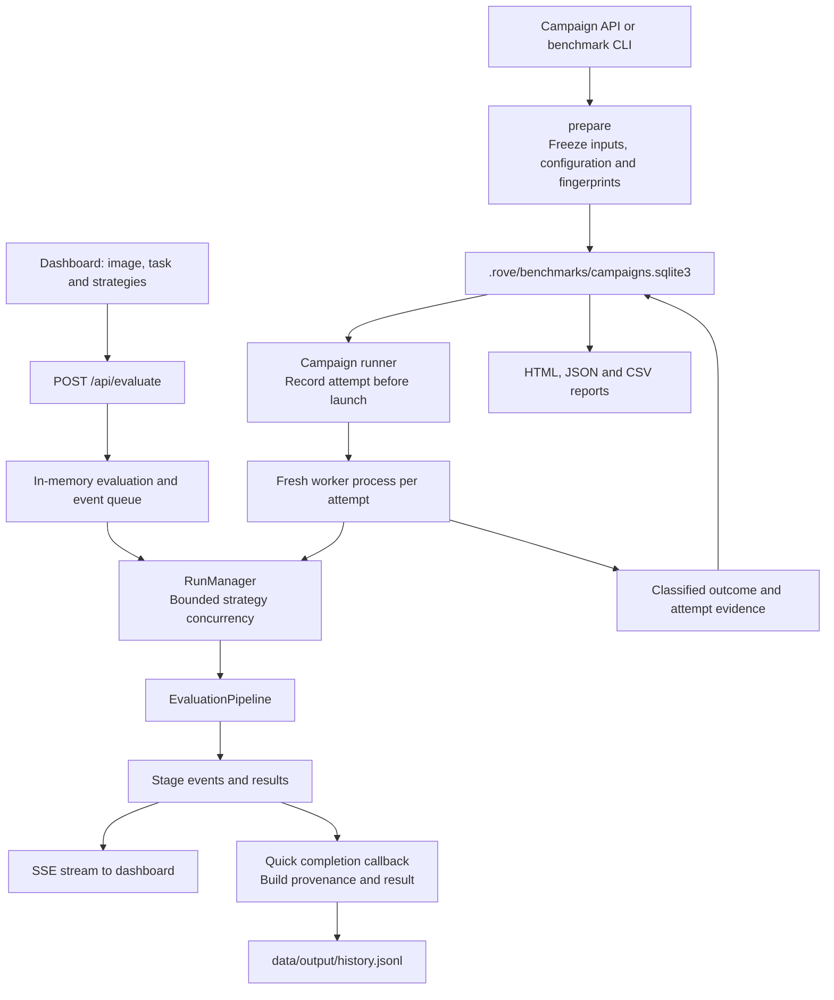
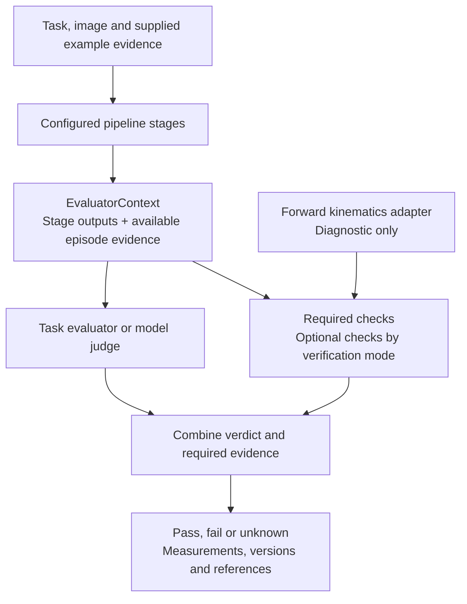

# Current Implementation

ROVE currently runs configurable robotics evaluation pipelines through a local
dashboard and a repeated-trial campaign runner. Both use the same stage
orchestrator, but they have different recording paths. This matters: campaign
recovery and snapshots are stronger than quick-run history today.

This description was checked against commit `776b39316ad80a012837b44904e38fcd5617942a`
on 12 September 2026, after configured verification was merged. It describes
implemented behavior. The linked [product concepts](../product/concepts.md),
[workflows](../product/evaluation-workflows.md) and
[success/metrics specification](../product/metrics-and-success.md) separately mark
the proposed follow-up. Historical architecture documents may describe interfaces
that are not implemented.

## Two Entry Paths, One Pipeline



The diagram shows the normal selected-strategy path. The legacy quick API path
without `strategy_ids` builds `EvaluationPipeline` directly. A campaign worker
runs one selected strategy through `RunManager` and returns evidence to its parent;
it does not append to quick-history JSONL.

The [API](../../src/rove/api/app.py) accepts an uploaded image and task. For a
gallery image, `example_filename` loads additional fields from
`data/manifest.json`, including embodiment, reference-label and optional episode
data. The API encodes the uploaded image as base64. It does not offer the proposed
general case/asset import or hardware episode-ingestion API.

[RunManager](../../src/rove/orchestrator/run_manager.py) builds pipelines from
[validated strategy configuration](../../src/rove/models/config.py), bounds
concurrent strategies and emits stage events. Adapters supply model or simulator
behavior. A fresh simulator is created for each strategy; quick-run model adapters
can be cached in the shared registry.

## Stages and Verification

The [pipeline](../../src/rove/orchestrator/pipeline.py) supports optional perceive,
plan and act stages, with verify required. At least one optional stage must be
configured. In sequential mode the stages run in order. In parallel VLA mode,
action generation runs alongside perception/planning used for evaluation context;
that perception/planning branch does not control the VLA's generated actions.
Agent-loop verification can request evaluation tools instead of precomputing that
context.

Strategies are not restricted to VLAs. The
[adapter protocols](../../src/rove/adapters/protocols.py) include specialized stage
interfaces and a generic agent `run_stage` interface. Together with optional stages,
these support configurations for scene understanding, planning or action generation
without requiring every configuration to run all three. A model still needs a
compatible adapter; the configuration does not make arbitrary endpoints compatible.
URDF and joint-state evidence are relevant to checks that need them, not mandatory
inputs for every image-and-task evaluation.



Structured stage settings add endpoint references and timeouts without adding a
separate hook framework. A local task evaluator receives a typed context and
returns a verdict, evidence quality, references and optional measurements. Required
checks run regardless of a model's tool choices. A failed required constraint
overrides task success; missing required evidence makes the combined verdict
unknown. Optional checks do not override it. Raw task and check results remain
available alongside the combined outcome.

Local evaluator functions run in child processes with timeout/cancellation support.
They are trusted developer code, not sandboxed untrusted plugins. Their identity
includes the declared revision, function name and entry-module hash. Imported
helpers and external artifacts are not automatically archived or fully hashed.
See [configured verification](../VERIFICATION.md),
[verification models](../../src/rove/models/verification.py) and
[local evaluator adapter](../../src/rove/adapters/local_verifier.py).

FK supplies modeled trajectory diagnostics. It cannot be configured as the task
evaluator or a task constraint. Evidence computed from a robot model does not prove
physical execution. `mock-sim` is a stub, and there is no complete closed-loop robot
simulator integration. The supplied placement examples grade existing observations;
they do not generate new physical outcomes from the candidate's actions.

## Recording and Recovery

| Property | Quick evaluation | Campaign |
| --- | --- | --- |
| Initial record | In-memory evaluation ID and event queue | Saved campaign plus a persisted record before each attempted slot |
| Completed results | Append to `data/output/history.jsonl`; dashboard also caches history | SQLite campaign and trial rows, with JSON payloads |
| Configuration record | Provenance is assembled after execution; includes a configuration-file hash | Selected resolved configuration, inputs and fingerprints frozen before execution |
| Attempt identity | Evaluation ID groups one or several strategy results | Composite key: campaign, task, strategy and seed |
| Isolation | Concurrent strategies within the server process | One fresh child process at a time per campaign |
| Seed handling | Requested seed is recorded, not passed into execution | Applied to supported mock adapters; other endpoints report unsupported |
| Crash recovery | No durable in-flight quick-run record | Resume marks saved in-flight work interrupted/unknown and runs untouched slots |
| History reads | Read the complete JSONL file; deletion rewrites it | Query campaign/trial rows; listing currently loads payloads |

The quick path has known durability gaps: top-level errors are retained in memory
but not appended by the completion writer; persistence failures are logged rather
than made durable; and the legacy single-pipeline result shape does not map all of
its stage/output fields into the JSONL writer's `results` field. The provenance
hash identifies a file, not a reconstructable snapshot of the loaded system.
These gaps motivate the proposed shared relational store; this document does not
claim they have been repaired.

[CampaignStore](../../src/rove/benchmarks/store.py) uses SQLite transactions and
foreign keys. The [runner](../../src/rove/benchmarks/runner.py) uses a process/file
lock to prevent simultaneous execution of one campaign. Cancellation terminates
the worker process group. Resume preserves completed, failed and interrupted slots
rather than silently repeating potentially executed actions. This process/lock
implementation currently supports macOS and Linux.

Campaign manifests embed base64 images, and worker requests serialize the task and
configuration for each attempt. The gallery already stores image files separately.
Neither path is the proposed large-asset store. There is no PostgreSQL backend,
Parquet exporter or Delta Lake integration in this revision.

## Reports and Comparability

The [worker](../../src/rove/benchmarks/worker.py) classifies verdicts separately from
execution errors. Missing evidence, invalid verdicts and runtime/evaluator drift
remain unknown. [Metrics](../../src/rove/benchmarks/metrics.py) retain the planned
attempt denominator, compute pass@k/pass^k when supported and expose bounds when
unknowns prevent point estimates. The
[evidence summary](../../src/rove/benchmarks/evidence.py) groups check results and
measurements with their units and quality.

[Reports](../../src/rove/benchmarks/report.py) provide offline HTML charts, JSON
evidence and a CSV row per attempt. Historical curves require the same strategy ID
and matching comparison fingerprints. These include task inputs, grading settings,
required checks, simulator and runtime identity. There is no explicit baseline
pointer, campaign lineage or component-difference comparison yet. A broad source
fingerprint also prevents comparisons across some intentional policy-code changes.

Fingerprints detect selected changes; they do not preserve remote model weights,
resolve mutable provider aliases or recreate a physical scene. Model revisions are
declared metadata. Reports omit frozen endpoint configuration, but task text and
model outputs remain in exported evidence. The local server has Host/Origin
restrictions and no authentication; it is intended for local use.

## Existing Interfaces and Verification

With the source checkout and dependencies installed, these commands are supported
by the [CLI](../../src/rove/benchmarks/cli.py):

```sh
rove serve
rove benchmark run examples/verification/campaign.json --config examples/verification/rove.yaml
rove benchmark list
rove benchmark report CAMPAIGN_ID
rove benchmark resume CAMPAIGN_ID
```

The synthetic campaign announces nine planned attempts and writes HTML, JSON and
CSV report paths. Replace `CAMPAIGN_ID` with the saved ID. It demonstrates passing,
constraint-failing and unresolved evidence; it is not a robot performance study.

| Existing route | Purpose |
| --- | --- |
| `POST /api/evaluate` | Start a quick evaluation from multipart inputs |
| `GET /api/evaluate/{eval_id}/stream` | Stream stage and completion events |
| `GET /api/history` | Read saved quick history |
| `POST /api/campaigns` | Validate, save and launch a campaign |
| `GET /api/campaigns/{id}` | Read campaign status and summary |
| `POST /api/campaigns/{id}/cancel` or `/resume` | Control pending campaign work |
| `GET /api/campaigns/{id}/report?format=html` | Render a report; also accepts `json` or `csv` |

The campaign routes are implemented in
[the campaign router](../../src/rove/benchmarks/api.py). `/docs` exposes the complete
current HTTP schema. There is no supported `rove evaluate` batch command or
`rove.evaluate()` convenience function.

The corresponding regression tests cover
[attempt isolation, seeds, cancellation, resume, metrics and exports](../../tests/test_benchmarks.py),
[required checks, evaluator drift and unknown verdicts](../../tests/test_configured_verification.py),
[strategy execution](../../tests/test_run_manager.py) and
[API behavior](../../tests/test_api.py). These tests establish software behavior;
they do not validate real robot task performance or the proposed review/dataset
features.

The decision trail distinguishes
[implemented configured verification](ADR-017-configured-verification.md) from
proposed [trial lineage and snapshots](ADR-018-trial-lineage-and-snapshots.md),
[relational recording and asset references](ADR-019-relational-storage-and-assets.md),
[SME-reviewed datasets](ADR-020-sme-reviewed-datasets.md) and
[campaign success and reporting](ADR-021-campaign-success-and-reporting.md).
