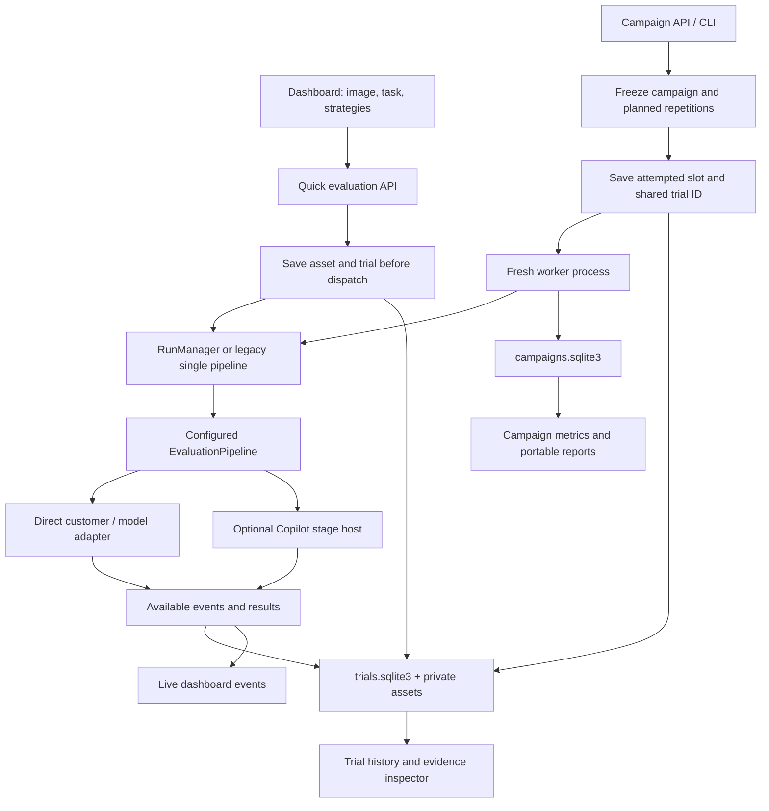
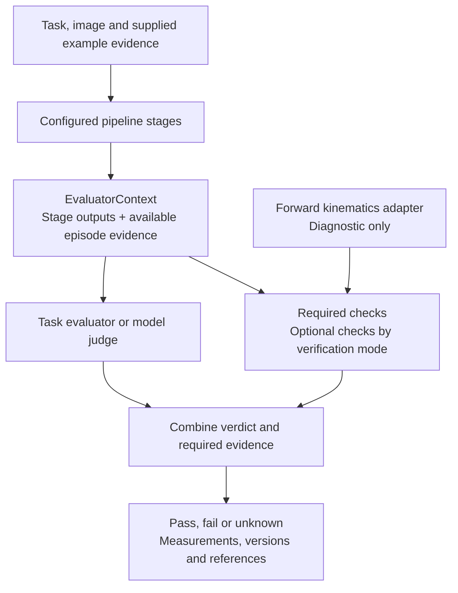
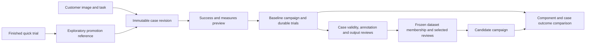

# Current Implementation

**Checked:** 12 September 2026, against the customer evaluation workflow and
original T01–T12 acceptance. The 49 bundled samples now import as versioned Cases; private reference
annotations and the report redesign have regression coverage. The
[delivery plan](../product/implementation-plan.md) records remaining work.

ROVE runs configurable robotics evaluation pipelines from a local dashboard and a
repeated-trial campaign runner. Both now create durable trial identities and frozen
configuration records before execution, retain available intermediate events, and
expose saved evidence through Trial history. The optional Copilot adapter hosts
perception, planning and verification stages; customer adapters remain directly
callable. Versioned cases, success contracts, SME review, dataset freezing and
baseline comparisons extend that foundation. The linked [product concepts](../product/concepts.md) and
[trace specification](../product/traces-and-measurements.md) describe the fuller
target, including capabilities not yet implemented.

## Two Entry Paths, One Pipeline



The selected-strategy path uses `RunManager`; the legacy quick API path without
`strategy_ids` constructs `EvaluationPipeline` directly. Both record trials. An
evaluation ID groups selected strategies for the existing dashboard; each strategy
attempt has its own durable trial ID. Campaign workers record intermediate events
directly into the shared journal and return final evidence to the campaign parent.

The [API](../../src/rove/api/app.py) accepts an uploaded image and task. For a
gallery image, `example_filename` loads additional fields from
`data/manifest.json`, including embodiment, reference-label and optional episode
data. The quick API encodes the uploaded image as base64. The Cases workflow
stores managed PNG/JPEG assets and task revisions; it hydrates bounded images only
at execution. General video/trajectory ingestion and hardware drivers are not provided.

[RunManager](../../src/rove/orchestrator/run_manager.py) builds pipelines from
[validated strategy configuration](../../src/rove/models/config.py), bounds
concurrent strategies and emits stage events. Adapters supply model or simulator
behavior. A fresh simulator is created for each strategy; quick-run model adapters
can be cached in the shared registry.

## Stages and Verification

The [pipeline](../../src/rove/orchestrator/pipeline.py) supports optional perceive,
plan and act stages, with verify required. At least one optional stage must be
configured. In sequential mode the stages run in order. In parallel VLA mode,
action generation runs alongside perception/planning used for evaluation context;
that perception/planning branch does not control the VLA's generated actions.
Agent-loop verification can request evaluation tools instead of precomputing that
context.

Strategies are not restricted to VLAs. The
[adapter protocols](../../src/rove/adapters/protocols.py) include specialized stage
interfaces and a generic agent `run_stage` interface. Together with optional stages,
these support configurations for scene understanding, planning or action generation
without requiring every configuration to run all three. A model still needs a
compatible adapter; the configuration does not make arbitrary endpoints compatible.
URDF and joint-state evidence are relevant to checks that need them, not mandatory
inputs for every image-and-task evaluation.



Structured stage settings add endpoint references and timeouts without adding a
separate hook framework. A local task evaluator receives a typed context and
returns a verdict, evidence quality, references and optional measurements. Required
checks run regardless of a model's tool choices. A failed required constraint
overrides task success; missing required evidence makes the combined verdict
unknown. Optional checks do not override it. Raw task and check results remain
available alongside the combined outcome.

Local evaluator functions run in child processes with timeout/cancellation support.
They are trusted developer code, not sandboxed untrusted plugins. Their identity
includes the declared revision, function name and entry-module hash. Imported
helpers and external artifacts are not automatically archived or fully hashed.
See [configured verification](../VERIFICATION.md),
[verification models](../../src/rove/models/verification.py) and
[local evaluator adapter](../../src/rove/adapters/local_verifier.py).

FK supplies modeled trajectory diagnostics. It cannot be configured as the task
evaluator or a task constraint. Evidence computed from a robot model does not prove
physical execution. `mock-sim` is a stub, and there is no complete closed-loop robot
simulator integration. The supplied placement examples grade existing observations;
they do not generate new physical outcomes from the candidate's actions.

## Recording and Recovery

| Property | Quick evaluation | Campaign |
| --- | --- | --- |
| Before dispatch | Input asset, frozen snapshot and running trial | Frozen campaign; shared trial and attempted-slot record before worker launch |
| Attempt identity | One ID per selected strategy; launch ID groups them | Shared ID linked to campaign/task/strategy/seed |
| Durable results | `trials.sqlite3`; JSONL remains a compatibility projection | Shared journal plus existing campaign report rows |
| Isolation | Concurrent strategies in server; direct adapters may be cached | Fresh child process per attempted slot |
| Recovery | Single UI-owner lock; abandoned quick work becomes interrupted on startup | Campaign-owner lock reconciles journals; potentially executed slots are not silently replayed |
| Seed handling | Requested seed retained, not applied universally | Supported mock adapters receive seed; other endpoints report unsupported |
| History | Paginated trial/event APIs and saved configuration inspector | Same history APIs, with campaign report link |

[TrialStore](../../src/rove/trials/store.py) uses schema-version checks, SQLite
transactions, foreign keys, indexes, immutable terminal records and source-event
deduplication. Snapshots separately hash supplied task, strategy and selected
configuration, including available runtime and selected local-evaluator identities.
These identify captured settings; they do not archive all imported
helpers, remote weights or physical environment state. Terminal execution status
is separate from an assessment verdict.

Initial observations are saved by content hash outside the public data mount.
Other inline media are reduced to references by snapshot sanitization; a reference
alone does not guarantee that its bytes were archived. Legacy campaign manifests
can still contain inline images; customer-case campaigns use managed asset references.

The application imports legacy quick JSONL idempotently without modifying the
source. New compatibility output goes to private `.rove/benchmarks/quick-history.jsonl`,
not the original `data/output/history.jsonl`. Missing historical configuration and
events remain unknown. Current JSONL entries referencing recorded trials do not
create duplicate attempts. Old campaign
results remain readable in their reports; this slice does not backfill every old
campaign into shared history.

`campaigns.sqlite3` and `trials.sqlite3` are separate journals under the same
directory, not one cross-database transaction. Recovery reconciles known shared
IDs under campaign ownership. Cancellation terminates the campaign worker process
group. Process/lock handling supports macOS and Linux. See
[Trial history](../TRIAL_HISTORY.md) for storage and backup requirements.

## Customer Cases, Reviews and Frozen Datasets

The [dataset service](../../src/rove/datasets/service.py) and
[customer workflow API](../../src/rove/api/datasets.py) provide image/task intake,
immutable case revisions, success contracts, revision-checked SME drafts and final
reviews, and dataset preview/freezing. PNG/JPEG inputs are bounded and checked
against their full content hash and decoded format. Missing assets remain visible
in case history but cannot launch a valid evaluation.



Schema version 2 adds case revisions, success contracts, reviews, dataset
membership and quick-promotion links to `trials.sqlite3`. Final reviews are
immutable; corrections keep the target, rubric and reviewer and supersede the old
review. Dataset freezing is one transaction and requires the exact preview hash.
New reviewer disagreement invalidates a stale preview. Case validity, reusable
annotations and ratings of a specific output remain distinct. An accepted output
does not become a label for another candidate.

The current fully reviewed dataset badge requires selected accepted case-validity
and annotation reviews, with no unresolved active disagreement. Incomplete datasets
can still be frozen and used with their coverage exposed. Annotations are retained
as explicit review material; automatic injection into model prompts or future
graders is not implemented. Public candidate context and archived episode evidence
are separate input fields. Static episode evidence can evaluate a grader, not a
new candidate's physical performance. Action-dependent rollout integration is pending.

[Quick promotion](../../src/rove/datasets/promotion.py) creates a case from a
finished quick trial's retained image/task and links its original trial ID as an
exploratory reference. Retrying an operation ID creates no duplicate case. Promotion
does not create another trial, reuse an output as ground truth, or add the old
attempt to a new campaign's reliability denominator.

## Optional Copilot Runtime

[CopilotAgentAdapter](../../src/rove/adapters/copilot_agent.py) supports perceive,
plan and verify through `adapter: copilot_agent`. Each stage starts a fresh runtime,
session and temporary workspace. Candidate and grader roles are host-selected;
candidate context excludes the private grading record. No tools are exposed by the
configured adapter. The shared runtime supports explicitly role-scoped host tools,
but robot action tools remain pending. The optional evaluation assistant uses a
separate assistant role with read and campaign-preview tools.

The optional profile pins `github-copilot-sdk==1.0.13` and Copilot CLI `1.0.81-9`.
The CLI is installed separately and checked before use. Startup, execution, abort
and cleanup are bounded. Explicit provider configuration is required; ambient
logged-in Copilot accounts and unrelated workspace instructions are not inherited.
Direct evaluations do not start Copilot.

The real SDK/CLI passed a controlled synthetic transport probe covering images,
host tools, ephemeral usage and native trace-context propagation. Offline tests
cover scope, timeout, cancellation, malformed output and recorder failures. No
real model quality, Azure identity flow or external collector deployment was
validated. See [compatibility evidence](copilot-compatibility.md) and
[ADR-024](ADR-024-copilot-runtime-and-observability.md).

## Trace and Telemetry Coverage

The [evaluation assistant API](../../src/rove/api/assistant.py) is enabled by
`ROVE_ASSISTANT_ENDPOINT`, which must name an explicitly configured `copilot_agent`
endpoint. Cases exposes its optional assistant panel. Tools read bounded case,
dataset, strategy and trial records and prepare a campaign preview. The model has
no launch, import, review or freeze tool. Launch requires a host-issued confirmation
token and a fresh validation of the exact preview; proposals expire after ten
minutes or server restart. Operation IDs prevent duplicate campaign creation.
The assistant uses the same evaluation services; it does not decide trial scores.

The read/preview boundary is deliberate for the local milestone: media selection,
case changes and expert review remain explicit user actions. The original T09
import-to-comparison assistant acceptance is therefore only partially implemented. Further tools require explicit user-directed operations;
that original scope never authorizes inventing SME judgments.

The pinned SDK/runtime and provider configuration remain required. The assistant
status check verifies configuration/runtime availability, not deployed model
quality or robot performance. Its API and confirmation boundaries have controlled
regression coverage; a live Azure/provider workflow remains a validation gate.

| Evidence | Implemented behavior and limits |
| --- | --- |
| Existing stage/tool activity | Events exposed by `RunManager` persist before UI delivery. Legacy single-pipeline recording includes stage events. Internal customer-agent calls require adapter support. |
| SDK activity | Event identities, actor role, stage, available usage and trace context are retained. Content capture defaults off. Missing usage is not zero; a cost multiplier is not dollars. |
| Results and measurements | Final stage outputs and configured checks retain values, units, quality, evaluator versions and evidence-reference strings. |
| Images | Initial observations have managed assets. Supported images load on demand; arbitrary reference strings do not resolve automatically to remote assets or recording ranges. |
| Timing | Stage durations and recorded event timestamps are available. Server receipt time is distinct from supplied source time. No synchronized robot/sensor clock model is implemented. |
| OpenTelemetry | Optional ROVE trial spans retain trace/span identity when the tracing SDK is installed. The runtime accepts native telemetry settings; no ROVE exporter is configured by default. |
| Inspector | Paginated history, source filters, deep links, frozen settings, measurements, stage outputs and stage-filtered activity. Parallel trace graphs and aligned baseline comparison remain pending. |

Required recording failures fail execution visibly rather than silently discard
evidence. Size/count limits are bounded; missing source telemetry cannot be
reconstructed. The authoritative journal does not require an external monitoring
account. The actual pinned SDK/CLI has a controlled HTTP 503 OTLP collector test, with
bounded cleanup and retained events/usage after reopening the journal; Python
exporter exceptions and failure results are covered too. These concrete outage
tests do not establish blackholed connections, blocked custom exporters, or a
complete application → native SDK → tool → external collector trace tree. Native
SDK tracing must be configured when distributed runtime/tool correlation is required.
See [telemetry resilience tests](../../tests/test_telemetry_resilience.py).

Predicted trajectories, requested calls, acknowledgements and observed outcomes are
different evidence. Process cancellation does not establish physical robot stopping.
The dashboard's older browser cache and JSONL view remain compatibility surfaces;
the new inspector reads durable server records. The
[trace specification](../product/traces-and-measurements.md) and
[ADR-022](ADR-022-trial-telemetry.md) describe remaining coverage and comparison work.

## Reports and Comparability

The [worker](../../src/rove/benchmarks/worker.py) classifies verdicts separately from
execution errors. Missing evidence, invalid verdicts and runtime/evaluator drift
remain unknown. [Metrics](../../src/rove/benchmarks/metrics.py) retain the planned
attempt denominator, compute pass@k/pass^k when supported and expose bounds when
unknowns prevent point estimates. The
[evidence summary](../../src/rove/benchmarks/evidence.py) groups check results and
measurements with their units and quality.

[Reports](../../src/rove/benchmarks/report.py) provide themed outcome and coverage
cards, strategy comparisons, reliability bounds and expandable evidence, plus JSON
evidence and a CSV row per attempt. Historical curves require the same strategy ID
and matching comparison fingerprints. Customer campaigns additionally use an
explicit baseline/strategy reference and
[component comparison](../../src/rove/benchmarks/comparison.py), including matching
case revisions, success contract, verification and repetition conditions. Renamed
strategies can compare when their assessment conditions match. Changed graders,
conditions or unattributed runtime changes are exposed as incompatibilities;
the broad source fingerprint remains conservative about intentional code changes.

A candidate points to an existing baseline campaign/strategy; this is usable baseline
lineage, not a separate named/pinned baseline registry. Comparisons require the full
matching case cohort; selecting arbitrary overlapping subsets is not implemented.
Paired improvement/regression counts are descriptive, not a causal or statistical
significance claim. Parallel/aligned trace navigation remains pending.

The [workflow service](../../src/rove/benchmarks/workflow.py) previews expected
measures and projects per-output SME assessments onto retained attempts while
keeping the original execution results. Pending/disputed reviews remain unknown.
Pipeline latency is available; episode duration, autonomy and recovery remain
unavailable without the required evidence and aggregation implementation. Declaring
a desired metric does not make it observed. Aggregate campaign targets are pending.

Fingerprints detect selected changes; they do not preserve remote model weights,
resolve mutable provider aliases or recreate a physical scene. Model revisions are
declared metadata. Reports omit frozen endpoint configuration, but task text and
model outputs remain in exported evidence. The local server has Host/Origin
restrictions and no authentication; it is intended for local use.

## Existing Interfaces and Verification

With the source checkout and dependencies installed, these commands are supported
by the [CLI](../../src/rove/benchmarks/cli.py):

```sh
rove serve
rove benchmark run examples/verification/campaign.json --config examples/verification/rove.yaml
rove benchmark list
rove benchmark report CAMPAIGN_ID
rove benchmark resume CAMPAIGN_ID
```

The synthetic campaign announces nine planned attempts and writes HTML, JSON and
CSV report paths. Replace `CAMPAIGN_ID` with the saved ID. It demonstrates passing,
constraint-failing and unresolved evidence; it is not a robot performance study.

| Existing route | Purpose |
| --- | --- |
| `POST /api/evaluate` | Start a quick evaluation from multipart inputs |
| `GET /api/evaluate/{eval_id}/stream` | Stream stage and completion events |
| `GET /api/history` | Compatibility quick-history view |
| `GET /api/trials?limit=25&offset=0` | Paginated durable history, with optional source filter |
| `GET /api/trials/{id}` | Frozen snapshot, result and lifecycle |
| `GET /api/trials/{id}/events` | Paginated recorded events |
| `GET /api/trial-assets/{sha256}` | Managed observation or safe asset download |
| `POST /api/cases` | Import a managed image and task as an immutable case revision |
| `POST /api/success-contracts` | Save a validated outcome scope, criteria and requested measures |
| `POST /api/reviews` | Save an attributed case or output assessment |
| `POST /api/datasets/preview` and `/api/datasets` | Preview and freeze exact case/review membership |
| `POST /api/trials/{id}/promote` | Preserve a quick trial as an exploratory case reference |
| `POST /api/campaigns/preview` and `/api/campaigns/from-cases` | Preview and launch versioned customer cases |
| `POST /api/campaigns/{id}/ablation-preview` and `/ablation` | Compare a candidate configuration before launch |
| `GET /api/campaigns/{id}/comparison` | Read matching case outcomes and component differences |
| `POST /api/campaigns` | Validate, save and launch a legacy campaign manifest |
| `GET /api/campaigns/{id}` | Read campaign status and summary |
| `POST /api/campaigns/{id}/cancel` or `/resume` | Control pending campaign work |
| `GET /api/campaigns/{id}/report?format=html` | Render a report; also accepts `json` or `csv` |

The campaign routes are implemented in
[the campaign router](../../src/rove/benchmarks/api.py). `/docs` exposes the complete
current HTTP schema. There is no supported `rove evaluate` batch command or
`rove.evaluate()` convenience function.

Choose **Trial history** in the dashboard to reopen a saved attempt without
executing it. The shared store adds regression tests for
[storage](../../tests/test_trial_store.py),
[quick/campaign recording](../../tests/test_trial_integration.py),
[runtime lifecycle](../../tests/test_copilot_runtime.py), and
[history presentation](../../tests/test_history_ui.cjs).

Existing regression tests cover
[attempt isolation, seeds, cancellation, resume, metrics and exports](../../tests/test_benchmarks.py),
[required checks, evaluator drift and unknown verdicts](../../tests/test_configured_verification.py),
[strategy execution](../../tests/test_run_manager.py) and
[API behavior](../../tests/test_api.py). These tests establish software behavior;
they do not validate real robot task performance. Additional
[dataset tests](../../tests/test_datasets.py) cover revision conflicts, review
identity, frozen membership, disagreement, image integrity and migration rollback.
[Promotion tests](../../tests/test_promotion.py) cover idempotency, concurrent
requests, rollback and unchanged trial counts.

The decision trail distinguishes
[implemented configured verification](ADR-017-configured-verification.md) from
partially implemented [trial lineage and snapshots](ADR-018-trial-lineage-and-snapshots.md),
[relational recording and asset references](ADR-019-relational-storage-and-assets.md),
implemented local [SME-reviewed datasets](ADR-020-sme-reviewed-datasets.md),
partially implemented [campaign success and reporting](ADR-021-campaign-success-and-reporting.md) and
[trial telemetry](ADR-022-trial-telemetry.md).
