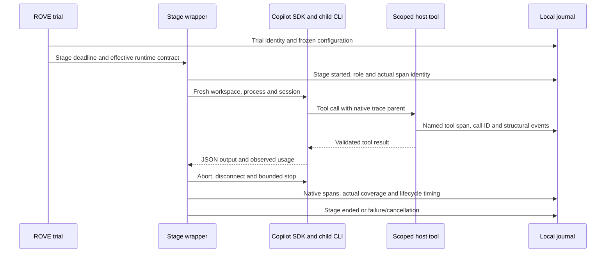

# Runtime and stage lifecycle

A robotics developer needs to know whether a repetition started from fresh state,
which process ran the candidate, and whether cancellation actually ended that
process. ROVE records that boundary for each stage while keeping the customer's
direct adapter intact. A cancelled model turn does not prove a physical robot stopped.



`EndpointConfig.runtime_contract` declares `memory`, `reset` and
`telemetry_coverage`. It is part of the endpoint configuration frozen with a
campaign. A direct endpoint without a declaration has unknown memory/reset and
stage-only coverage. Customer declarations have `attribution: customer_declared`;
they are configuration claims, not independent reset attestations.

```yaml
endpoints:
  existing-agent:
    type: agent
    adapter: mock_agent
    runtime_contract:
      memory: customer_managed
      reset: customer_managed
      telemetry_coverage: stage_only
```

For `copilot_agent`, ROVE implements `fresh_per_stage` memory and
`fresh_process_session` reset. Contradictory declarations fail configuration
validation. Cross-stage or cross-trial session reuse is intentionally unsupported.
No inherited working directory, user session, repository instruction, skill,
file hook or built-in tool enters the hosted stage. Candidate, grader and
assistant roles use independently scoped tools and sessions. An `act` stage must
use an explicit robot integration; the hosted adapter rejects it.

`stage_span()` wraps adapter execution, including local configured checks and
environment reset, rather than spanning async-generator yields. The Copilot
adapter also wraps direct callers; nested wrappers for the same stage/endpoint
coalesce. The simulator's reset evidence remains a separate environment concern.

The runtime returns startup, inference and cleanup durations measured with the
host monotonic clock. Its actual `native_capture` status is `captured`,
`not_observed` or `disabled`; a configured intention to capture native spans does
not manufacture observed coverage. Usage remains null when no usage event arrived.
Callback recording failures invalidate the attempt's evidence. Duplicate source
deliveries coalesce only when their original content agrees.

On timeout/cancellation, the runtime cancels the pending send, then calls abort,
disconnect and stop. Each SDK cleanup operation has a configured timeout. A
failed graceful stop invokes the SDK's `force_stop` when available and remains an
execution error. The pinned SDK's force-stop kills its owned child process. These
bounds assume cooperative Python coroutines; an arbitrary in-process customer
function that blocks the interpreter needs process isolation from its integration.
No software timeout here attests hardware emergency-stop behavior.

Implementation: [configuration](../../src/rove/models/config.py),
[recording](../../src/rove/orchestrator/recording.py),
[runtime](../../src/rove/runtime/copilot.py),
[adapter](../../src/rove/adapters/copilot_agent.py).
Regression evidence: [runtime lifecycle tests](../../tests/test_copilot_runtime.py)
and [source-clock/real-SDK tests](../../tests/test_runtime_observability.py).

The current local tests exercise SDK `1.0.13` and CLI `1.0.81-9` with controlled
model responses. They validate infrastructure, not provider inference quality.
See the [live-provider specification](../product/live-provider-validation.md).
