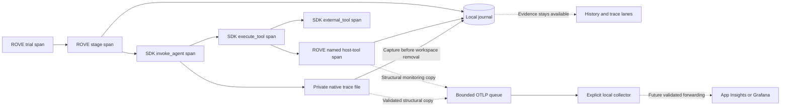

# Local trace capture and optional monitoring

A platform engineer can inspect a failed robotics evaluation without a monitoring
account. The trial journal owns evaluation evidence; an optional collector receives
monitoring copies. An outage or a full export queue cannot change a trial score.



The actual pinned SDK ancestry is trial → stage → `invoke_agent` → `execute_tool`
→ ROVE tool span. The SDK's `external_tool` span is a sibling of the ROVE tool
span. Python SDK callbacks restore the native OpenTelemetry context. ROVE restores
only its own recording context variables around the callback, preserving that
native parent. Copying the full original Python context would incorrectly erase
the SDK's parent span. The private tracer provider never replaces an embedder's
global provider. [SDK telemetry documentation](https://docs.github.com/en/copilot/how-tos/copilot-sdk/observability/opentelemetry).

Each record distinguishes producer time from local receipt:

| Field | Meaning |
| --- | --- |
| `source_clock_id` | ROVE process UUID, Copilot session clock, or explicit environment clock |
| `source_timestamp`, `time_unit` | Original producer instant; absent time remains unknown |
| `clock_alignment` | `same_process` for host events, `unverified` for the CLI clock |
| `recorded_at` | Local durable journal receipt, never substituted for producer time |
| `start_time_unix_nano`, `end_time_unix_nano` | Native span boundaries as exact decimal strings |
| `trace_id`, `span_id`, `parent_span_id` | Actual OpenTelemetry identity and parentage |
| `previous_event_id` | SDK event sequence link; never treated as a span parent |

Clock lanes may share an origin only within a source clock. Wall-clock timestamps
on two processes do not establish synchronization. Cross-clock span ancestry is
causal evidence; it does not establish comparable timing offsets. Incomplete spans
have no invented duration.

Enable the local collector profile in `rove.yaml` only when needed:

```yaml
defaults:
  observability:
    enabled: true
    endpoint: http://127.0.0.1:4318
    request_timeout_s: 1
    shutdown_timeout_s: 0.1
    queue_capacity: 64
    max_payload_bytes: 1000000
```

Install ROVE's optional `copilot` extra for OpenTelemetry SDK support. The profile
sends OTLP/HTTP JSON to `/v1/traces`; it accepts numeric loopback addresses only,
with no URL credentials, queries, redirects or ambient proxies. A local collector
can independently forward to a hosted service after its own authentication and
validation. No cloud exporter or collector deployment is implicit in this setting.
For an OpenTelemetry Collector, explicitly bind its OTLP HTTP receiver to the
loopback interface and configure a traces pipeline with the desired exporter.
The [packaged profiles](../../examples/observability/README.md) include a local
debug collector and separate opt-in Grafana/Azure templates, source-reviewed
against Collector Contrib 0.160.0. Their YAML is validated locally; the collector
binary and hosted integrations have not been run.

One daemon worker has a bounded queue and request timeout, no retries, and bounded
shutdown drain. Queue overflow or shutdown drops only monitoring copies. The
`telemetry.export.status` event reports queued, sent, failed, dropped, pending and
in-flight counts. An in-flight request may finish after that final snapshot; it is
not a delivery guarantee. A collector acknowledging HTTP success does not prove
downstream retention. Native events are captured from the private SDK trace file
before workspace removal; malformed or conflicting native records fail evidence
capture rather than silently claiming complete traces.

Content capture is off by default. Native capture/export keeps structural fields
and an explicit attribute allowlist. Error descriptions, unknown attributes and
host metadata are discarded. Tool arguments/results and model messages are not
monitoring payloads. Model/tool names and configured IDs remain structural metadata;
do not put secrets in those names. Payload size and event count have explicit caps.

The real SDK/CLI regression runs supply model responses in process and use actual
loopback HTTP collectors returning 200, 503 or accepting a connection without a
response. Tests verify complete ancestry, exact source times, named tool delivery,
durable usage, reopening the trial, queue overflow, no retry and bounded disposal.
The separate native SDK exporter outage test remains covered as well. This is
local protocol validation, not a deployed App Insights, Grafana or Azure result.

Implementation: [bounded exporter](../../src/rove/runtime/telemetry.py),
[recorder](../../src/rove/orchestrator/recording.py).
Tests: [full path](../../tests/test_runtime_observability.py),
[native exporter failures](../../tests/test_telemetry_resilience.py).
Live integration is specified separately in
[live-provider validation](../product/live-provider-validation.md).
