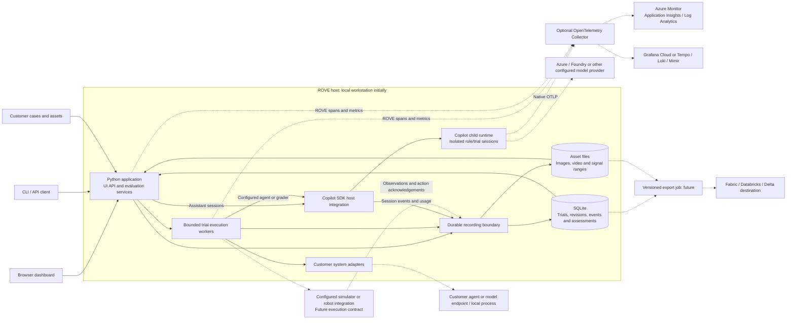
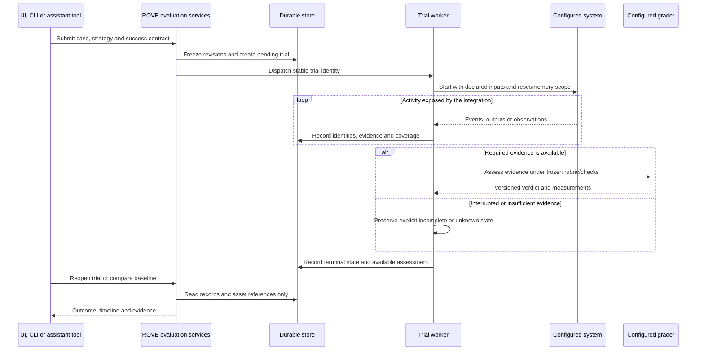

# ROVE System Diagram: Processes, Data and External Integrations

**Status:** Target system design; new runtime, recording and integration components are pending.
**Updated:** 2026-09-12

The first deployment remains a local application. These boundaries explain how
the [logical architecture](target-architecture.md) maps to processes and storage;
they do not require microservices, Kubernetes or a cloud account.

## System Diagram

Solid arrows show the intended local execution and recording paths. Dashed arrows
show optional external integrations. This entire diagram is a target design; see
[current implementation](current-implementation.md) for today's separate history
paths and worker behavior.

The worker owns dispatch into the selected environment; an SDK robotics tool calls
that same configured integration. The SDK is not a physical robot driver. Local
adapters need not call external endpoints. The initial implementation must decide
worker/SDK process reuse from isolation tests; no fixed process-per-session promise
is made here. CLI commands can invoke application services directly without an
HTTP round trip.

## Trial Lifecycle

This target sequence preserves the distinction between execution state and task
outcome. A failed task can have a complete trace; an interrupted process can leave
an unknown outcome. Reopening history never dispatches actions. An interrupted
physical trial is not automatically replayed; continuing it requires the declared
execution/reset contract and a valid environment acknowledgement.

## Failure and Data Boundaries

| Boundary | Required behavior |
| --- | --- |
| Browser disconnect | Worker recording continues; reconnect reads saved progress |
| Process crash | Pending/running records reconcile to interrupted or uncertain state; captured evidence survives |
| Duplicate tool request/event | Stable operation IDs prevent duplicate dispatch; source IDs prevent duplicate history |
| Recorder failure | Surface capture failure; do not present incomplete recording as complete evidence |
| Collector/provider outage | Collector failure cannot erase trials; provider failure remains a recorded execution failure |
| Slow exporter | Bounded queues and explicit drop/coverage reporting; external export does not block robot control |
| Candidate versus grader | Separate sessions, tools and data access; private grading labels stay outside candidate context |
| Sensitive/large content | Redact credentials; external content capture off initially; export approved references rather than full recordings |

Tracing follows OpenTelemetry/W3C context, while robot timestamps retain their own
clock identity and alignment uncertainty. Keep high-cardinality trial IDs in
traces/logs and links, rather than turning every trial into a metrics label.

## Optional Destinations

Azure Monitor accepts OTLP through a configured Collector. In Microsoft's documented
setup, log/trace data uses a Log Analytics workspace and metrics use an Azure Monitor
workspace; Application Insights supplies investigation experiences. Identity,
workspace and metric-format configuration remain deployment tasks. See
[Microsoft's ingestion guide](https://learn.microsoft.com/en-us/azure/azure-monitor/containers/opentelemetry-protocol-ingestion).

Grafana supports OTLP through its Collector/Alloy path or supported ingestion
endpoints, with Tempo, Loki and Mimir providing trace, log and metric storage.
See [Grafana's OpenTelemetry guide](https://grafana.com/docs/opentelemetry/).

Fabric/Delta exports use versioned evaluation records and asset manifests rather
than reconstructing the dataset from monitoring logs. PostgreSQL is a separate,
demand-driven storage decision; none of these integrations is required locally.
