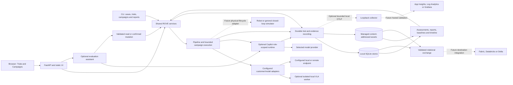
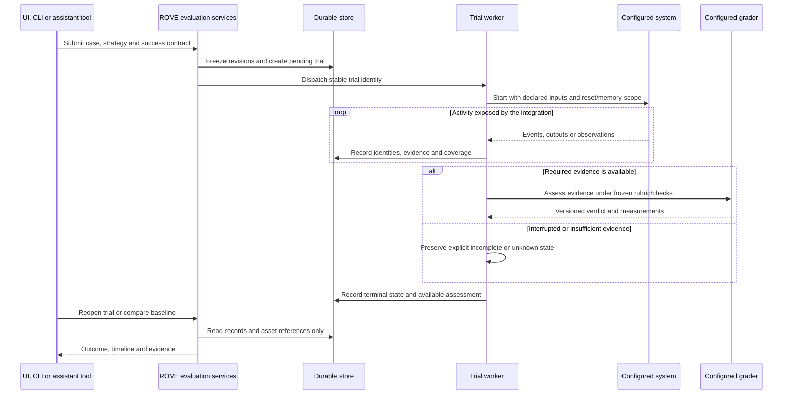

# ROVE system: execution, evidence and integrations

**Status:** Current local process boundaries, with future integrations explicitly
labelled. Broader robot lifecycle requirements below remain a target contract.
**Updated:** 2026-09-14.

The local application serves both interactive strategy comparison and automated
campaigns. It does not require microservices or a cloud account for mock operation.
See [current implementation](current-implementation.md) for source/test evidence and
[logical architecture](target-architecture.md) for responsibilities.

## Current local system

Ordinary CLI evaluation and data commands call application services directly. Assistant
settings/test/proposal commands contact the owning local server. Copilot hosts optional
assistant or configured agent behavior; it does not schedule every direct-model call
or act as a robot driver. The isolated VLA worker uses its own dependency environment,
not a security sandbox. Its successful inference does not establish task completion.

SQLite stores retain trials/cases/reviews/assets metadata, campaigns and their insight
cache, strategy revisions, and local assistant selection in their respective databases.
A complete study backup preserves all relevant databases and managed assets together.
SDK session state and optional telemetry are not substitutes for those records.
ABC and JSONL/image imports enter existing Case services; original source artifacts
and private labels remain separate from candidate input. See
[storage and exchange](../product/evidence-and-exchange.md).

## Trial Lifecycle

This broader target sequence preserves the distinction between execution state and task
outcome. A failed task can have a complete trace; an interrupted process can leave
an unknown outcome. Reopening history never dispatches actions. An interrupted
physical trial is not automatically replayed; continuing it requires the declared
execution/reset contract and a valid environment acknowledgement.

## Failure and Data Boundaries

| Boundary | Required behavior |
| --- | --- |
| Browser disconnect | Worker recording continues; reconnect reads saved progress |
| Process crash | Pending/running records reconcile to interrupted or uncertain state; captured evidence survives |
| Duplicate tool request/event | Stable operation IDs prevent duplicate dispatch; source IDs prevent duplicate history |
| Recorder failure | Surface capture failure; do not present incomplete recording as complete evidence |
| Collector/provider outage | Collector failure cannot erase trials; provider failure remains a recorded execution failure |
| Slow exporter | Bounded queues and explicit drop/coverage reporting; external export does not block robot control |
| Candidate versus grader | Separate sessions, tools and data access; private grading labels stay outside candidate context |
| Sensitive/large content | Redact credentials; external content capture off initially; export approved references rather than full recordings |

Tracing follows OpenTelemetry/W3C context, while robot timestamps retain their own
clock identity and alignment uncertainty. Keep high-cardinality trial IDs in
traces/logs and links, rather than turning every trial into a metrics label.

## Optional Destinations

Azure Monitor accepts OTLP through a configured Collector. In Microsoft's documented
setup, log/trace data uses a Log Analytics workspace and metrics use an Azure Monitor
workspace; Application Insights supplies investigation experiences. Identity,
workspace and metric-format configuration remain deployment tasks. See
[Microsoft's ingestion guide](https://learn.microsoft.com/en-us/azure/azure-monitor/containers/opentelemetry-protocol-ingestion).

Grafana supports OTLP through its Collector/Alloy path or supported ingestion
endpoints, with Tempo, Loki and Mimir providing trace, log and metric storage.
See [Grafana's OpenTelemetry guide](https://grafana.com/docs/opentelemetry/).

Fabric/Delta exports use versioned evaluation records and asset manifests rather
than reconstructing the dataset from monitoring logs. PostgreSQL is a separate,
demand-driven storage decision; none of these integrations is required locally.
