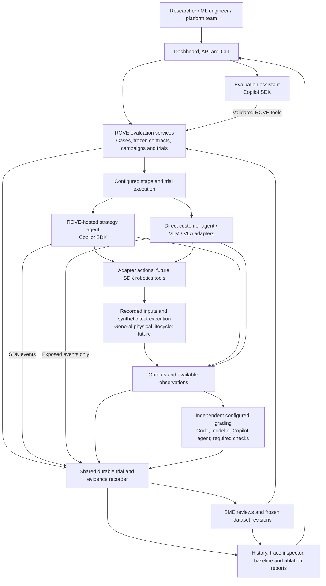

# ROVE Architecture: Evaluation Services and Shared Agent Runtime

**Status:** Accepted logical architecture. The core services, optional Copilot
runtime, durable records, assistant and local inspection are implemented; general
physical lifecycle tools and hosted analytics integrations remain future work.
**Updated:** 2026-09-14
**Decision:** [ADR-024](ADR-024-copilot-runtime-and-observability.md)

**ROVE evaluates robotics agent pipelines on your task.** Copilot SDK supplies the
agent runtime for workflows ROVE hosts. ROVE supplies cases, trial execution rules,
grading contracts, evidence records and comparisons. Customer systems can keep
their own runtime and decision-making behavior.

## Architecture Diagram

This is a logical architecture rather than a deployment inventory. Existing local
services and optional runtime roles are shown together with future environment tools.
Arrows show requests or data delivery, not separate microservices. Use the
[system diagram](system-diagram.md) for current process and storage boundaries.

The three Copilot roles share runtime infrastructure, not conversation memory or
permissions. A candidate receives its allowed inputs and tools; a grader receives
the evidence and rubric it needs; the assistant operates ROVE through validated
tools. Candidate inputs exclude grader-only labels and SME reference material.

## Responsibilities and Contracts

| Boundary | Responsibility | Contract and remaining extension |
| --- | --- | --- |
| UI/API/CLI → evaluation services | One behavior across quick runs and campaigns | Validate configuration, assign stable IDs and freeze revisions before dispatch |
| Assistant → evaluation services | Prepare and investigate evaluations; confirm selected mutations | Typed tools use the same services; exact host confirmations guard writes and operation IDs prevent duplicates |
| Trial executor → configured system | Run the selected system with declared conditions | Start, progress, cancel, terminal reason, memory/reset scope and telemetry coverage |
| System → environment | Observe and act when supported | Input/output types, action units/frames, reset acknowledgement and execution evidence |
| Evidence → grader | Apply a declared evaluation contract | Versioned rubric, required constraints and independent assessment identity |
| Producers → recorder | Preserve events and evidence | Stable source IDs, sequence/clock context, role, asset references and explicit gaps |
| Recorder → report | Explain results and differences | Matching case/contract revisions, planned-attempt accounting and evidence navigation |

The names describe responsibilities rather than final Python classes. Extend the
existing optional-stage configuration and adapter contracts; do not introduce a
second user-facing hooks framework. SDK hooks can support internal tool policy and
instrumentation. They do not replace configured verification or required checks.

## Evaluate the Customer's Actual System

| Strategy | What executes | What a result supports |
| --- | --- | --- |
| Customer VLA | Its configured observation/action adapter | Performance of that VLA configuration under the stated environment conditions |
| Customer agent | Its existing planner, memory, tools and recovery logic | Performance of the exposed customer pipeline, with internal trace coverage stated |
| Copilot planner plus VLA | The configured SDK agent invokes the VLA through tools | Performance of the combined pipeline, including planning and recovery behavior |

The third strategy is a legitimate ablation of the first, but an improvement cannot
be attributed to the VLA alone. Record changed prompts, preprocessing, action
normalization, observations, budgets and retry behavior. Pure transport translation
must not silently become additional decision-making. Copilot need not make a model
call for a direct-model trial, and must not sit in every low-latency control tick.

## Evidence, Telemetry and Storage

The durable evaluation record uses SQLite locally, with large assets stored
separately by identity and range. SDK session persistence supports agent
continuation; it does not replace trial history or restore a physical environment.
ROVE event identities remain separate from OpenTelemetry trace/span IDs and SDK
session/event IDs, with explicit mappings between them.

Use SDK events for inspectable agent activity and native OpenTelemetry for runtime
traces. Add ROVE trial/stage/tool spans, preserve their correlation, and avoid
creating duplicate model/tool spans from the same activity. The external exporter
can be disabled or unavailable without erasing local evidence. Metric calculations
use authoritative trial records, never a sampled telemetry population. See
[ADR-022](ADR-022-trial-telemetry.md) and the
[system diagram](system-diagram.md) for the collection and deployment boundaries.

## Persona Outcomes

- **Robotics Researcher:** compare a VLA alone with an agent-assisted VLA under the
  same case and assessment revisions, with changed components visible.
- **ML Engineer on a Manipulation Team:** import customer images/tasks, inspect a
  failed output, request SME review and freeze a reusable dataset.
- **Platform / AI Infrastructure Team:** configure provider identity, locate a
  trial's model/tool calls and optionally follow its trace in existing monitoring.

## Existing Foundations and Delivery

Optional stages and supported adapters, campaign SQLite/repeated-trial reports,
and configured verification already exist. Copilot integration, a shared durable
quick/campaign recorder, linked inspection, SME datasets and baseline lineage are
not implemented by this document. The
[current implementation](current-implementation.md) links shipped behavior to
source. The [implementation sequence](../product/implementation-plan.md) defines
the remaining tasks, dependencies and acceptance gates.
