# Build evaluation cases from ABC episodes

**Status:** Accepted product contract; implementation and validation are tracked in
[ADR-028](../architecture/ADR-028-abc-episode-import.md).
**Updated:** 2026-09-13.

ROVE builds on the ABC team's open data and conversion tools so robotics teams can
try their strategies on recorded bimanual manipulation observations. The first
release imports a selected observation into the existing Case workflow. It does not
require a new campaign type, a training environment or a model download.

## Jobs this supports

| Persona | Job | Useful first result |
| --- | --- | --- |
| ML Engineer on a Manipulation Team | Test an agent's scene understanding or plan on unfamiliar manipulation data | Compare strategies on one sourced observation, task and exported robot state |
| Robotics Researcher | Build a repeatable held-out case selection | Retain episode, split, frame and source identity alongside strategy and scoring revisions |
| Platform / AI Infrastructure Team | Automate reproducible imports and evaluations | Use the same importer through CLI and API, then existing campaign/report commands |

ABC supplies recordings and tools; ROVE supplies case curation, strategy comparison,
review and iteration history. An evaluation service that produces independent robot
rollouts could supply additional evidence through a future integration. No service
account or commercial integration is required for the local episode import.

## One journey, existing concepts

```mermaid
flowchart LR
    A[ABC public preview or authorized local episodes] --> B[Upstream converted episode]
    B --> C[Cases: Import ABC episode]
    C --> P[Preview observation, state and limitations]
    P --> D[Existing immutable Case]
    D --> E[Select strategies and review success criteria]
    E --> F[Run trials and inspect outputs]
    F --> G[SME review and saved dataset revision]
    G --> H[Baseline and later campaign iterations]
```

1. Obtain the ABC team's public preview, or convert locally available ABC-130k MCAP
   episodes using their conversion tools. Dataset access decisions stay with the user.
2. In **Cases → Import cases**, select **ABC episode** and choose its metadata,
   combined video and state/action files. Choose an observation frame and camera;
   identify the source revision, episode, split and real/sim domain.
3. Preview the actual image and current state. Review limitations before importing.
   Import adds an ordinary case to the current selection; it does not execute a trial.
4. Choose existing strategies and review success criteria. For this import, the
   immediately useful assessment is scene understanding or plan quality.
5. Run and review the outputs. Preserve reviewed cases and a baseline before changing
   strategies. Future case or rubric changes remain visible in iteration history.

The CLI equivalent is `rove data case import-abc`; see the
[worked example](../../examples/abc/README.md). Both paths call the same service.
The browser selects files explicitly rather than accepting a server filesystem path.

## What becomes a case

| Source information | ROVE treatment |
| --- | --- |
| Task and selected camera observation | Candidate input |
| State at the selected exported frame | Candidate context with explicit ordering and units |
| Episode, source revision, split, domain and selected frame/camera | Immutable provenance and comparison conditions |
| Metadata, full video and complete state/action artifact | Private managed references for inspection and reproducibility |
| Demonstrated actions and later observations | Reference evidence, excluded from candidate input |
| Missing calibration, original camera details or robot model | Explicit limitation; no invented URDF or inferred calibration |

The converted export is a derived representation. Raw sensor data, optional subtask
annotations and source station models are not automatically carried by its three
files. Its state values are not proof of complete original channels: the upstream
converter can fill absent channels with zeros. Preserve that limitation rather than
treating every numeric zero as a measured joint or gripper state.

## Measures and review

Importing a demonstration never creates a candidate success label. A strategy's
proposed plan can be assessed by a reviewed rubric, with latency and repeated-output
reliability reported under that scope. Physical task success requires a separate
execution of that strategy and associated outcome evidence. Offline agreement with a
demonstrated action, if added later, must remain a diagnostic with that narrower name.

Keep evaluation selections separate from known training episodes. Preserve upstream
splits and group selections by episode when making further splits; adjacent frames
from the same demonstration are not independent trials. Disclose known or unknown
model training exposure. A small curated import tests the workflow, not the entire
dataset or general robot competence.

## Acceptance criteria

- Preview validates all three files and selected frame/camera before durable writes.
- Import retains the selected observation and source artifacts in managed storage;
  the resulting case works with existing selection, review and campaign services.
- Repeating the same import does not duplicate cases. A changed selection or source
  produces a distinct immutable identity.
- Invalid dimensions, lengths, unsupported metadata and out-of-range selections fail
  clearly. Source revisions are user declarations plus artifact hashes, not a claim
  of remote verification.
- Future frames/actions never enter the candidate context. No review or success label
  is fabricated. Real and simulation source domains remain distinguishable.
- Metadata is limited to 256 KiB; each video/state artifact to 64 MiB. No automatic dataset or checkpoint download,
  raw MCAP parser, calibration recovery or MJCF-to-URDF conversion is introduced.

## Building further on ABC

The next useful integration is an adapter for outputs from ABC's existing
`eval_policy.py`. It should retain per-world initial conditions, seeds, checkpoint
identity, evaluator configuration, progress measurements and video references. Its
strict current success, success reached at any point and maximum task progress must
remain distinct. Aggregate-only summaries cannot reconstruct case-level evidence or
repetition groupings and must not manufacture pass@k or pass^k.

That adapter is **proposed**, not part of episode import. Run the upstream simulator
in its own environment; a ROVE wrapper should call it or import its outputs instead
of duplicating their physics and scoring logic. Validate the schema and evidence
binding on actual outputs before advertising support. A physical evaluation service
can follow the same principle without equating simulation with hardware results.

## Upstream resources

- [ABC project](https://abc.bot/) — research, data and evaluation methodology.
- [ABC code and usage guide](https://github.com/amazon-far/abc) — public preview,
  conversion and simulation entry points. The minimal release is useful without
  adopting its training stack.
- [ABC-130k dataset card](https://huggingface.co/datasets/XDOF/ABC-130k) — raw format,
  source splits, dataset license and gated access conditions.
- [XDOF announcement](https://www.xdof.ai/blog/abc-130k) — data and evaluation service
  context. These are resources to build upon, not a separate ROVE benchmark claim.

ROVE's import code is independent. Retain upstream attribution when redistributing
data; model and third-party asset licenses should be reviewed separately if a future
integration actually uses those components.
