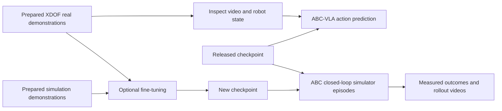

# ABC and XDOF: an executable Jupyter introduction

## Reader and outcome

A robotics developer or ML engineer can inspect one task's demonstrations,
predict an action chunk, then see how a policy behaves across complete simulator
episodes. A platform engineer can reproduce the commands and identify the GPU,
data and model artifacts needed before considering cloud deployment.

The [Jupyter notebook](../../notebooks/abc_xdof/hello_abc.ipynb) is a standalone
reference exercise using ABC. ROVE remains a separate evaluation application;
the notebook does not add training, simulation hosting or cloud deployment to it.

## Notebook experience

The default path runs on a laptop: check prerequisites, fetch the pinned source
and small prepared preview, play a short demonstration, display camera views,
plot states/actions and export file fingerprints. GPU inference and training are
off by default and produce explicit skipped messages rather than placeholder
results. The notebook contains no saved outputs in Git.

On a supported Linux/NVIDIA host, `RUN_GPU=True` installs ABC separately and
executes the released ABC-VLA. Native frame decoding and policy preprocessing
preserve the observation/action contract. Recorded future actions are excluded
from the policy's input. A complete episode uses repeated observations and
actions, with task completion supplied by ABC's simulator evaluator.

The small evaluation uses one fresh process per world seed. Reports preserve
ever-observed success, final success, actual reset metadata, prompt and execution
settings. Three worlds teach the workflow; they do not establish reliability.

`RUN_FINE_TUNING=True` runs a 20-step mechanics exercise using the real/sim preview
mixture, saves an explicit fresh checkpoint, and evaluates it. It retains the
parent's normalization and derives the candidate prompt from training metadata.
Changed prompts or reset conditions are surfaced as comparison notes. A result
does not claim fine-tuning improved performance merely because training finished.

## Implementation and validation boundary

- [Notebook helpers](../../notebooks/abc_xdof/tutorial.py) validate prepared rows,
  stop failed commands, terminate subprocesses on interruption and inspect
  comparison conditions.
- [Offline tests](../../tests/test_abc_notebook.py) cover malformed observations,
  failed/stale result rejection, missing assessments and changed protocols.
- The real-data preview execution is validated locally on macOS, including video
  decoding, plots and provenance export. GPU inference, simulation and training
  are source-checked against the pinned ABC revision but have not been executed
  on this host. No model performance is claimed.
- Azure hosting, Fabric reporting, external VLA adapters and physical-robot
  validation are outside this example.

The [setup guide](../../notebooks/abc_xdof/README.md) records prerequisites and
execution controls. [ADR-037](../architecture/ADR-037-standalone-abc-notebook.md)
explains why the example has an independent environment.
