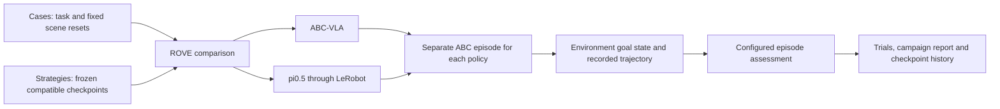
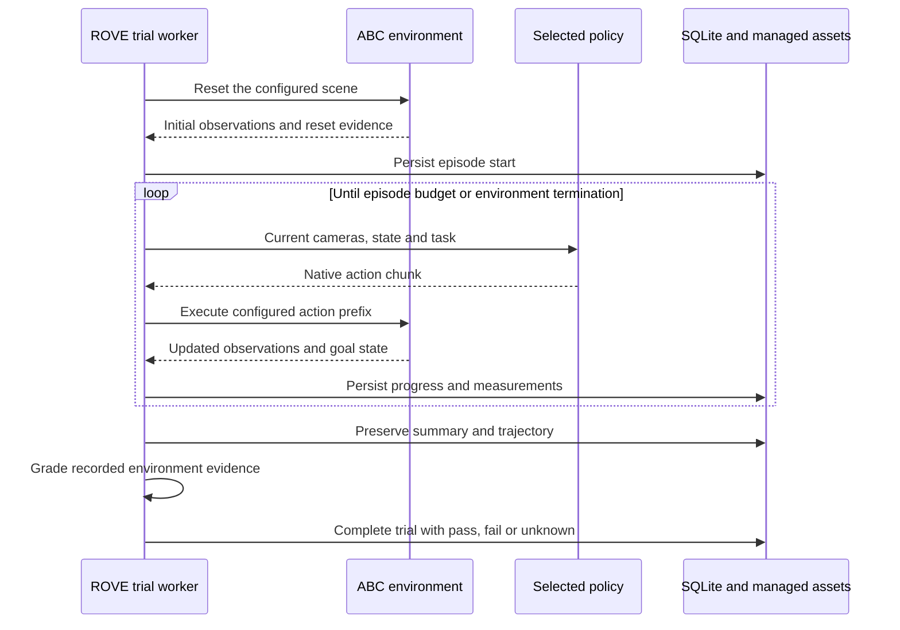

# Compare ABC-VLA and pi0.5 on a bimanual task

ROVE compares compatible robot policies on the same simulated job, records the
complete episodes, and preserves the evidence needed to compare a later checkpoint.
The first integration uses ABC's **put plastic bottles in the bin** task and
compares ABC-VLA with a pi0.5 checkpoint adapted to ABC's robot.

**Status:** Experimental implementation. Local contract, persistence and reporting
tests exercise the integration boundary. Real GPU inference, closed-loop simulator
execution and pi0.5 fine-tuning have not been validated on the development host.
No model ranking or customer-performance result is claimed by the included tests.

## The customer decision

The useful question is: **Which policy meets this robot's task requirements, and
did adaptation improve it?** The first example establishes the evaluation path
using an existing simulator task. A customer's different workcell, robot or job
requires a compatible environment, inputs, actions and task evaluator.

| Persona | Job to do | ROVE provides |
| --- | --- | --- |
| Robotics researcher | Compare ABC-VLA and pi0.5 under matched conditions | Fixed scene cases, repeated policy seeds and separately recorded episodes |
| ML engineer | Decide whether an adapted checkpoint improves task performance | Success curves, inference measurements, recorded outcomes and checkpoint identity |
| Platform / AI infrastructure team | Run evaluations automatically and retain reports | Local profile setup, CLI/API execution, SQLite history and portable reports |

ABC supplies the robot environment, rendering, physics and task-success signal.
LeRobot supplies the pi0.5 policy runtime and its native processors. ROVE owns
configuration, trial scheduling, durable recording, comparison and reporting.
The existing image-based robotics pipeline remains available.



## Cases, strategies and repeats

A case identifies the ABC task and a fixed scene reset seed. The policy gets the
current three camera observations, measured robot state and task instruction.
It does not get the demonstration's future actions or an evaluation reference.

A strategy selects a compatible policy checkpoint and runtime. Both policies must
use ABC's two-arm state/action conventions and 14 action dimensions. Merely
changing a LIBERO checkpoint's configured dimensions does not adapt that model.
The camera mapping, joint order, gripper conventions and native normalization
must agree with the checkpoint's training.

The campaign's attempt seeds control policy randomness. They do not silently
change the scene. For example, **3 scene cases × 2 strategies × 3 policy seeds =
18 planned trials**. The two policies therefore receive matched starting scenes;
their later observations differ because each policy executes its own actions.

Each trial starts a new process and environment. The loop requests an action
chunk, executes the configured prefix, observes the changed scene and requests
the next chunk. The default budget is 3,540 executed steps, with up to 15 actions
executed between predictions. Policy loading and simulator initialization are
part of the trial deadline, but have separate meaning from inference latency.



## What success means

The profile explicitly chooses the simulator's success interpretation:

- **Ever:** the environment reports the task goal at some point in the episode.
- **Final:** the environment reports the task goal at the episode's end.

The initial default is `ever`, matching the upstream ABC success interpretation.
Both measurements remain visible so temporarily reaching the goal can be
distinguished from leaving the scene in the desired state. The configured choice
is frozen with the campaign; changing it creates different assessment conditions.

The grader uses recorded simulator state. A policy's text claim or a successfully
produced action chunk does not determine success. Missing, malformed or changed
evidence leaves the result unknown. Errors, timeouts and cancellations remain
execution failures with unresolved outcomes; they are not silently removed from
the planned denominator.

## What the report shows

| Measure | Meaning |
| --- | --- |
| Success rate | The fraction meeting the frozen goal criterion; unresolved trials remain explicit |
| pass@k | Estimated probability of at least one success in k attempts of the same strategy on a case |
| pass^k | Estimated probability that all k attempts succeed |
| Goal reached / goal at end | Distinct simulator measurements retained even when only one supplies the grade |
| Executed steps and simulated duration | How much of the episode was executed; simulated duration is not physical cycle time |
| Policy predictions | Number of action chunks requested during the episode |
| Inference latency and time | Measured policy-call timing, separate from model loading and simulator setup |
| Execution and assessment time | The complete worker duration, including initialization and grading |

The episode-performance table appears near the top of the campaign report.
Every value shows how many planned episodes supplied that measurement. Units and
evidence quality are not pooled. An average of episode p95 inference latencies is
labeled as such; it is not presented as a pooled p95 across all predictions.

Small seeded examples demonstrate the workflow rather than establish a reliable
model ranking. Repeated deterministic outputs do not establish independent
success probabilities. Matched scene seeds help paired comparisons, but GPU
numerics, policy randomness and the simulator version still matter.

Policy-call timing includes the selected runtime's adapter overhead. In particular,
pi0.5 communicates through a separate process; its observation transfer and reply
are part of that elapsed time. It is not a kernel-only accelerator benchmark.
Reports also check actual initial-state fingerprints: differing states produce
a prominent unmatched-comparison warning, while missing fingerprints leave
matching conditions unconfirmed.

## Reproducibility and operating boundary

Create a profile, replace its placeholder paths with installed runtimes and
compatible local checkpoints, then register it:

```bash
rove bimanual init --output abc-profile.json
# Edit abc-profile.json before continuing.
rove bimanual setup --config abc-profile.json --store .rove/benchmarks
rove bimanual doctor --store .rove/benchmarks
```

`setup` requires every model in the profile to be available. To establish the
ABC-VLA baseline before adapting pi0.5, remove the `pi05` strategy from that
working profile, register ABC-VLA, then add and register pi0.5 after adaptation.
This is explicit setup; evaluation does not produce a missing adapted checkpoint.

Preview the complete two-policy comparison before launching:

```bash
rove bimanual plan --strategy abc-vla --strategy pi05 \
  --scene 0 --scene 1 --scene 2 --seed 11 --seed 29 --seed 47
```

This plan contains 18 trials. A single scene and policy seed can first be used for
a standalone comparison, producing two saved trials without creating a campaign:

```bash
rove bimanual trial --strategy abc-vla --strategy pi05 --scene 0 --seed 11
```

Run the repeated campaign and write an HTML report:

```bash
rove bimanual run --name "Bottles policy comparison" \
  --strategy abc-vla --strategy pi05 \
  --scene 0 --scene 1 --scene 2 --seed 11 --seed 29 --seed 47 \
  --output bottles-comparison.html
```

These commands default to `.rove/benchmarks`; use the same `--store` for setup and
execution when choosing another location. Campaigns and trials remain inspectable
through the existing browser history. Standard `rove benchmark report` and trial
inspection commands can read the same persisted records.

The campaign command retains its report before returning a nonzero exit status
for interrupted, missing or unassessed executions. An assessed episode that did
not meet its success criterion is a valid evaluation and does not make the
command fail. This distinction lets automated workflows detect broken evaluation
jobs without confusing them with a model's measured failures.

Setup registers an operator-owned profile with installed interpreter paths,
checkpoint contents, runtime fingerprints and pinned ABC source. The browser
selects registered strategies and bounded episode settings; it cannot supply an
arbitrary executable path. Launch does not implicitly download a model or install
another runtime.

ABC and pi0.5 use separate Python environments. One ROVE worker owns the whole
episode process group, so timeout or cancellation terminates its descendants.
Progress and already-saved assets survive interruption. This local process
boundary controls lifecycle and dependency conflicts; it is not a sandbox for
untrusted model code.

The worker's optional evaluation context supplies declared environment settings,
durable progress and bounded managed evidence. It does not add private references
to candidate inputs. Each artifact has a content hash; grading may cite only
recorded, available evidence. Large media must be split into bounded assets.

Existing ABC/XDOF observation imports remain useful for inspecting demonstrations.
An imported video frame is not automatically an executable simulator case. This
comparison uses ABC's supported task/reset environment explicitly. Training data
and held-out evaluation cases need separate provenance; simulator seeds alone do
not prove that a pretrained model has never seen the underlying task.

## Improve a checkpoint

Run the released ABC-VLA baseline and a compatible pi0.5 candidate, inspect failed
episodes and timing, then adapt a new checkpoint outside the evaluation worker.
Register it as a new strategy and rerun the frozen cases, policy seeds, action
budget and success criterion. Preserve the training data split and processor
configuration beside that checkpoint.

The local [dataset conversion](../../examples/abc-pi05/dataset.py) and
[pi0.5 adaptation recipe](../../examples/abc-pi05/train.py) prepare training data
and an explicit training plan outside the ROVE evaluation process. Their resulting
checkpoint must still pass runtime and embodiment checks before evaluation.

A fine-tuning smoke test verifies that the training path produces a usable
checkpoint; it does not establish useful specialization. A performance claim
requires held-out episode results. Azure deployment, Fabric integration and
physical robot control are separate follow-up work.

## Validation status

The real ABC simulator has completed a 30-control-step CPU smoke test with camera
rendering. Two genuine ABC training episodes, totaling 1,870 frames, have also
been converted into a LeRobot dataset and read back successfully. These checks
exercise the environment and data path; they do not measure a learned policy.

Local regression tests cover the execution contracts, evidence persistence,
reporting and command failure behavior. GPU inference for ABC-VLA and pi0.5,
fine-tuning, and a learned-policy performance comparison remain unrun.

See [ADR-038](../architecture/ADR-038-abc-bimanual-episodes.md) for the process and
storage decision, [the reusable core](reusable-evaluation-core.md) for the shared
lifecycle, and [the standalone notebook](abc-jupyter-tutorial.md) for the original
ABC/XDOF learning exercise.
