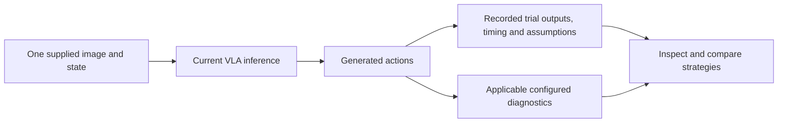
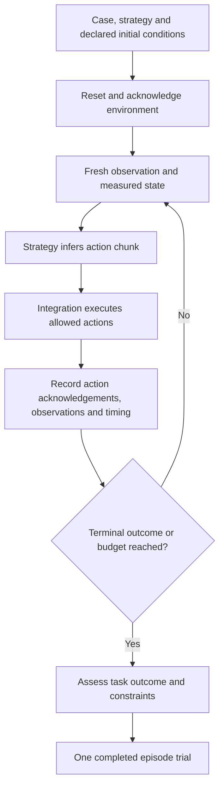

# Action comparison and episode evaluation

**Status:** Local LeRobot inference boundary and episode integration scope, 2026-09-15.
ROVE's local LeRobot adapter generates actions from a supplied observation. It does
not execute those actions, obtain new observations and continue until the task finishes.
The separate [ABC bimanual integration](abc-pi05-comparison.md) now implements
complete simulator episodes through the reusable evaluation core. Its CPU simulation
and integration checks do not establish GPU policy performance or physical success.

A robotics team needs both levels, but they answer different questions:

| Level | Question | Evidence required |
| --- | --- | --- |
| Action-level comparison | Can this configured model process this observation/state, and what actions does it produce? | Exact input, checkpoint/processors, returned actions, timing and disclosed assumptions |
| Episode-level evaluation | Does this complete strategy accomplish the task, how reliably and at what cost? | Controlled initial conditions, executed actions, fresh observations, terminal outcome and applicable constraints |

## An action chunk is not a whole task

A chunk is a sequence of actions covering part of an execution horizon. Robot systems
typically need further inference conditioned on updated observations. Chunk length,
control rate, how much of each chunk executes and inference delay all affect behavior.
Physical Intelligence's [real-time chunking work](https://www.pi.website/research/real_time_chunking)
describes coordinating successive chunks while the robot moves. LeRobot's
[asynchronous inference design](https://huggingface.co/docs/lerobot/async) separates
policy inference from robot-side observation and action execution. Neither capability
is implied merely by loading a VLA inside ROVE.

The current in-process LeRobot adapter and isolated worker call `select_action` using
the same prepared input batch while collecting the requested action output. The policy
may consume its internal action queue or perform another inference, but it does not
receive an updated physical observation from ROVE during that loop. More returned
actions therefore do not establish a completed closed-loop episode.

This remains useful for integration checks, incompatible inputs, inference latency,
action-space analysis and model diagnostics. For an observation-only probe, state or
views may be missing; its output remains explicitly execution-ineligible and cannot
be fed to dynamics or simulation as though it were a validated robot command.

## What a complete episode integration supplies

The [ABC executor](../../src/rove/bimanual/adapter.py) and
[episode loop](../../src/rove/bimanual/episode.py) implement this lifecycle for the
supported simulator. Other environments need their own reset/initial-state acknowledgements, camera
and state alignment, action/control conventions, budgets, cancellation behavior,
measurement sources and an independent terminal evaluator. A hardware or simulation
integration should own those mechanics; ROVE should retain the trial, configuration,
trace and assessment. A copied recording cannot stand in for fresh candidate actions.

One trial may contain many observations and action chunks when its integration runs a
complete episode. Those chunks are correlated steps inside one attempt, not independent
trials for pass@k or pass^k. Repeated episode trials start from the declared initial
conditions and reset policy. Fair strategy comparisons match the initial task and
environment conditions; later observations naturally diverge as strategies act.
Forcing every candidate to consume the same later recorded frames instead evaluates
an offline replay, which answers a different question.

## Further industrial validation: one measurable task

To help a robotics team choose a reliable task solution, the next recommended slice
is one industrial pick-and-place task on one declared robot/environment, with a
resettable initial scene and an independently measurable object goal. Connect two
executable strategies, run repeated complete episodes, record the fresh observations,
action acknowledgements and terminal outcome, then compare success, completion time
and applicable intervention/constraint evidence.

An agent calling robot tools and a VLA producing action chunks can be compared when
each is integrated into a complete executable strategy for those same initial
conditions. Raw models with incompatible observation/action interfaces are not
interchangeable candidates. Their adapters, controllers and recovery behavior belong
to the strategy identity.

This is a **recommended next milestone, not an approved implementation commitment**.
Current offline image/task/URDF screening and FK checks cannot determine which system
most reliably completes that industrial task. Additional geometric diagnostics or
more polished reports do not close the execution-and-outcome gap.

## Robot compatibility is more than a URDF

A URDF describes robot structure and may support applicable geometric/kinematic
checks. Supplying one does not make an arbitrary checkpoint understand or control
that robot. The model still needs compatible camera inputs, measured state ordering,
embodiment, action representation, normalization and controller interpretation.
Unverified mappings remain limitations rather than silently inferred compatibility.

In the current release, the local SmolVLA probe establishes inference and recording
under its declared assumptions. It does not establish task completion, general
multi-camera support, Pi0.5 availability or transfer to a user-provided robot.

Sources: [LeRobot adapter](../../src/rove/adapters/local_lerobot.py),
[isolated worker](../../src/rove/adapters/lerobot_worker.py),
[ADR-033](../architecture/ADR-033-isolated-vla-runtime-and-trial-inspection.md), and
[runtime preparation](../../examples/runtime/lerobot/README.md).
