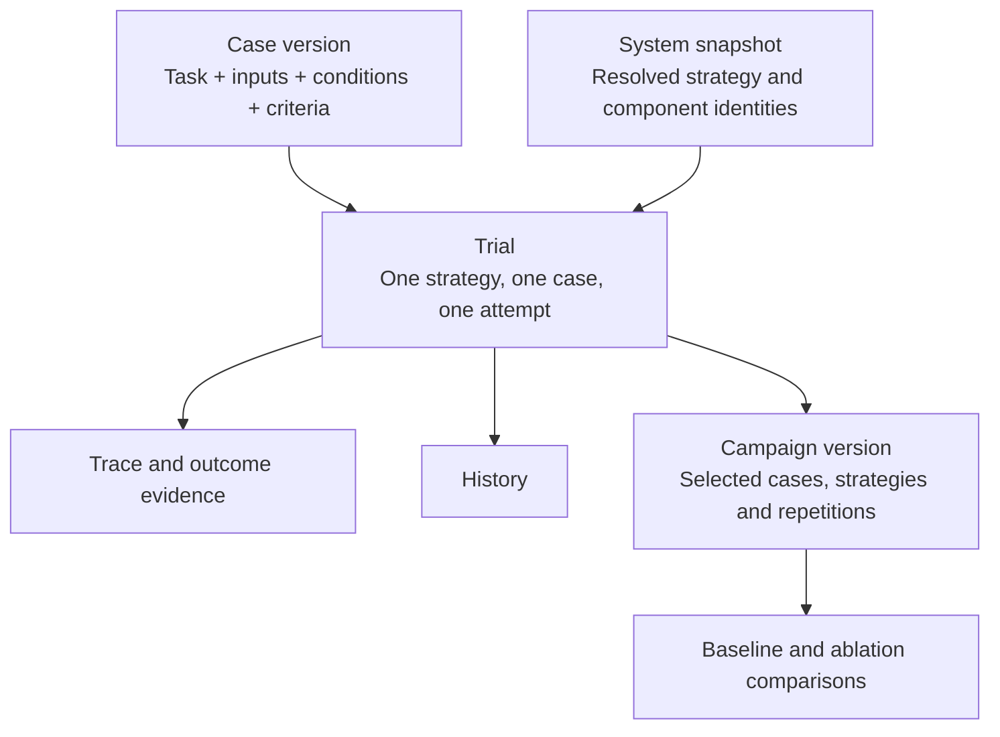

# Cases, Trials and Campaigns

ROVE helps a robotics developer answer: **did this system perform the task under
these conditions, and what evidence supports that assessment?** The same workbench
can assess scene understanding or a proposed plan before robot execution evidence
is available. The report must make that scope clear.

A robotics team can start with its own images and task instructions, choose a
supported system configuration and collect initial outputs. The proposed onboarding
workflow turns those outputs into a reviewed baseline for a stated customer outcome:
for example, whether a planning agent produces an acceptable placement plan. It
does not require a VLA or a complete robot recording to be useful.

This page defines the product vocabulary and distinguishes it from the current
implementation. Current behavior was checked against commit `776b393` on
12 September 2026. The versioned case, review and campaign workflows below are
**proposed**, not existing API or UI capabilities.

## One Attempt Has One Identity

A **case** describes a concrete task, its inputs, conditions and success criteria.
A **trial** is one strategy attempting that case once. A **campaign** organizes
trials across selected cases, strategies and repetitions. Selecting three
strategies for one case produces three trials, even if the user clicks Run once.

This is the target hierarchy. A quick trial will not require a campaign name before
execution. Promoting it later will reference the same trial rather than manufacture
another attempt. New planned repetitions receive their own identities.

The vocabulary follows the distinction between a test case, an individual attempt
and its outcome in [Anthropic's evaluation guidance](https://www.anthropic.com/engineering/demystifying-evals-for-ai-agents).
ROVE uses **Case** in navigation and retains **task instruction** as a case field.
An Experiment or Session container is not needed alongside Campaign.

| Concept | Meaning | Robotics example |
| --- | --- | --- |
| Case | A task with specific starting inputs, conditions and criteria | Place the red block in the bin, starting from this camera view and reset state |
| Task instruction | What the agent is asked to do; part of a case | “Place the red block in the bin” |
| Strategy | Reusable system configuration built from supported adapters and pipeline stages | A VLM for scene understanding, a planning agent, a VLA policy or a combination, with its evaluator |
| System snapshot | Proposed frozen record of the strategy and component versions used | Policy checkpoint, prompt, action convention and controller revision |
| Trial | One strategy attempting one case once | One placement attempt, including any actions within that attempt |
| Campaign | A named evaluation across cases, configurations and repetitions | Ten placement cases evaluated five times per strategy |
| Baseline / ablation | Proposed roles and links between exact campaign versions and system snapshots | Compare a changed policy with the baseline under the same grading criteria |
| Dataset revision | Proposed frozen case selection, annotations and grading revisions; managed under Cases | SME-approved placement cases and labels, including difficult or failed examples |
| Provenance | Identity and origin metadata attached to records, not another container | Input hash, evaluator revision, producing system and evidence origin |
| History | A view of saved work | Quick trials, campaign attempts and their later reviews |

A dataset revision defines **what to evaluate**. A campaign defines **which systems
to evaluate and how many attempts to make**. Case membership can be reused without
copying the recordings or treating a dataset as an execution.

The strategy is the system under test. Current optional stages and the generic
agent adapter allow different system shapes; integration still requires an adapter
that implements ROVE's stage contracts. The proposed case input requirements follow
the evaluation profile. An image-to-plan agent needs the image, instruction and
planning rubric; it should not be forced to supply URDF or joint state. A modeled
trajectory check or a physical completion assessment needs the additional geometry,
state or outcome evidence required by that check.

## Evidence Determines What a Result Means

For “place the block in the bin,” a correct object label, an expert-approved plan
and a measured final block position answer different questions. They can all be
useful, but only the last supplies direct evidence about final placement.

| Assessment scope | Useful evidence | Meaning of a positive result |
| --- | --- | --- |
| Prediction or plan assessment | Initial image, generated output, reference labels or SME review | The assessed output meets its declared rubric |
| Recorded episode evaluation | Actions and outcome observations from an existing episode | That recorded episode meets the selected criteria |
| Fresh policy rollout evaluation | A new attempt with outcome evidence tied to its producing configuration | That attempt meets the task criteria and required constraints |

The current adapters and verification stage provide foundations for these scopes;
they do not implement the proposed complete episode identity and reset contract.
The bundled placement verifier evaluates supplied final observations. Regrading
the same recording with a new evaluator creates another **assessment**, not another
robot attempt or evidence that a new policy improved.

In the proposed review workflow, an SME can validate a case, approve reusable
annotations and rate a particular trial output. These remain separate records.
A baseline output is not automatically ground truth; a different valid solution
must be allowed. A reviewed plan does not become observed physical completion.
See [evaluation workflows](evaluation-workflows.md) for review and dataset freezing.

## What Exists Today

| Product concept | Current implementation | Proposed change |
| --- | --- | --- |
| Case | `BenchmarkTask` stores an ID, instruction, inline image and optional example data; gallery entries reference image files | Shared immutable case versions and asset references |
| Trial | Campaign attempts have a task/strategy/seed key within a campaign; quick evaluation results group selected strategies under one evaluation ID | Stable trial IDs shared by quick runs and campaigns |
| Campaign | Campaign preparation freezes selected task inputs and configuration for one saved execution | Explicit version lineage, baseline selection and clone-to-ablation |
| Strategy and provenance | Strategies resolve configured endpoints; campaigns save selected configuration and fingerprints; quick results save lighter metadata | Shared snapshots captured before execution, with component differences |
| History | Completed quick evaluations use JSONL and browser storage; campaigns use SQLite | One durable, indexed recording path including interrupted quick trials |
| Dataset and SME review | Some examples provide existing reference labels | Review queue, case/output reviews and frozen dataset revisions |
| Success and performance metrics | Configured verification and required checks; pass@k, pass^k and evidence summaries | Campaign success-contract editor and robotics measures with expandable details |
| Session | A dashboard connection-information heading; no persisted Session entity | Rename the panel to Connection |

The source types are in [benchmark models](../../src/rove/benchmarks/models.py)
and [shared models](../../src/rove/models/core.py). The quick-history and Session
presentation are in [the dashboard](../../frontend/app.js). See
[current implementation](../architecture/current-implementation.md) for the actual
execution and storage paths.

## Success Rules and Performance Metrics

**Success rules** decide whether one assessed attempt passes: for example, the
object reaches the declared region and the required force limit is satisfied.
**Performance metrics** summarize results across attempts: for example, pass@k
or pass^k. A metric cannot replace missing task-outcome evidence.

The proposed report focuses on task correctness, completion or progress,
repeatability, constraint violations, interventions and recovery, task time and
evidence coverage. Several of these require signals that current adapters do not
supply. They must show **not measured** when unavailable, with expandable details
explaining the evidence, denominator and assessment scope. Robot completion time
and pipeline wall time are separate quantities. See
[success and metrics](metrics-and-success.md) for current support and the proposed
contract.

The design principles are simple: capture every attempt, preserve what was known
when it ran, keep evidence separate from judgments, and compare configurations
only within an explicit assessment scope.

The related decisions are [configured verification](../architecture/ADR-017-configured-verification.md),
[trial lineage and snapshots](../architecture/ADR-018-trial-lineage-and-snapshots.md),
[relational storage and assets](../architecture/ADR-019-relational-storage-and-assets.md),
[SME-reviewed datasets](../architecture/ADR-020-sme-reviewed-datasets.md) and
[campaign success and reporting](../architecture/ADR-021-campaign-success-and-reporting.md).
