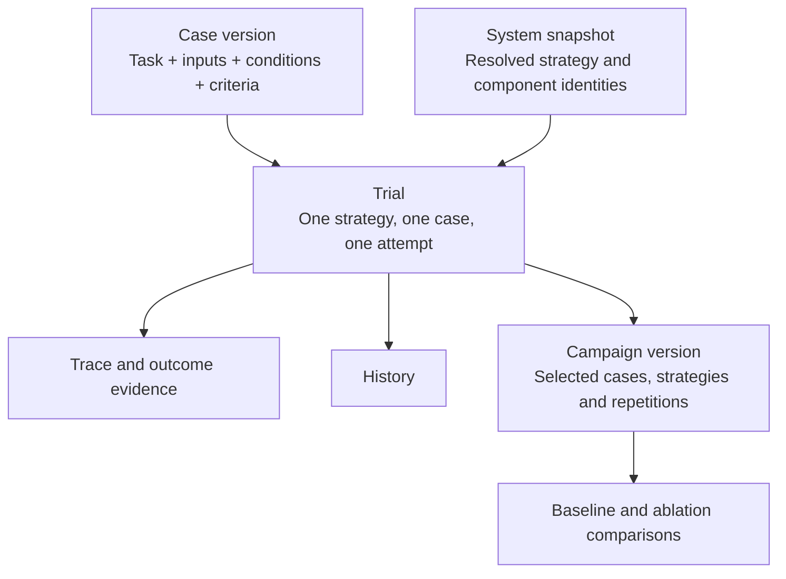

# Cases, Trials and Campaigns

ROVE helps a robotics developer answer: **did this system perform the task under
these conditions, and what evidence supports that assessment?** The same workbench
can assess scene understanding or a proposed plan before robot execution evidence
is available. The report must make that scope clear.

A robotics team can start with its own images and task instructions, choose a
supported system configuration and collect initial outputs. The local onboarding
workflow turns those outputs into a reviewed baseline for a stated customer outcome:
for example, whether a planning agent produces an acceptable placement plan. It
does not require a VLA or a complete robot recording to be useful.

This page defines the product vocabulary and distinguishes it from the current
implementation as of the customer workflow slice on 12 September 2026. Versioned
cases, explicit reviews, dataset freezing and baseline references are implemented;
complete robot reset contracts and general recording ingestion remain future work.

## One Attempt Has One Identity

A **task** is the robotics objective or instruction. A **case** combines that task with
a specific observation, relevant robot/environment conditions and expected outcome.
Several cases can test the same task under different conditions. Task is a case field,
not an additional persisted container.
A **trial** is one strategy attempting that case once. A **campaign** organizes
trials across selected cases, strategies and repetitions. Selecting three
strategies for one case produces three trials, even if the user selects **Run campaign**
once. **Create a campaign** prepares this work; **Run campaign** executes its trials;
**Review results** reads their saved evidence. Evaluation and run describe activities,
not additional persisted containers.

This hierarchy now has local implementation support. A quick trial needs no campaign
name before execution. Promotion preserves the same trial as an exploratory reference
and creates a reusable input case without manufacturing another attempt. New planned repetitions receive their own identities.

The vocabulary follows the distinction between a test case, an individual attempt
and its outcome in [Anthropic's evaluation guidance](https://www.anthropic.com/engineering/demystifying-evals-for-ai-agents).
ROVE uses **Case** in navigation and retains **task instruction** as a case field.
An Experiment or Session container is not needed alongside Campaign.

| Concept | Meaning | Robotics example |
| --- | --- | --- |
| Case | A task with specific starting inputs, conditions and criteria | Place the red block in the bin, starting from this camera view and reset state |
| Task instruction | What the agent is asked to do; part of a case | “Place the red block in the bin” |
| Strategy | Reusable system configuration built from supported adapters and pipeline stages | Models, agent runtime, tools and action components for the relevant stages, with declared grading |
| Strategy revision | Immutable saved variation of a source strategy, selectable for later trials | A new planning model or stage setting with a distinct recorded ID |
| System snapshot | Frozen record of the strategy and component versions used | Policy checkpoint, prompt, action convention and controller revision |
| Trial | One strategy attempting one case once | One placement attempt, including any actions within that attempt |
| Campaign | A named evaluation across cases, configurations and repetitions | Ten placement cases evaluated five times per strategy |
| Baseline | Saved reference to one completed campaign strategy and its frozen assessment snapshot | Set the current planning strategy results as the reference for future comparisons |
| Comparison campaign / ablation | Fresh candidate trials linked to a reference under matching conditions | Change the planning model and compare it with the saved baseline |
| Dataset revision | Frozen case selection, annotations and grading revisions; managed under Cases | SME-approved placement cases and labels, including difficult or failed examples |
| Provenance | Identity and origin metadata attached to records, not another container | Input hash, evaluator revision, producing system and evidence origin |
| History | A view of saved work | Quick trials, campaign attempts and their later reviews |

A dataset revision defines **what to evaluate**. A campaign defines **which systems
to evaluate and how many attempts to make**. Case membership can be reused without
copying the recordings or treating a dataset as an execution.

A campaign can compare several existing strategies together. Four cases, three
strategies and two repetitions produce 24 trials, grouped under one campaign. The
report keeps strategy results separate while using the same case and scoring cohort.
A component ablation answers a different question: did a specific change to the
baseline strategy improve the result? Save the changed strategy as a distinct revision
and compare its fresh trials under matching conditions. Both use the existing Case,
Strategy, Trial, Campaign and Baseline concepts; neither needs another container.

A saved strategy revision preserves its definition, while endpoints resolve from the
current configuration at campaign creation. The campaign freezes that complete resolved
configuration. Revising a strategy does not rewrite the source YAML or old campaign
snapshots. The editor begins with the current source, which may differ from a saved
baseline; preview must expose that drift. See [ADR-026](../architecture/ADR-026-versioned-strategy-catalog.md).

**Set as baseline** preserves a completed campaign strategy as a named reference.
This explicit save establishes its baseline role; the first campaign is not automatically
a baseline. Results derives its **Baseline** badge from saved references, not names.
The captured assessment may contain unknowns, and later expert ratings do not rewrite
it. Revision and pinning controls manage the saved reference in secondary details.

Opening results, recording expert judgments and saving a baseline do not rerun the
agent. **Compare a strategy change** prepares and previews a candidate. Only **Start
comparison campaign** executes the new candidate trials after validation; the reference
trial identities and outputs remain unchanged.

The strategy is the system under test. Current optional stages and the generic
agent adapter allow different system shapes; integration still requires an adapter
that implements ROVE's stage contracts. Case input requirements follow
the evaluation profile. An image-to-plan agent needs the image, instruction and
planning rubric; it should not be forced to supply URDF or joint state. A modeled
trajectory check or a physical completion assessment needs the additional geometry,
state or outcome evidence required by that check.

ROVE's **evaluation services** run and assess trials; its **execution services**
dispatch the configured system through supported adapters. Copilot SDK supplies
the shared agent runtime for behavior ROVE hosts. A customer's agent may keep its
own tools, memory and recovery; those remain part of the system being evaluated.
Record the relevant versions and settings in the system snapshot without adding
another Cases/Trials/Campaigns container. See the
[evaluation boundary](../architecture/ADR-023-evaluation-and-execution-harnesses.md)
and [runtime decision](../architecture/ADR-024-copilot-runtime-and-observability.md).

A **trace** links recorded events and outputs for a trial. A **measurement** is a
value with its unit, source quality, scope and evidence reference. The [trial inspector](traces-and-measurements.md) retains the events exposed by
the orchestrator and optional SDK; unsupported customer-internal calls are not
reconstructed. Durability does not imply that every source supplies full telemetry.

## Evidence Determines What a Result Means

For “place the block in the bin,” a correct object label, an expert-approved plan
and a measured final block position answer different questions. They can all be
useful, but only the last supplies direct evidence about final placement.

| Assessment scope | Useful evidence | Meaning of a positive result |
| --- | --- | --- |
| Prediction or plan assessment | Initial image, generated output, reference labels or SME review | The assessed output meets its declared rubric |
| Recorded episode evaluation | Actions and outcome observations from an existing episode | That recorded episode meets the selected criteria |
| Fresh policy rollout evaluation | A new attempt with outcome evidence tied to its producing configuration | That attempt meets the task criteria and required constraints |

The current adapters and verification stage provide foundations for these scopes;
they do not implement the proposed complete episode identity and reset contract.
The bundled placement verifier evaluates supplied final observations. Regrading
the same recording with a new evaluator creates another **assessment**, not another
robot attempt or evidence that a new policy improved.

In the local review workflow, an SME can validate a case, approve reusable
annotations and rate a particular trial output. These remain separate records.
A baseline output is not automatically ground truth; a different valid solution
must be allowed. A reviewed plan does not become observed physical completion.
See [evaluation workflows](evaluation-workflows.md) for review and dataset freezing.

## What Exists Today

| Product concept | Current implementation | Remaining extension |
| --- | --- | --- |
| Case | Immutable task/input revisions with managed PNG/JPEG assets and separate recorded evidence | General recording/video ingestion |
| Trial | Stable identities shared by quick and campaign attempts, persisted before execution | Complete robot reset and episode identity contracts |
| Campaign | Frozen selected inputs/configuration, explicit baseline references and clone-to-ablation | Richer campaign version navigation |
| Strategy and provenance | Frozen snapshots and component comparisons | Archival of remote weights and auxiliary artifacts |
| History | Durable indexed records, interrupted-work recovery and exploratory promotion | Aligned trace graphs and recording ranges |
| Dataset and SME review | Attributed drafts, immutable corrections, explicit annotations and frozen membership | Automatic mapping to configured graders and team adjudication |
| Success and performance metrics | Frozen contracts, expected-metric preview, existing pass metrics and per-output review | Aggregate campaign targets and evidence-backed autonomy/recovery aggregation |
| Session | Existing connection information; no additional persisted evaluation container | Keep connection and internal runtime session details separate from campaigns |

The source types are in [benchmark models](../../src/rove/benchmarks/models.py)
and [shared models](../../src/rove/models/core.py). The quick-history and Session
presentation are in [the dashboard](../../frontend/app.js). See
[current implementation](../architecture/current-implementation.md) for the actual
execution and storage paths.

## Success Rules and Performance Metrics

**Success rules** decide whether one assessed attempt passes: for example, the
object reaches the declared region and the required force limit is satisfied.
**Performance metrics** summarize results across attempts: for example, pass@k
or pass^k. A metric cannot replace missing task-outcome evidence.

The proposed report focuses on task correctness, completion or progress,
repeatability, constraint violations, interventions and recovery, task time and
evidence coverage. Several of these require signals that current adapters do not
supply. They must show **not measured** when unavailable, with expandable details
explaining the evidence, denominator and assessment scope. Robot completion time
and pipeline wall time are separate quantities. See
[success and metrics](metrics-and-success.md) for current support and remaining contract extensions.

The design principles are simple: capture every attempt, preserve what was known
when it ran, keep evidence separate from judgments, and compare configurations
only within an explicit assessment scope.

The related decisions are [configured verification](../architecture/ADR-017-configured-verification.md),
[trial lineage and snapshots](../architecture/ADR-018-trial-lineage-and-snapshots.md),
[relational storage and assets](../architecture/ADR-019-relational-storage-and-assets.md),
[SME-reviewed datasets](../architecture/ADR-020-sme-reviewed-datasets.md) and
[campaign success and reporting](../architecture/ADR-021-campaign-success-and-reporting.md).
