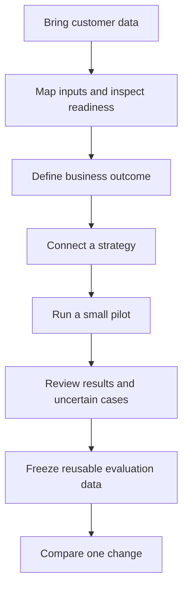
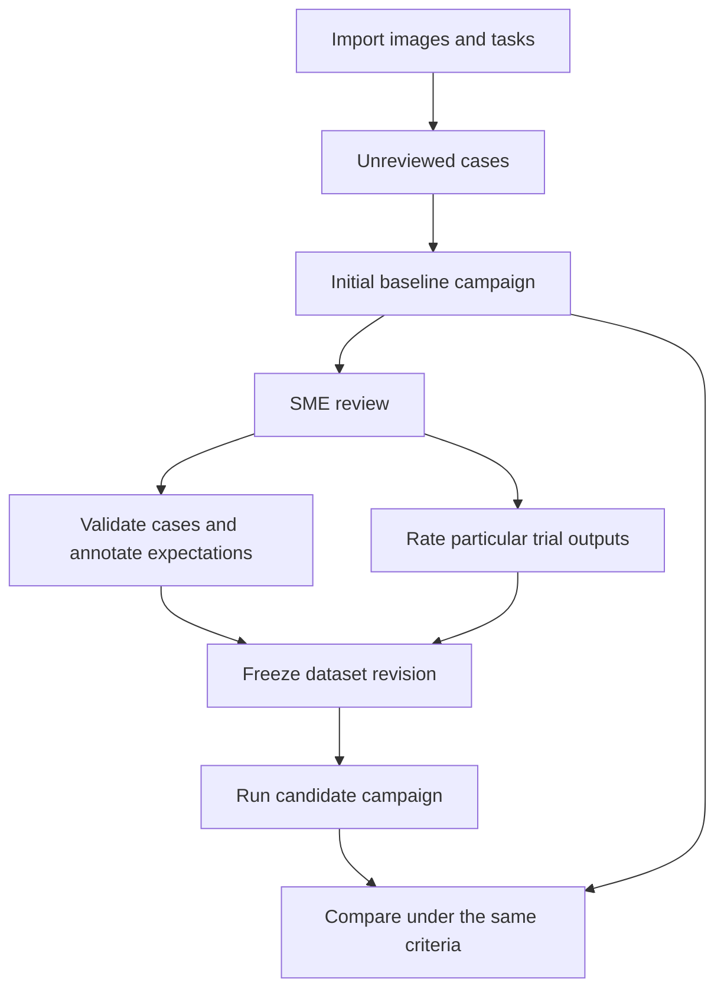
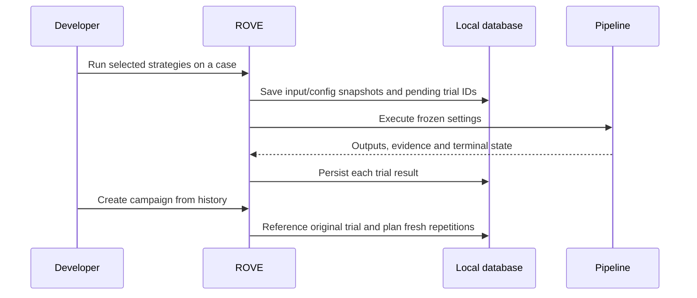

# Product specification: build, review and compare robotics evaluations

**Status:** Proposed follow-up. No implementation of the new review, dataset-freeze, promotion or ablation UI is included in this documentation change.
**Scope:** Local OSS workbench for robotics developers and subject-matter experts (SMEs).
**Related:** [Concepts](concepts.md), [metrics and success](metrics-and-success.md), [current implementation](../architecture/current-implementation.md), [ADRs](../architecture/README.md).

**Core vision: ROVE evaluates robotics agent pipelines on your task.**

The [product specification](../PRODUCT_SPEC.md) retains the founding vision and the three personas below. Configurable agents, human-reviewed datasets and business-outcome reports extend that vision. A supported agent or VLM can occupy the relevant stages; a VLA is not mandatory for every robotics evaluation.

## Personas and user stories

| Founding persona | Job to be done | Journey and evidence of value |
| --- | --- | --- |
| Robotics Researcher | Compare pipeline configurations and understand which changes help on a task suite | Import cases, establish a baseline, change a component, inspect per-case results and uncertainty with preserved configuration/seed support |
| ML Engineer on a Manipulation Team | Establish whether an agent meets a customer task's quality, cycle-time and intervention requirements | Onboard customer images/tasks, define outcome criteria, involve an SME, freeze reviewed cases and compare failures/constraints on the same dataset |
| Platform Team / Azure AI Foundry Administrator | Connect supported models and agents consistently and make evaluation evidence usable by development teams | Configure adapters/endpoints, inspect versions and availability, reuse strategy definitions and retain an integration path for external analytics |

- As a **Robotics Researcher**, I want a candidate linked to a frozen baseline so I can distinguish a model/configuration change from a changed case or grader.
- As an **ML Engineer on a Manipulation Team**, I want to start with a customer's unlabeled images and tasks, obtain expert-reviewed results and preserve a reusable dataset so I can evaluate business requirements without building one-off scripts.
- As a **Platform Team / Azure AI Foundry Administrator**, I want a consistent configuration and evidence contract for supported agents and models so teams can swap a component and share results without coupling evaluation history to a provider's API.

An SME is a reviewer collaborating with these personas, not a replacement for them. The platform persona describes a product need; it does not imply that MCP servers, hosted collaboration, authentication or lakehouse connectors have shipped. The current supported integration surface is documented in [current implementation](../architecture/current-implementation.md).

## Problem and intended outcome

A developer may have images and robot tasks but no labeled evaluation dataset. They need an initial baseline, a way for an expert to validate cases and assess outputs, and a stable reference for comparing a changed model or strategy. Today, quick evaluations and campaigns record different amounts of context, and strategy names alone do not connect baselines to later ablations.

ROVE should support both starting points: evaluating a prepared dataset, and creating a reviewed dataset from an initial campaign. The outcome is an explainable comparison tied to fixed inputs, criteria, configuration and evidence. Physical completion claims require outcome evidence from the relevant robot episode; expert assessment of perception and planning is useful before such episodes exist.

## First value for a robotics company

The primary promise is: **bring your customer data, connect the system you want to test, define the business outcome, and obtain a baseline you can inspect and improve.** A strategy may be an agent, a VLM, a VLA or a combination using supported endpoints/adapters. Do not force an agent that produces a plan to supply joint state, URDF files or a simulated execution stage. “Any model” means an extensible adapter contract, not a claim that every model API already works.

The onboarding flow is organized around the job the customer needs done:

| Step | Customer experience | Required behavior |
| --- | --- | --- |
| Bring data | Select images and a task list, or an existing case manifest | Preview a sample, map fields and keep assets separate; explain unsupported formats clearly |
| Check readiness | See valid cases, missing inputs, duplicates and missing labels | Distinguish “can run” from “can grade this outcome”; allow unlabeled cases to enter review |
| Define outcome | Choose the business task and edit a short success/constraint rubric | Show exactly what will be measured, what needs SME review and what is not measured |
| Connect strategy | Select an agent or model endpoint and its applicable stages | Check connectivity/input compatibility; display configuration identity and version gaps |
| Pilot | Run a small configurable case subset before the full campaign | Preview attempt count and budget; preserve every result and make progress/recovery visible |
| First report | See accepted/completed, failed and unknown cases with evidence | Surface representative failures and missing checks, not only aggregate charts |
| Improve | Review uncertain cases, freeze a dataset, clone the baseline and change one component | Retain labels, inputs, configuration diff and comparison lineage automatically |

A customer asking “can our agent choose the right object and generate an acceptable plan from these images?” gets target/plan criteria and human-review coverage. A customer asking “can our VLA place the object without excessive force or human intervention?” gets completion, force, intervention and timing criteria, with unobserved measures unavailable. The product shares cases, trials and campaign records across these profiles while adapting the grading scope.

An illustrative first report could say: “20 cases: 12 plans accepted by the SME, 5 rejected, 3 awaiting review,” with the rejected plans and their evidence one click away. This example is not a measured result. It describes the useful first outcome without implying that any robot executed those plans.

Success for this journey means a developer can reach a report on their own data, understand one actionable failure and compare a changed strategy without writing an ad hoc evaluation script. Measure import-to-first-result time, setup actions, invalid-case resolution and time to the next comparison in local usability tests. Model execution latency remains visible and separate from setup effort. A configurable small pilot avoids committing the customer to a large batch before validating the input and grading contract.

The UI should make task, strategy and expected outcome the primary controls. Keep protocol details, hashes and advanced configuration in expandable views. Provide templates for common robotics jobs, but permit developer-supplied task graders through the existing verification stage. Do not require an external analytics service, a full benchmark dataset or a hardware integration to obtain useful agent-output assessments.

## What exists and what is proposed

| Capability | Current implementation | Follow-up |
| --- | --- | --- |
| Configured pipeline and verification | Strategy stages, local task evaluators, required constraints and diagnostics | Surface the criteria and expected measures before launch |
| Repeated campaigns | Frozen configuration, SQLite trial records, pass@k/pass^k and portable reports | Explicit baseline/version relationships and component diffs |
| Quick evaluation history | JSONL records after completion, partial provenance | Record every trial before dispatch, recover interruption, promote by reference |
| Case references | Gallery files and inline campaign images | Immutable case versions and shared asset references |
| Human labels | Existing reference-label inputs | Review queue, rubric versions and output-specific assessments |
| Evaluation datasets | Campaign task lists | Frozen reviewed dataset membership and reusable annotations |
| Storage/integration | Local SQLite campaigns and JSONL quick history | Shared relational storage; optional PostgreSQL or Delta integration when needed |

## Core user journeys

### Start with images and tasks

This diagram describes the proposed workflow. The first campaign freezes the input cases and selected strategy and records all outputs. It can be named as the initial baseline immediately, with human-review coverage shown as pending. An SME then reviews the original inputs and outputs in a campaign Review tab.

Three review targets remain distinct:

| Target | Example | Reuse |
| --- | --- | --- |
| Case validity | Is the instruction clear and the image sufficient for this assessment? | Select or exclude this case version with a reason |
| Case annotation | Which object is the target? What constraints and acceptable alternatives apply? | Reusable grading material for the case |
| Trial output | Is this particular plan acceptable under rubric v1? | An assessment of this output, not a score for future outputs |

An SME can approve a useful case even when the baseline output fails. A reference output is one example, not automatically ground truth or the only valid solution. Unknown/Not assessable is available when evidence is insufficient. Excluded cases remain in history with reasons.

“Freeze dataset” previews exact case versions, approved annotations, rubric versions and links to reference outputs/reviews. It creates immutable membership and a content hash; assets are referenced rather than copied. Dataset revisions live under Cases and supply campaign inputs. Later corrections produce new revisions without changing previous reports.

Future candidates receive declared case inputs, not private labels or baseline answers. Their outputs get their own grades. If the rubric changes, retained baseline evidence can be regraded under that rubric without pretending another robot attempt occurred. Missing evidence stays unknown. Changed task inputs require new case versions and matching executions.

### Preserve a quick evaluation

This is proposed behavior. One selected strategy creates one trial; several strategies create separate trials linked to the same UI launch. Restarted history retains interrupted trials. A deliberate retry creates another linked trial, rather than silently rerunning a possibly executed action.

Promotion references the original trial ID. A trial selected after inspecting its result stays exploratory by default and is shown separately from prospectively planned repetitions. It must not be duplicated or inflate reliability evidence.

### Compare a baseline and an ablation

The user selects an exact baseline campaign version and strategy snapshot, then chooses Create ablation. ROVE copies case versions, grading criteria and repetition conditions and shows every changed component before execution. Changing the action model may be intentional; an incidental prompt, evaluator or environment change must also be visible.

The comparison uses matching case/condition blocks and explains mismatches. Changing a strategy's name does not prevent comparison when its contract matches. Changing the current baseline preserves older comparison references. Shared code changes that cannot be attributed to a known component remain conservatively incomparable.

Display task completion, reliability, constraint violations, intervention/recovery measures and task duration only where the captured evidence supports them. Keep robot completion time separate from pipeline wall time. A metric target for a campaign does not silently change the grader's definition of success. See the [metric specification](metrics-and-success.md).

## Robotics example

For an image and “place the red block in the bin,” an SME can judge target identification and plan quality. They can flag insufficient depth information or annotate the intended target. A high plan rating is human acceptance of the proposal, not proof that the block moved.

For observed completion, the trial needs its own associated episode evidence: producing configuration, case/reset identity, timestamps, relevant state and constraint observations. A developer-supplied hardware adapter can provide these through the existing pipeline boundaries. Regrading a recording from policy A cannot demonstrate physical improvement by policy B.

The sample pack should include successful placement, outside-target placement, excessive-force placement and missing final sensing. Small separate images and timestamped pose/force records exercise the input contract. An action-dependent synthetic rollout can demonstrate baseline/ablation plumbing, explicitly labeled synthetic.

## Data and architecture decisions

Use SQLite for the current local application, with transactions, foreign keys, indexes, immutable revision references, backup/restore and tested migrations. Consider PostgreSQL when a shared deployment requires it. Keep video, images and large trajectories in separate assets. Parquet/Delta is an optional transfer or analytics integration, not a dependency for ordinary runs.

Reviews record the reviewer, timestamp, target output/case version, rubric version, assessment scope, rationale, evidence links and superseded review ID. Freezing a dataset must select exact revisions atomically and detect concurrent edits. Local reviewer names are attribution, not authenticated organizational identities. Preserve disagreements rather than silently replacing them with the latest score.

| Decision | ADR |
| --- | --- |
| Extend existing verification stages | [017: Configured verification](../architecture/ADR-017-configured-verification.md) |
| Freeze cases/configurations and retain lineage | [018: Trials and snapshots](../architecture/ADR-018-trial-lineage-and-snapshots.md) |
| Relational records and external assets | [019: Storage](../architecture/ADR-019-relational-storage-and-assets.md) |
| Review and freeze datasets | [020: SME datasets](../architecture/ADR-020-sme-reviewed-datasets.md) |
| Declare success and report meaningful measures | [021: Campaign reporting](../architecture/ADR-021-campaign-success-and-reporting.md) |

## Acceptance and delivery order

1. Shared recording preserves pending, completed, errored and interrupted trials. Legacy JSONL imports once without inventing missing provenance; old IDs and source history remain intact.
2. The same asset can serve several cases/trials without copying its bytes. History uses paginated summary queries; missing or changed external assets remain explicit.
3. Review drafts survive restart. An ambiguous case can be excluded with a reason, while a valid case with failed output can be included. Conflicting edits are detected.
4. Dataset freezing preserves exact membership and review/rubric references. Corrections never rewrite a frozen dataset or old report. Missing required reviews remain visible.
5. Candidate outputs receive independent ratings and can differ from an accepted reference answer. Private grading material is excluded from candidate inputs.
6. A regrade changes the grading revision, not the number of robot attempts. Comparisons use matching dataset and grading versions and show curation/exclusion coverage.
7. Baseline/ablation views retain complete component diffs, missing evidence and unsupported seeds. Renamed configurations can compare under the same contract.
8. The full demonstration works without manual database edits: import → baseline → review → freeze → candidate → comparison. Quick-run promotion works after restarting ROVE.

Validate the complete flow for each persona: the researcher can reproduce the comparison inputs, the ML engineer can find and review a failed customer case, and the platform administrator can identify which configured endpoint/version produced the evidence. These are acceptance scenarios, not claims of measured adoption or enterprise readiness.

Start with the local single-SME workflow. Team assignment/authentication, automatic judge training, direct robot drivers and cloud lakehouse connectors are outside this iteration. Precision, recall and F1 are also out of scope; ROVE's current task-level evaluations need robotics outcomes and reliability measures instead.

Track review coverage, unresolved cases, time spent reviewing and completion of the full workflow. A curated development dataset is useful for iteration; it is not an independent held-out evaluation if it was used to tune the candidate or judge. Preserve this provenance without adding extra navigation concepts.
