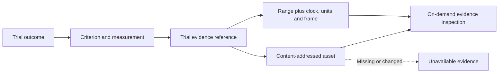
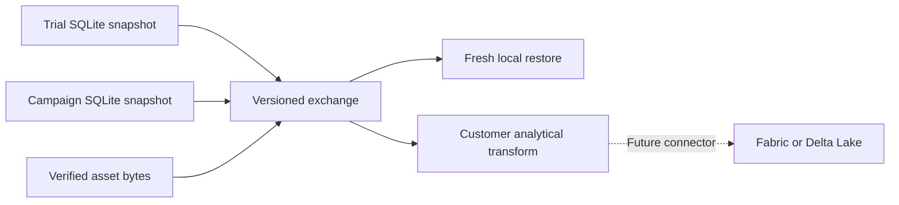

# Preserved evidence, trace comparison and relational exchange

**Status:** Implemented locally; validation results are recorded in the delivery plan.

A robotics engineer needs to follow a failed criterion to the exact trajectory
segment or stage output that supported it. A researcher needs to compare activity
between a baseline and an ablation without assuming their clocks are synchronized.
A platform engineer needs to move the retained records into an analytical system
without changing case, trial, review or assessment identities.

## Product behavior

Trial history preserves stage outputs as addressed JSON assets. Adapters may also
emit explicitly identified recording assets. A measurement references an evidence
identity within its trial; that reference resolves to a content hash, recording
selection, units, coordinate frame and source clock. Unavailable or changed bytes
remain visible as unavailable. References never cause remote URLs to be fetched.

Selections use half-open byte, sample, frame or second ranges. Non-byte selections
require an indexed JSON recording; time selections additionally require a declared
duration and matching source clock. Video and binary blobs can be preserved and
downloaded, but arbitrary video indexing or codec decoding is not implemented.
Large recordings should be divided into bounded segments (64 MiB per asset).



Trace lanes show producer offsets and measured span durations. Lanes using the same
source clock share an origin; unrelated clocks remain distinct. Missing timestamps
and unfinished spans have no inferred duration. The initial trace query is capped
at 10,000 events and reports incomplete coverage explicitly. Raw events remain
available through paginated history. A paired-trial link places baseline and
candidate traces side by side; this visualization does not establish evaluation
comparability or causal attribution by itself.

## Exchange contract

SQLite remains the transactional working store. A versioned ZIP contains a manifest,
JSONL relational tables with column schemas and hashes, and immutable asset files.
JSONL is an interchange representation here, not the live database. Nested JSON
columns retain their payloads for downstream transformation. No Parquet/Delta
runtime or cloud dependency is needed for local evaluation.



The export takes consistent read transactions and refuses active trials/campaigns.
It includes the local workspace's private cases, outputs and reviews, so the UI
labels its scope before download. Import validates exact schema/table membership,
row counts, table hashes, asset hashes and relational foreign keys in staging. It
requires a fresh destination and never merges into or replaces an existing store.
The current bounded format supports 512 MiB of uncompressed content. A production
analytical connector needs partitioning and measured workload requirements before
choosing larger limits, Parquet layouts or Delta merge semantics.

```sh
rove exchange export /tmp/rove-evidence.zip --store .rove/benchmarks
rove exchange import /tmp/rove-evidence.zip --store /tmp/rove-restored
```

## Acceptance and limits

- Reopen a trial, navigate from a measurement to its exact preserved selection,
  and inspect stage output without rerunning the model.
- Detect missing/tampered bytes, invalid ranges and reused reference identities.
- Compare asynchronous producer lanes without inventing clock alignment or time.
- Round-trip cases, revision cycles, private reviews, dataset membership, trials,
  events and assets while preserving identities and immutable records.
- Reject active exports, archive traversal entries, unknown formats, corrupt hashes,
  broken references and imports into an existing destination.

[Tests](../../tests/test_evidence_exchange.py), [evidence contracts](../../src/rove/trials/evidence.py),
[trace projection](../../src/rove/trials/traces.py), [exchange](../../src/rove/trials/exchange.py).
