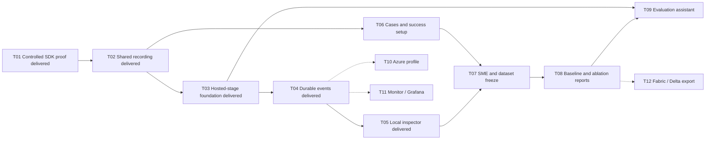

# ROVE Delivery Plan: From Trial Evidence to Customer Evaluation Workflows

**Status:** First local slice delivered: durable trials, optional Copilot stages and history inspector. Remaining validation and customer workflows are listed below.
**Updated:** 2026-09-12
**Design:** [Architecture diagram](../architecture/target-architecture.md), [system diagram](../architecture/system-diagram.md), [ADR-024](../architecture/ADR-024-copilot-runtime-and-observability.md)

The first useful milestone is a saved robotics trial whose configuration, agent
activity and assessment can be reopened after restart. The next is a customer
workflow: import cases → baseline → SME review → frozen dataset → candidate →
comparison. Copilot powers ROVE-owned agents while direct customer systems share
the same evaluation records and reporting rules.

## Already Available

PR #13 supplies repeated campaigns, pass@k/pass^k, cross-strategy coverage and
portable reports. PR #14 supplies configured verification, required checks,
optional FK diagnostics and versioned measurements. PR #15 documents the product
concepts. Build on these capabilities rather than recreate them. Their limitations
and source links are in [current implementation](../architecture/current-implementation.md).

## Task Sequence

The table describes the full accepted scope. The progress table below distinguishes
delivered foundations from remaining gates. Each task is a reviewable delivery
slice; split further if needed. Dependencies are completion gates, not dates or
estimates. Each slice updates its specification, ADR and diagram and runs repository
checks. The user has authorized implementation PR merges after required checks pass.

| Order / ID | Deliverable | Depends on | Completion evidence |
| --- | --- | --- | --- |
| 1 / T01 | Copilot SDK compatibility spike and version decision | This architecture | Pinned SDK/runtime; image/tool/event/usage/cancellation probe; Python trace correlation; actual provider coverage stated |
| 2 / T02 | Shared trial identities, snapshots and relational recording | T01 findings for runtime metadata | Quick and campaign paths create records before execution; history survives restart; legacy import preserves missing fields |
| 3 / T03 | Copilot runtime service and execution lifecycle | T01, T02 | Separate assistant/candidate/grader scopes; one hosted strategy works; direct customer path stays unchanged; cancellation/reset limits explicit |
| 4 / T04 | Durable telemetry bridge and OpenTelemetry correlation | T02, T03 | SDK and existing adapter events persisted; usage retained; trial/tool spans linked; replay deduplicated; collector-outage test |
| 5 / T05 | Trial history and evidence inspector | T04 | Reopen a quick/campaign trial, inspect configuration and failed calls, follow measurements to assets; original ROVE design language |
| 6 / T06 | Customer case import, success setup and robotics examples | T02; integrate after T05 | Import images/tasks and referenced recordings; preview available measures; reject unsupported claims before running |
| 7 / T07 | SME review and frozen dataset revisions | T05, T06 | Separate case validity, reusable annotations and output ratings; freeze exact membership/reviews atomically; corrections create revisions |
| 8 / T08 | Baseline/ablation history and complete reports | T05, T06, T07 | Match case/assessment conditions; show component diffs, uncertainty and regressions; quick-trial promotion preserves identity |
| 9 / T09 | Copilot evaluation assistant over validated services | T03, T08 | Prepare and operate the full import-to-comparison workflow through typed tools; assistant narrative links to authoritative evidence |
| 10 / T10 | Azure/Foundry runtime deployment profile | T03, T04; after local milestone | Document and validate customer identity, endpoint configuration and provider usage on an authorized Azure environment |
| 11 / T11 | Optional Azure Monitor and Grafana export profiles | T04; after local milestone | Same trial correlation in external trace views; bounded export and content policies; local use unaffected by exporter failure |
| 12 / T12 | Versioned analytical exports for Fabric/Delta consumers | T07, T08; customer demand | Export/import preserves revisions, schemas and asset manifests; measured data volumes justify format and connector choices |

### Progress after the first implementation slice

| Task | Delivered | Remaining before full acceptance |
| --- | --- | --- |
| T01 | Pinned SDK `1.0.13` / CLI `1.0.81-9`; real CLI with controlled image/tool/usage/trace responses; offline lifecycle tests | Explicit live provider; Azure identity and deployment validation |
| T02 | Shared quick/campaign IDs, frozen task/strategy/configuration hashes, SQLite journal, initial observation assets, ownership-aware recovery and idempotent legacy quick import | Full case/assessment revision model; archived auxiliary artifacts; complete migration away from compatibility journals |
| T03 | Optional perceive/plan/verify adapter with fresh candidate/grader scope, bounded lifecycle and direct paths retained | Assistant service tools; explicit robot action/reset contracts; any declared cross-stage memory mode |
| T04 | Existing exposed stage/tool events plus SDK events and usage persist; source deduplication; optional ROVE trial spans | Full application/native/export correlation; actual collector outage and bounded exporter shutdown; robot clock/range contracts |
| T05 | Paginated history, saved snapshots, verdict/measurement inspection, stage-filtered activity, trace details and on-demand observations | Remote recording-range resolution, parallel trace graph and aligned comparison views |
| T06–T09 | Pending; existing gallery/campaign/configuration services remain the starting point | Customer import/success setup, SME review/freeze, baseline/ablation workflow and guided assistant |
| T10–T12 | Pending, with the authorization/demand gates below | Live Azure profile, external monitoring profiles and justified analytical export |

The first slice is a useful durable inspection workflow, not completion of the full
customer onboarding milestone. [Current implementation](../architecture/current-implementation.md),
[setup](../TRIAL_HISTORY.md) and [compatibility evidence](../architecture/copilot-compatibility.md)
describe what can be used and tested now.

T06 contract/import work can proceed after T02, alongside runtime/telemetry work.
Its UI integration follows the inspector. Dashed branches are later optional
integrations. T10 and T11 are independent after the local milestone; neither gates
customer evaluation locally. The SDK proof comes first because schema coverage,
trace behavior and runtime isolation influence the recording contract.

Delivered labels in the diagram refer to the first-slice scope in the progress
table; they do not close its remaining acceptance gates.

## Milestone A: One Trustworthy, Inspectable Trial — T01–T05

- **T01:** prove the selected SDK/runtime against controlled fixtures and one
  explicitly configured provider. Inspect event and span schemas, image handling,
  shutdown behavior and startup overhead. Separate tested behavior from documented
  capabilities. Record any experimental APIs and a version-upgrade test plan.
- **T02:** define immutable case/system/evaluation revisions, trial and assessment
  IDs, source-event identity and asset references. Use SQLite migrations, foreign
  keys, indexes and bounded transactions. Prefer the existing campaign store as
  the starting point. Import quick JSONL once without fabricating provenance, and
  support backup/restore. Preserve planned, failed, interrupted and unknown work.
- **T03:** implement one shared SDK host integration with scoped role sessions,
  configured tools, timeouts and terminal reasons. Add memory/reset and telemetry
  coverage contracts to existing stage/adapters. Keep customer agents and VLAs
  directly callable. Do not implement hardware drivers as part of this slice.
- **T04:** record essential live events before relying on UI delivery; preserve
  ephemeral usage. Separate previous-event links from span parents. Add bounded
  buffering, flush/termination handling, recorder-failure visibility and source
  deduplication. Preserve units, timestamps, clock identity and asset ranges.
  Join native SDK spans with ROVE spans; avoid duplicate model spans/counters.
- **T05:** deliver a paginated history view, frozen configuration display,
  parallel activity lanes and outcome → measurement → criterion → evidence
  navigation. Display missing or truncated records. Load large assets on demand.
  Keep existing colors, typography, navigation and collapsible details consistent.

**Acceptance:** run a direct-model trial and an SDK-hosted trial on synthetic
robotics cases; terminate/restart ROVE; reopen both without executing anything;
inspect their recorded differences. A collector outage cannot erase local trials.
Tests explicitly cover missing usage, duplicate events, recorder failure and
candidate/grader separation. No physical-performance claim follows from synthetic
fixtures.

## Milestone B: Bring Customer Data and Compare Improvements — T06–T08

- **T06:** accept case manifests and referenced image/episode assets with schema,
  units, frame and availability validation. Ship redistribution-safe examples for
  image-to-plan grading and action-dependent synthetic execution evidence. Cases
  with only images/tasks can establish a baseline output and receive SME review;
  they do not automatically establish robot completion. Offer success criteria,
  required constraints and expected-measure preview in configuration and UI.
- **T07:** persist reviewer attribution, rubric/version, rationale and evidence.
  Distinguish invalid cases from valid cases with failed outputs. Freeze selected
  case/annotation/review revisions with conflict detection; preserve disagreements.
  Regrade existing evidence as a new assessment, never as another trial. An SME
  rating of a baseline output is not automatically a reusable ground-truth label.
- **T08:** name/pin baselines and compare candidate snapshots on matching cases
  and contracts. Show runtime/model/tool/prompt/preprocessing changes, coverage,
  uncertainty and per-case regressions. Reuse existing pass@k/pass^k calculations
  and explain assumptions; keep cross-strategy coverage separate from a single
  strategy's repeated-trial reliability. Promote quick history by reference and
  label post-hoc selection as exploratory. Complete report preview, history trends
  and exports with collapsible metric definitions and denominators.

Report task outcomes, required-constraint violations, latency and supplied usage.
Add intervention, recovery and robot task-time measures only when their evidence
and denominators exist. Precision, recall and F1 remain out of scope. Unsupported
metrics stay unavailable; a label or synthetic datum cannot become observed
episode success. [ADR-021](../architecture/ADR-021-campaign-success-and-reporting.md)
and the [metric specification](metrics-and-success.md) define the reporting rules.

**Acceptance:** a researcher compares a baseline and ablation; a manipulation-team
engineer imports and reviews a failed customer case; a platform engineer locates
the endpoint/configuration and supporting calls. The full workflow completes
without manual database edits and survives restart. Held-out evaluation remains
distinct from data used to tune the candidate or grader.

## Milestone C: Guided Workflow — T09

Expose the tested application services as Copilot tools for import, validation,
campaign creation, inspection and comparison. The UI and assistant use the same
validation and operation IDs. Draft suggestions become frozen configuration when
the user launches the evaluation; the assistant cannot silently change that
configuration during execution. Proposed changes create a new candidate revision.

**Acceptance:** complete the same customer journey through the assistant, with
traceable tool actions and evidence-linked explanations. Duplicate requests do not
duplicate campaigns. Review/freeze actions operate on exact revisions. Candidate
agents cannot access private labels through assistant or grader sessions.

## Milestone D: Integration Profiles — T10–T12

- **T10:** validate Azure/Foundry authentication and deployment configuration for
  the runtime. Keep credentials outside snapshots and traces. Measure provider
  usage coverage, rate-limit behavior and runtime overhead. Existing Azure
  adapters alone are not proof that this SDK profile works.
- **T11:** provide optional OTLP Collector profiles for Azure Monitor/Application
  Insights/Log Analytics and Grafana backends. Test correlation, permissions,
  redaction, queue/drop reporting and export shutdown. Tune backend-specific
  metric formats and sampling without changing the authoritative eval population.
- **T12:** define a versioned export manifest containing cases, trials, assessments,
  lineage and asset references. Add Parquet when useful for analytical transfer;
  validate target-specific Delta/Fabric/Databricks behavior separately. PostgreSQL
  becomes a task only if shared deployment requirements justify it.

## Deliberate Deferrals and Revisit Triggers

No new robotics hardware drivers, general model-serving stack, authentication/RBAC,
multi-tenant platform or automatic judge training is included in the local
milestones. Customer-supplied integrations can be supported through explicit
contracts. SDK sub-agents, MCP and cross-trial memory require a concrete workflow
benefit; do not add them because the runtime offers them. Revisit worker topology
when measured concurrency warrants it, and storage when workload/hosting needs
outgrow local SQLite. External integrations require their own validation before
being described as available.
