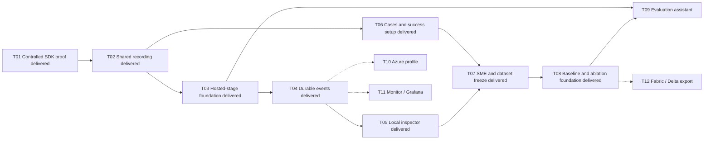

# ROVE Delivery Plan: From Trial Evidence to Customer Evaluation Workflows

**Status:** Local completion implemented and verified; PR checks govern merge readiness. Live provider/Azure validation is specification-only at user request; hosted integrations remain explicitly unvalidated.
**Updated:** 2026-09-12
**Design:** [Architecture diagram](../architecture/target-architecture.md), [system diagram](../architecture/system-diagram.md), [ADR-024](../architecture/ADR-024-copilot-runtime-and-observability.md)

The first useful milestone is a saved robotics trial whose configuration, agent
activity and assessment can be reopened after restart. The next is a customer
workflow: import cases → baseline → SME review → frozen dataset → candidate →
comparison. Copilot powers ROVE-owned agents while direct customer systems share
the same evaluation records and reporting rules.

## Already Available

PR #13 supplies repeated campaigns, pass@k/pass^k, cross-strategy coverage and
portable reports. PR #14 supplies configured verification, required checks,
optional FK diagnostics and versioned measurements. PR #15 documents the product
concepts. Build on these capabilities rather than recreate them. Their limitations
and source links are in [current implementation](../architecture/current-implementation.md).

## Task Sequence

The table describes the full accepted scope. The progress table below distinguishes
delivered foundations from remaining gates. Each task is a reviewable delivery
slice; split further if needed. Dependencies are completion gates, not dates or
estimates. Each slice updates its specification, ADR and diagram and runs repository
checks. The user has authorized implementation PR merges after required checks pass.

| Order / ID | Deliverable | Depends on | Completion evidence |
| --- | --- | --- | --- |
| 1 / T01 | Copilot SDK compatibility spike and version decision | This architecture | Pinned SDK/runtime; image/tool/event/usage/cancellation probe; Python trace correlation; actual provider coverage stated |
| 2 / T02 | Shared trial identities, snapshots and relational recording | T01 findings for runtime metadata | Quick and campaign paths create records before execution; history survives restart; legacy import preserves missing fields |
| 3 / T03 | Copilot runtime service and execution lifecycle | T01, T02 | Separate assistant/candidate/grader scopes; one hosted strategy works; direct customer path stays unchanged; cancellation/reset limits explicit |
| 4 / T04 | Durable telemetry bridge and OpenTelemetry correlation | T02, T03 | SDK and existing adapter events persisted; usage retained; trial/tool spans linked; replay deduplicated; collector-outage test |
| 5 / T05 | Trial history and evidence inspector | T04 | Reopen a quick/campaign trial, inspect configuration and failed calls, follow measurements to assets; original ROVE design language |
| 6 / T06 | Customer case import, success setup and robotics examples | T02; integrate after T05 | Import images/tasks and referenced recordings; preview available measures; reject unsupported claims before running |
| 7 / T07 | SME review and frozen dataset revisions | T05, T06 | Separate case validity, reusable annotations and output ratings; freeze exact membership/reviews atomically; corrections create revisions |
| 8 / T08 | Baseline/ablation history and complete reports | T05, T06, T07 | Match case/assessment conditions; show component diffs, uncertainty and regressions; quick-trial promotion preserves identity |
| 9 / T09 | Copilot evaluation assistant over validated services | T03, T08 | Prepare and operate the full import-to-comparison workflow through typed tools; assistant narrative links to authoritative evidence |
| 10 / T10 | Azure/Foundry runtime deployment profile | T03, T04; after local milestone | Document and validate customer identity, endpoint configuration and provider usage on an authorized Azure environment |
| 11 / T11 | Optional Azure Monitor and Grafana export profiles | T04; after local milestone | Same trial correlation in external trace views; bounded export and content policies; local use unaffected by exporter failure |
| 12 / T12 | Versioned analytical exports for Fabric/Delta consumers | T07, T08; customer demand | Export/import preserves revisions, schemas and asset manifests; measured data volumes justify format and connector choices |

### Local completion and explicit validation exclusions

The user authorized completing the remaining local implementation and requested
**live provider validation as a specification only**. No live model calls, Azure
resources or hosted monitoring credentials are used to establish local acceptance.
The original milestones below remain the design rationale; this table records the
implementation boundary after the follow-up work.

| Task | Local delivery | Validation boundary |
| --- | --- | --- |
| T01 | Pinned SDK/CLI compatibility, real local protocol and native trace probes | Live provider behavior and Azure identity are specification-only |
| T02 | Shared durable recording, managed assets and schema v3 migrations | Local SQLite; remote model weights and physical scenes are not reproduced |
| T03 | Explicit stage memory/reset/telemetry contracts, scoped SDK sessions and actual stage/tool spans | Direct adapter declarations are customer contracts; cross-trial memory is not enabled |
| T04 | Native/application/tool ancestry, source clocks, bounded optional exporter and outage handling | Controlled loopback collector tests; external service validation is specified separately |
| T05 | Parallel clock-aware lanes, paired-trial views, preserved outputs and exact recording selections | Unknown clocks stay unaligned; initial lane projection is bounded and reports truncation |
| T06 | Versioned episode/trajectory references, action-dependent synthetic execution, target setup and measures | Idealized one-axis test world; general video codecs and hardware drivers are excluded |
| T07 | Explicit frozen annotation bindings to participating local graders; immutable review/freezing workflow | No automatic SME judgment, judge training or team authentication |
| T08 | Named/pinned baseline revisions, frozen assessment projections, controlled ablations and trace links | Full matching cohorts; no unsupported significance claims or selective subset statistics |
| T09 | Typed guided import/revise/contract/freeze/baseline/launch/comparison services with host confirmation | SME decisions stay explicit human input; live-provider answer quality remains unvalidated |
| T10 | Live provider/Azure validation specification | Execution skipped at user request |
| T11 | Bounded local OTLP profile, structural redaction, queue/drop/shutdown behavior and collector examples | Hosted Azure/Grafana permissions and externally navigable views require the specified validation |
| T12 | Versioned relational exchange with schema/hash/asset/lineage round-trip | SQLite remains transactional; target-specific Fabric/Delta transforms are future integrations |

The local acceptance evidence is in the source-linked specifications:
[robotics evidence](robotics-evidence.md), [baselines and assistant](named-baselines-and-assistant.md),
and [preserved evidence and exchange](evidence-and-exchange.md). Missing outcome
evidence remains unknown throughout these workflows.

### Regression evidence for delivered behavior

- **T01/T03/T04:** [runtime tests](../../tests/test_copilot_runtime.py) cover fresh
  role scopes, missing usage, tool context, cancellation and recorder failure.
  [Telemetry resilience tests](../../tests/test_telemetry_resilience.py), including
  `test_real_sdk_cli_failed_otlp_collector_keeps_trial_and_usage`, exercise the
  installed CLI with a controlled HTTP 503 collector. This is not a deployed
  Azure/Grafana or complete application trace-tree validation.
- **T02/T05:** [integration tests](../../tests/test_trial_integration.py), including
  `test_quick_trial_is_recorded_before_execution_and_reopens`, cover durable
  dispatch, cancellation and campaign recovery. [Store tests](../../tests/test_trial_store.py)
  cover deduplication, terminal immutability, redaction and legacy rollback;
  [history UI tests](../../tests/test_history_ui.cjs) cover the implemented inspector.
- **T06/T07:** [dataset tests](../../tests/test_datasets.py) cover immutable inputs,
  asset integrity, review conflicts, exact freezes and rollback, including
  `test_v1_backup_restores_assets_and_migrates_without_losing_history` and
  `test_review_finalization_serializes_after_atomic_freeze`.
- **T08:** `test_customer_baseline_review_freeze_ablation_journey` in the
  [customer workflow tests](../../tests/test_customer_workflow.py) covers the API
  journey. [Comparison tests](../../tests/test_comparison.py) distinguish intentional
  model changes from invalid assessment drift. [Review/report tests](../../tests/test_workflow_review.py)
  cover disagreement beyond one page and matching report/history assessments;
  [promotion tests](../../tests/test_promotion.py) verify unchanged trial counts.
- **T09:** [assistant tests](../../tests/test_assistant.py) cover the implemented
  read/preview tool boundary, host confirmation, stale inputs and duplicate launches.
  They do not establish the broader assistant journey or live-provider quality.

### Deferred validation and future extensions

Live model/provider and Azure validation is intentionally not executed. The
[live validation specification](live-provider-validation.md) defines required identity, endpoint, usage, timeout, rate-limit and
startup-overhead evidence before any deployment claim. Hosted monitoring/Fabric
validation also requires an actual authorized target environment.

Future work is driven by customer needs: richer simulator physics, hardware drivers,
video indexing, shared multi-user storage, team review/authentication, selective
comparison cohorts and analytical connector scale. These are not silently implied
by the completed local fixture and relational exchange.

See [current implementation](../architecture/current-implementation.md),
[setup](../TRIAL_HISTORY.md) and [compatibility evidence](../architecture/copilot-compatibility.md)
for usable interfaces and exact runtime limits.

T06 contract/import work can proceed after T02, alongside runtime/telemetry work.
Its UI integration follows the inspector. Dashed branches are later optional
integrations. T10 and T11 are independent after the local milestone; neither gates
customer evaluation locally. The SDK proof comes first because schema coverage,
trace behavior and runtime isolation influence the recording contract.

Delivered labels in the diagram refer to the local scope in the progress
table; they do not close its remaining acceptance gates.

## Milestone A: One Trustworthy, Inspectable Trial — T01–T05

- **T01:** prove the selected SDK/runtime against controlled fixtures and one
  explicitly configured provider. Inspect event and span schemas, image handling,
  shutdown behavior and startup overhead. Separate tested behavior from documented
  capabilities. Record any experimental APIs and a version-upgrade test plan.
- **T02:** define immutable case/system/evaluation revisions, trial and assessment
  IDs, source-event identity and asset references. Use SQLite migrations, foreign
  keys, indexes and bounded transactions. Prefer the existing campaign store as
  the starting point. Import quick JSONL once without fabricating provenance, and
  support backup/restore. Preserve planned, failed, interrupted and unknown work.
- **T03:** implement one shared SDK host integration with scoped role sessions,
  configured tools, timeouts and terminal reasons. Add memory/reset and telemetry
  coverage contracts to existing stage/adapters. Keep customer agents and VLAs
  directly callable. Do not implement hardware drivers as part of this slice.
- **T04:** record essential live events before relying on UI delivery; preserve
  ephemeral usage. Separate previous-event links from span parents. Add bounded
  buffering, flush/termination handling, recorder-failure visibility and source
  deduplication. Preserve units, timestamps, clock identity and asset ranges.
  Join native SDK spans with ROVE spans; avoid duplicate model spans/counters.
- **T05:** deliver a paginated history view, frozen configuration display,
  parallel activity lanes and outcome → measurement → criterion → evidence
  navigation. Display missing or truncated records. Load large assets on demand.
  Keep existing colors, typography, navigation and collapsible details consistent.

**Acceptance:** run a direct-model trial and an SDK-hosted trial on synthetic
robotics cases; terminate/restart ROVE; reopen both without executing anything;
inspect their recorded differences. A collector outage cannot erase local trials.
Tests explicitly cover missing usage, duplicate events, recorder failure and
candidate/grader separation. No physical-performance claim follows from synthetic
fixtures.

## Milestone B: Bring Customer Data and Compare Improvements — T06–T08

- **T06:** accept case manifests and referenced image/episode assets with schema,
  units, frame and availability validation. Ship redistribution-safe examples for
  image-to-plan grading and action-dependent synthetic execution evidence. Cases
  with only images/tasks can establish a baseline output and receive SME review;
  they do not automatically establish robot completion. Offer success criteria,
  required constraints and expected-measure preview in configuration and UI.
- **T07:** persist reviewer attribution, rubric/version, rationale and evidence.
  Distinguish invalid cases from valid cases with failed outputs. Freeze selected
  case/annotation/review revisions with conflict detection; preserve disagreements.
  Regrade existing evidence as a new assessment, never as another trial. An SME
  rating of a baseline output is not automatically a reusable ground-truth label.
- **T08:** name/pin baselines and compare candidate snapshots on matching cases
  and contracts. Show runtime/model/tool/prompt/preprocessing changes, coverage,
  uncertainty and per-case regressions. Reuse existing pass@k/pass^k calculations
  and explain assumptions; keep cross-strategy coverage separate from a single
  strategy's repeated-trial reliability. Promote quick history by reference and
  label post-hoc selection as exploratory. Complete report preview, history trends
  and exports with collapsible metric definitions and denominators.

Report task outcomes, required-constraint violations, latency and supplied usage.
Add intervention, recovery and robot task-time measures only when their evidence
and denominators exist. Precision, recall and F1 remain out of scope. Unsupported
metrics stay unavailable; a label or synthetic datum cannot become observed
episode success. [ADR-021](../architecture/ADR-021-campaign-success-and-reporting.md)
and the [metric specification](metrics-and-success.md) define the reporting rules.

**Acceptance:** a researcher compares a baseline and ablation; a manipulation-team
engineer imports and reviews a failed customer case; a platform engineer locates
the endpoint/configuration and supporting calls. The full workflow completes
without manual database edits and survives restart. Held-out evaluation remains
distinct from data used to tune the candidate or grader.

## Milestone C: Guided Workflow — T09

**Implemented local boundary:** the assistant reads evidence and proposes typed
imports, case revisions, contracts, freezes, named baselines, campaign launches
and comparisons. The host requires explicit confirmation and revalidates exact
inputs before every mutation. Media selection and SME judgment remain human
inputs; no assistant tool manufactures expert reviews. Durable operation identities
make confirmed retries idempotent. Live-provider validation is specification-only.

**Original broader scope, retained for acceptance tracking:**

Expose the tested application services as Copilot tools for import, validation,
campaign creation, inspection and comparison. The UI and assistant use the same
validation and operation IDs. Draft suggestions become frozen configuration when
the user launches the evaluation; the assistant cannot silently change that
configuration during execution. Proposed changes create a new candidate revision.

**Guided acceptance:** complete the same customer journey through the assistant, with
traceable tool actions and evidence-linked explanations. Duplicate requests do not
duplicate campaigns. Review/freeze actions operate on exact revisions. Candidate
agents cannot access private labels through assistant or grader sessions.

## Milestone D: Integration Profiles — T10–T12

- **T10:** validate Azure/Foundry authentication and deployment configuration for
  the runtime. Keep credentials outside snapshots and traces. Measure provider
  usage coverage, rate-limit behavior and runtime overhead. Existing Azure
  adapters alone are not proof that this SDK profile works.
- **T11:** provide optional OTLP Collector profiles for Azure Monitor/Application
  Insights/Log Analytics and Grafana backends. Test correlation, permissions,
  redaction, queue/drop reporting and export shutdown. Tune backend-specific
  metric formats and sampling without changing the authoritative eval population.
- **T12:** define a versioned export manifest containing cases, trials, assessments,
  lineage and asset references. Add Parquet when useful for analytical transfer;
  validate target-specific Delta/Fabric/Databricks behavior separately. PostgreSQL
  becomes a task only if shared deployment requirements justify it.

## Deliberate Deferrals and Revisit Triggers

No new robotics hardware drivers, general model-serving stack, authentication/RBAC,
multi-tenant platform or automatic judge training is included in the local
milestones. Customer-supplied integrations can be supported through explicit
contracts. SDK sub-agents, MCP and cross-trial memory require a concrete workflow
benefit; do not add them because the runtime offers them. Revisit worker topology
when measured concurrency warrants it, and storage when workload/hosting needs
outgrow local SQLite. External integrations require their own validation before
being described as available.

## Local completion verification

The local regression suite passed with 568 tests and 3 existing skips; the
subsequently added five collector-profile checks also passed. All 33 mandatory
JavaScript UI tests passed. Documentation validation checked 297 relative links
and parsed 29 Mermaid diagrams. Browser checks covered named baseline creation,
pinned revision history, paired trace lanes and target results without horizontal
overflow. The isolated action-dependent demo completed all 18 trials: baseline
0/9 and candidate 6/9, using synthetic evidence only.

The [live provider validation specification](live-provider-validation.md) defines
the deferred acceptance gate. [Collector profiles](../../examples/observability/README.md)
are locally parsed configuration examples; hosted ingestion and authentication
remain unvalidated.
